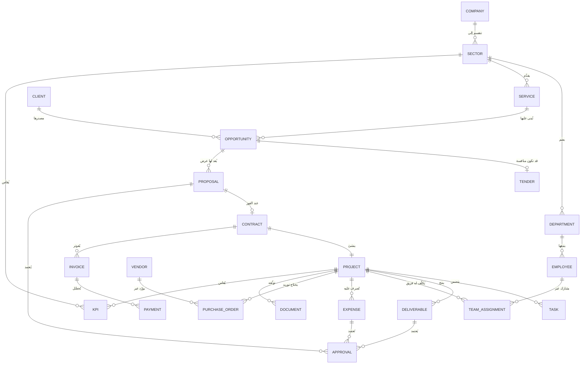

# وثيقة تحليل الأعمال والمتطلبات — منصة رؤية الخبراء (EVC OS)
## الإصدار التمهيدي v0.1 — «إطار التحليل والنموذج المرجعي» (قبل المعاينة الميدانية)

**التاريخ:** 2026-07-13 | **الحالة:** تمهيدي — ينتظر فتح الوصول الشبكي للمنصة
**النطاق:** `https://os.evcsol.com` (يُشار إليها أدناه بـ «المنصة»)

> ### ⚠️ طبيعة هذه الوثيقة — اقرأ أولًا
> تعذّر الدخول الفعلي للمنصة من بيئة التنفيذ الحالية (انظر `00-exploration-log.md` — رفض 403 من بوابة الخروج، مع منع الالتفاف على السياسة). لذلك هذه الوثيقة **ليست توصيفًا للمنصة كما هي**، بل:
> 1. **إطار تحليل كامل** بالهيكل الخمسة‑عشر بندًا المطلوب، تتحول أقسامه المعلّقة إلى محتوى فعلي فور المعاينة؛
> 2. **قوائم التقاط تفصيلية** لكل قسم معلّق (ماذا نفحص، وما الدليل المطلوب)؛
> 3. **نماذج مرجعية مقترحة** (الأدوار والصلاحيات، نموذج البيانات، دورة التشغيل) تُقابَل لاحقًا بالواقع لتحديد الفجوات — وهي موسومة صراحة بأنها مقترحات؛
> 4. **سياق عام موثّق المصادر** عن شركة رؤية الخبراء.
>
> **مفاتيح الوسم في كامل الوثيقة:** 🟢 ملاحظة مؤكدة | 🔵 استنتاج | 🟡 افتراض | 🟣 توصية | ⚪ يتطلب تحققًا من المنصة

---

# 1. الملخص التنفيذي

- **ما المنصة؟** ⚪/🔵 نظام تشغيل داخلي لشركة رؤية الخبراء الاستشارية على النطاق `os.evcsol.com`. الاستنتاجات الأولية من عنوان الوصول فقط: وجود مسار `#ceo` يوحي بواجهات/لوحات مرتبطة بالأدوار (توجيه SPA بالوسم Hash)، والنطاق الفرعي `os.` يوحي بمفهوم «نظام تشغيل مؤسسي». لا شيء من ذلك مؤكد قبل المعاينة.
- **الهدف الاستراتيجي المفترض:** 🟡 (بحسب نص التكليف من المالك) تمثيل الشركة بقطاعاتها وإداراتها ومشاريعها وعملياتها وإدارة دورة العمل من الفرصة حتى إغلاق المشروع — يتطلب تثبيتًا من الإدارة والمعاينة.
- **أهم ما وُجد حتى الآن:**
  1. 🟢 الوصول للمنصة من بيئة التحليل محجوب بسياسة الشبكة (الدليل في سجل الاستكشاف) — **هذا هو العائق الوحيد أمام التحليل الميداني الكامل**.
  2. 🟢 لا توجد أي ملفات/وثائق مرفقة في المستودع رغم ورودها في التكليف.
  3. 🟢 سياق الشركة العام موثّق ومتوافر (القسم 2) ويكفي لتأطير التحليل، لا لاستبداله.
  4. 🔵 مصدر عام يشير إلى أن الشركة كانت عميلًا لنظام Odoo (صفحة مرجع عملاء Odoo الرسمية) — يفتح سؤالًا جوهريًا: ما علاقة المنصة الحالية بـ Odoo (إحلال؟ تكامل؟ تعايش؟) — القسم 11.
- **أهم الفجوات المعروفة الآن:** فجوة وصول (شبكة)، فجوة وثائق (لا ملفات)، فجوة حوكمة وصول للتحليل (استُخدم حسابٌ شخصي عالي الصلاحية بدل حساب مراجعة للقراءة فقط) 🟣.
- **أهم القرارات المطلوبة فورًا:**
  | القرار | المالك | الأثر |
  |--------|--------|-------|
  | فتح النطاق `os.evcsol.com` في سياسة شبكة بيئة التحليل (أو بيئة بديلة) | مالك الجلسة | يفتح كامل التحليل الميداني |
  | توفير الملفات/الوثائق المشار إليها في التكليف | مالك الجلسة | يمكّن الربط بين الموثّق والمطبَّق |
  | إنشاء حساب مراجعة للقراءة فقط + تدوير كلمة المرور الحالية بعد التحليل | مسؤول النظام | حوكمة وأمان |
  | تثبيت المصدر المرجعي للهيكل التنظيمي (قطاعات/إدارات) | الإدارة العليا | أساس قياس تمثيل المنصة للشركة |

---

# 2. تعريف المنصة

### 2.1 ما نعرفه بدليل (سياق الشركة — مصادر عامة)

| المعلومة | الوسم | المصدر |
|----------|-------|--------|
| «رؤية الخبراء الاستشارية» (Experts Vision Consulting — EVC) شركة استشارية سعودية، موقعها الرسمي `evc.sa` | 🟢 (مصدر عام) | [evc.sa](https://evc.sa/en/) |
| مجالات عمل معلنة: التحول الرقمي، إدارة المشاريع، إدارة الحشود، الحلول المؤسسية المتكاملة، إدارة الفعاليات والمبادرات، المدن الذكية، الذكاء الاصطناعي، استشارات SAP | 🟢 (مصدر عام) | [evc.sa — الخدمات](https://evc.sa/our-consulting-services/)، [عن الشركة](https://evc.sa/en/expert-vision/) |
| تعاملت مع أكثر من 60 جهة حكومية في مناطق المملكة | 🟢 (مصدر عام — تصريح الشركة) | [evc.sa](https://evc.sa/en/expert-vision/) |
| شراكة معلنة مع البنك الدولي في مجال الحكومة التقنية GovTech | 🟢 (مصدر عام صحفي) | [صحيفة سبق](https://sabq.org/saudia/hvxfqpgphj) |
| الشركة وردت كعميل في مرجع عملاء Odoo الرسمي | 🟢 (مصدر عام) → 🔵 استنتاج: وُجد استخدام سابق/قائم لنظام Odoo | [Odoo — مرجع العملاء](https://www.odoo.com/customers/evc-experts-vision-consulting-7037515) |
| حضور مؤسسي على لينكدإن وX | 🟢 (مصدر عام) | [LinkedIn](https://www.linkedin.com/company/evcsa)، [X](https://x.com/evc_sa) |

> ملاحظة منهجية: المصادر العامة تصف **الشركة**، لا **المنصة**. المنصة (`os.evcsol.com`) غير مفهرسة في نتائج البحث العام 🟢 — متوقع لنظام داخلي. كما يلاحظ أن نطاق المنصة (`evcsol.com`) **مختلف عن** نطاق الشركة الرسمي (`evc.sa`) — من يملك/يشغّل `evcsol.com` (فريق داخلي؟ مورّد تطوير؟) ⚪ سؤال مفتوح (القسم 15، س7).

### 2.2 بطاقة تعريف المنصة (تُملأ بعد المعاينة)

| البند | القيمة الحالية |
|-------|----------------|
| الرؤية | ⚪ + 🟡 مبدئيًا من نص التكليف: «منصة مؤسسية متكاملة تدير دورة عمل الشركة من الفرصة إلى إغلاق المشروع» — يحتاج اعتماد الإدارة |
| الأهداف | ⚪ تُستخرج من المنصة/الإدارة، وتُصاغ SMART |
| القيمة المقدمة | ⚪ (فرضيات للاختبار 🟡: مركزية المعلومة، ضبط الاعتمادات، رؤية مالية وتشغيلية موحدة، تقليل التشغيل اليدوي) |
| المستخدمون المستهدفون | ⚪ (قائمة الأدوار المرجعية في القسم 7 هي الإطار المقترح للمقابلة) |
| نطاق العمل (In-Scope) | ⚪ |
| خارج النطاق (Out-of-Scope) | ⚪ (يُقترح 🟣 حسمه صراحة لملفات مثل: الرواتب، المحاسبة الرسمية، الأرشفة القانونية) |

---

# 3. الوضع الحالي As-Is

**الحالة: ⚪ معلّق كليًا على المعاينة.** لا يُكتب في هذا القسم أي وصف غير مشاهد. أدناه **خطة الالتقاط الإلزامية** التي ستُنفَّذ فور فتح الوصول، وتتحول مخرجاتها إلى محتوى هذا القسم:

### 3.1 قائمة الالتقاط (Capture Checklist)

| # | ما يُفحص | الدليل المطلوب توثيقه |
|---|-----------|------------------------|
| 1 | صفحة الدخول وآلية المصادقة (حقول، استعادة كلمة مرور، تحقق ثنائي، رسائل الأخطاء) | لقطة + مسار |
| 2 | ما بعد الدخول: الصفحة الرئيسة/لوحة المعلومات الافتراضية للدور | لقطة + مسار |
| 3 | **خريطة الملاحة كاملة**: كل قائمة رئيسية/فرعية، وكل مسار Hash (#…) يمكن بلوغه — تُبنى شجرة كاملة | جدول مسارات |
| 4 | لكل وحدة: الجداول المعروضة (الأعمدة، الفلاتر، الفرز، البحث، الترقيم، التصدير) | لقطة + تفريغ أعمدة |
| 5 | لكل وحدة: نماذج الإدخال (كل حقل: النوع، إلزامي؟، قوائم القيم، التحقق) — **تُفتح دون حفظ** | تفريغ حقول |
| 6 | الحالات Statuses لكل كيان وقواعد الانتقال الظاهرة | جدول حالات |
| 7 | مسارات الاعتماد: من يعتمد ماذا، خطوات، تفويض، رفض/إرجاع | لقطات + وصف |
| 8 | الإشعارات: أنواعها، قنواتها (داخل المنصة/بريد)، مسبباتها | لقطات |
| 9 | التقارير ولوحات المعلومات: كل تقرير، مدخلاته، فلاتره، تصديره | لقطات |
| 10 | الإعدادات والإدارة: المستخدمون، الأدوار، الصلاحيات، القوائم المرجعية، سجلات التدقيق Audit log | لقطات + تفريغ |
| 11 | نداءات API الخلفية (أسماء الكيانات، الحقول المعادة، أنماط الترخيص) عبر سجل الشبكة | ملف network.log |
| 12 | اللغة/الاتجاه RTL، الاستجابة للجوال، إمكانية الوصول الأساسية | ملاحظات |
| 13 | ما يظهر من أدوار أخرى في القوائم (هل يكشف حساب واحد بيانات أدوار أخرى؟ — مؤشر حوكمة) | ملاحظات |
| 14 | أزرار/صفحات موجودة اسمًا بلا وظيفة (تُدوَّن ولا يُفترض عملها) | قائمة |

**ضوابط التنفيذ الملزمة:** قراءة فقط؛ لا حفظ/إرسال/اعتماد/حذف؛ النماذج تُفتح وتُغلق دون إرسال؛ أي حوار تأكيد يُرفض؛ توثيق كل شاشة قبل مغادرتها.

### 3.2 مخرجات هذا القسم بعد المعاينة
خريطة المنصة (شجرة الوحدات) + وظيفة كل وحدة + تدفقات العمل الحالية + نقاط القوة + نقاط الضعف — كلها بوسم 🟢 وأدلتها.

---

# 4. الهيكل المؤسسي داخل المنصة

**الحالة: ⚪ معلّق** — لا يجوز افتراض الهيكل النهائي للشركة (قاعدة تكليف صريحة). المصادر العامة تكشف **مجالات عمل** (القسم 2.1) لكنها لا تكشف الهيكل التنظيمي الداخلي (قطاعات/إدارات/وحدات) ولا كيفية تمثيله في المنصة.

### 4.1 ما سيُستخرج من المنصة
- هل توجد كيانات صريحة لـ: الشركة، القطاع، الإدارة/الوحدة، المنتج/الخدمة، الفرصة/المنافسة، العرض، المشروع، العقد، العميل، الشريك، المورّد، الموظف/الفريق، المهمة، المخرج، المصروف/الإيراد/الدفعة، الوثيقة، الاعتماد، مؤشر الأداء؟
- لكل كيان: أين يُدار؟ من ينشئه؟ ما حقوله؟ بمن يرتبط؟
- **التعارضات** بين تمثيل المنصة وأي وثائق تنظيمية تصل لاحقًا تُسجَّل كتعارض دون ترجيح بلا دليل.

### 4.2 خريطة العلاقات المرجعية المقترحة (🟣 نموذج للمقابلة، ليس وصفًا للمنصة)

بعد المعاينة يُرسم **المخطط الفعلي** ويُوضع بجانبه هذا المرجعي، وتُستخرج الفجوات (كيانات ناقصة، علاقات مفقودة، ازدواج).

---

# 5. رحلات المستخدمين

**الحالة: ⚪ معلّق.** تُبنى الرحلات بالمعاينة الفعلية (تسجيل الدخول ← المهام اليومية ← نقاط القرار والاعتماد ← الإشعارات ← الإنجاز) لكل شخصية من شخصيات القسم 7.

**قالب التوثيق المعتمد لكل رحلة:**

| العنصر | ما يُلتقط |
|--------|-----------|
| الشخصية والدور | الاسم الوظيفي + نطاق الرؤية |
| نقطة الدخول | أول شاشة بعد الدخول ولماذا |
| المهام الأساسية | 3–7 مهام يومية/أسبوعية كما تظهر في المنصة |
| نقاط القرار | أين يقرر/يعتمد/يرفض، وما المعلومات المتاحة له لحظة القرار |
| الإشعارات | ما الذي يصله ومتى وعبر أي قناة |
| نقاط الألم | خطوات زائدة، بيانات ناقصة، انتظار اعتماد، غموض حالة |
| نهاية الرحلة | متى تُعد مهمته منجزة وما أثرها على من بعده |

**الرحلات ذات الأولوية عند المعاينة:** الرئيس التنفيذي (لوحة `#ceo` المذكورة في رابط التكليف 🟢 كمسار، ⚪ كوظيفة)، مدير تطوير الأعمال، مدير المشروع، المالية، مدير القطاع، الموظف.

---

# 6. العمليات وسير العمل

**الحالة: ⚪ معلّق للمعاينة — وأدناه النموذج المرجعي 🟣 لدورة التشغيل (من التكليف نفسه) بصيغة «أسئلة تحقق» تُجاب من المنصة، فيتحول الجدول إلى توصيف فعلي:**

| المرحلة | نقطة البداية المفترضة | المسؤول المفترض | أسئلة التحقق من المنصة |
|---------|------------------------|------------------|--------------------------|
| 1. تسجيل الفرصة | رصد إعلان منافسة/طلب عميل | تطوير الأعمال | هل يوجد سجل فرص؟ حقوله؟ مصدر الفرصة؟ ربطها بعميل/قطاع/خدمة؟ |
| 2. دراسة الفرصة | فرصة بحالة «جديدة» | تطوير الأعمال + مدير القطاع | هل توجد شاشة دراسة/تأهيل (Go/No-Go)؟ معايير؟ درجات؟ |
| 3. قرار المشاركة | اكتمال الدراسة | لجنة/الرئيس التنفيذي | هل يوجد اعتماد رسمي مسجَّل بقرار وتاريخ وصاحب قرار؟ |
| 4. إعداد العرض | قرار «مشاركة» | فريق العروض | هل تُدار نسخ العرض الفني/المالي؟ مهام إعداد؟ مواعيد نهائية؟ |
| 5. التسعير | اكتمال النطاق | المالية + المعنيون | هل يوجد نموذج تسعير (تكلفة/هامش)؟ من يرى الأرقام؟ |
| 6. اعتماد وتقديم العرض | اكتمال العرض | الإدارة العليا | اعتماد متسلسل؟ توثيق التقديم وقناته وتاريخه؟ |
| 7. النتيجة (فوز/خسارة) | إعلان الجهة | تطوير الأعمال | هل تُسجَّل النتيجة وأسبابها؟ تحليل خسارة؟ |
| 8. التعاقد | فوز | العقود/القانونية | كيان عقد؟ قيمته، مدته، دفعاته، ضماناته، توقيعه؟ |
| 9. تكوين المشروع | عقد نافذ | مدير المشروع/PMO | هل يتولد مشروع من العقد أم يُنشأ يدويًا؟ ميثاق؟ خطة؟ |
| 10. الفريق والموردون | مشروع مفتوح | مدير المشروع + HR + المشتريات | تكليف موظفين؟ نِسَب إشغال؟ أوامر شراء وتعاقد باطني؟ |
| 11. التنفيذ والمتابعة | خطة معتمدة | مدير المشروع | مهام، نسب إنجاز، جداول زمنية، مخاطر، محاضر؟ |
| 12. المخرجات والاعتمادات | إنجاز مخرج | المشروع + العميل | تسليم المخرجات؟ اعتماد داخلي/خارجي؟ نسخ ومراجعات؟ |
| 13. الفوترة والتحصيل | استحقاق دفعة | المالية | ربط الفواتير بالدفعات التعاقدية؟ حالات التحصيل؟ تنبيهات تأخر؟ |
| 14. الإغلاق والتقييم | اكتمال الالتزامات | مدير المشروع + الإدارة | إغلاق رسمي؟ دروس مستفادة؟ تقييم عميل؟ أرشفة؟ |

**لكل مرحلة يُوثَّق فعليًا:** نقطة البداية، المسؤول، المدخلات، الخطوات، الاعتمادات، المخرجات، الحالات، الانتقالات، الإشعارات، الاستثناءات (مسارات بديلة/تجاوزات) — بالجدول القياسي المطلوب في التكليف:

> | العملية | نقطة البداية | المسؤول | المدخلات | الخطوات | الاعتمادات | المخرجات | الحالات | الاستثناءات |

---

# 7. الأدوار والصلاحيات

**الحالة:** النموذج أدناه 🟣 **مقترح مرجعي** مبني على مبدأ *أقل صلاحية لازمة* وقائمة الأدوار الواردة في التكليف. بعد المعاينة: يُستخرج نموذج المنصة الفعلي 🟢، ويُقابل بهذا المرجعي، وتُسجَّل الفجوات.

### 7.1 مبادئ الحوكمة المقترحة 🟣
1. **أقل صلاحية لازمة** افتراضيًا، والتوسعة استثناء موثّق.
2. **فصل الواجبات:** لا يجمع دور بين الإنشاء والاعتماد النهائي لنفس السجل المالي.
3. **نطاق الرؤية أربع طبقات:** كامل الشركة ← القطاع ← الإدارة ← المشروع/الذاتي.
4. **البيانات المالية الحساسة** (تكلفة، هوامش، رواتب، تسعير داخلي) تُعامل كتصنيف مستقل يُمنح صراحة، لا يُورَّث من رؤية السجل.
5. الحذف الفعلي محظور عمومًا؛ **إلغاء/أرشفة مع أثر تدقيق** بديلًا.
6. **سجل تدقيق** غير قابل للتعديل لكل اعتماد وتغيير حساس.
7. المستخدم الخارجي (عميل/مورّد) يُعزل في بوابة مقيدة بسجلاته فقط.

### 7.2 مصفوفة الأدوار × الوحدات (مقترح مرجعي 🟣)

**الرموز:** R قراءة | C إنشاء | U تعديل | A اعتماد | X إلغاء/أرشفة | — لا وصول
**النطاق:** 🏢 كامل الشركة | 🏬 قطاعه | 🏛 إدارته | 📁 مشاريعه/سجلاته | 👤 الذاتي

| الوحدة ⟍ الدور | إدارة عليا/مجلس | الرئيس التنفيذي | مدير قطاع | مدير إدارة | مدير تطوير أعمال | مدير مشروع | مدير منتج/خدمة | المالية | الموارد البشرية | المشتريات | العقود/القانونية | موظف | معتمِد/مراجع | مسؤول النظام | خارجي (عميل/مورد) |
|---|---|---|---|---|---|---|---|---|---|---|---|---|---|---|---|
| لوحات القيادة | R 🏢 | R 🏢 | R 🏬 | R 🏛 | R (أعماله) | R 📁 | R (منتجه) | R (مالي 🏢) | R (بشري 🏢) | R (مشتريات) | R (عقود) | R 👤 | R (بند الاعتماد) | R (تقنية فقط) | — |
| العملاء | R | R·C·U | R·C·U 🏬 | R 🏛 | R·C·U 🏢 | R 📁 | R | R (فوترة) | — | — | R | — | R | — | R 👤 (بياناته) |
| الفرص والمنافسات | R | R·A | R·C·U·A 🏬 | R 🏛 | R·C·U 🏢 | R 📁 | R (منتجه) | R (تسعير) | — | — | R | — | A (بند) | — | — |
| العروض والتسعير | R (ملخص) | R·A | R·A 🏬 | — | R·C·U | — | C·U (نطاق منتجه) | R·C·U·A (مالي) | — | — | R (شروط) | — | A | — | — |
| العقود | R (ملخص) | R·A | R 🏬 | — | R | R 📁 | — | R (دفعات) | — | R (باطني) | R·C·U·A | — | A | — | R 👤 (عقده) |
| المشاريع | R 🏢 | R 🏢 | R·A 🏬 | R 🏛 | R (المرتبطة) | R·C·U 📁 | R (منتجه) | R (مالية) | R (تكليفات) | R (توريد) | R (التزامات) | R 📁 (مهامه) | A (بوابات) | — | R 👤 (مشروعه) |
| المهام والمخرجات | — | R (ملخص) | R 🏬 | R 🏛 | — | R·C·U·A 📁 | R | — | — | — | — | R·U 👤 (تحديث حالته) | A (مخرجات) | — | A (اعتماد العميل لمخرجه) |
| المالية: فواتير/دفعات | R (ملخص) | R·A (حدود) | R 🏬 (ملخص) | — | — | R 📁 (بلا هوامش) | — | R·C·U·A 🏢 | — | — | R | — | A | — | R 👤 (فواتيره) |
| المصروفات | — | A (فوق حد) | A 🏬 (ضمن حد) | A 🏛 (ضمن حد) | C·U 👤 | C·U·A 📁 (ضمن حد) | — | R·A 🏢 (نهائي) | — | — | — | C 👤 | A | — | — |
| المشتريات/الموردون | — | A (فوق حد) | A 🏬 | R | — | C (طلب) | — | R·A (سداد) | — | R·C·U·A 🏢 | R·A (عقود توريد) | C (طلب) | A | — | R 👤 (أوامره/مستحقاته) |
| الموارد البشرية | R (مؤشرات) | R (مؤشرات) | R 🏬 (بلا رواتب) | R 🏛 (بلا رواتب) | — | R (فريقه: إتاحة) | — | R (كلفة موحدة) | R·C·U·A 🏢 | — | — | R·U 👤 (بياناته/طلباته) | A | — | — |
| الوثائق | R (المصنفة له) | R 🏢 | R 🏬 | R 🏛 | R·C (أعماله) | R·C·U 📁 | R·C (منتجه) | R·C (مالية) | R·C (بشرية) | R·C (توريد) | R·C·U·A (قانونية) | R 📁 | R (بند) | — | R·C 👤 (تبادل مشروعه) |
| الاعتمادات (محرك) | R (سجل) | A (مستواه) | A (مستواه) | A (مستواه) | — | A (مستواه) | — | A (مالي) | A (بشري) | A (توريد) | A (تعاقدي) | — | A (المسند له) | إعداد المسارات (بلا A) | A (بند خارجي فقط) |
| التقارير | R 🏢 | R 🏢 | R 🏬 | R 🏛 | R (قمعه البيعي) | R 📁 | R (منتجه) | R (مالية 🏢) | R (بشرية 🏢) | R (توريد) | R (التزامات) | R 👤 | — | R (تشغيل النظام) | — |
| إدارة النظام (مستخدمون/أدوار/قوائم/تدقيق) | — | R (تقارير وصول) | — | — | — | — | — | — | R (ربط الموظفين) | — | — | — | — | R·C·U·X 🏢 | — |

**قيود مكملة للمصفوفة 🟣:**
- **الحذف:** لا حذف فعلي لأي دور تشغيلي؛ الإلغاء/الأرشفة X تظهر في المصفوفة فقط لمسؤول النظام وبأثر تدقيق، والحذف النهائي (إن وُجد) بقرار مزدوج (مسؤول النظام + مالك البيانات).
- **الحجب المالي:** الهوامش والتكاليف الفعلية ورواتب الأفراد تُحجب عن: مدير المشروع (يرى موازنة مشروعه دون هوامش الشركة)، الموظف، الخارجي، ومديري الإدارات غير المالية ما لم يُمنحوا صراحة.
- **مسؤول النظام** يدير البنية ولا يمارس صلاحيات أعمال (لا اعتماد، لا تعديل سجلات تشغيلية) — وأي استخدام تقني اضطراري يُسجَّل ويُراجع.
- **حدود الاعتماد المالية** (سقف مدير الإدارة/القطاع/الرئيس التنفيذي) قيم تحتاج قرار إدارة ⚪.

### 7.3 ما سيُفحص في المنصة فعليًا ⚪
هل يوجد نموذج أدوار أصلًا؟ عدد الأدوار وأسماؤها؟ هل الصلاحيات على مستوى الوحدة أم السجل أم الحقل؟ هل يوجد نطاق قطاع/إدارة؟ هل تُحجب الحقول المالية؟ هل يوجد سجل تدقيق؟ وهل شاشة `#ceo` مجرد لوحة أم نطاق صلاحيات كامل؟

---

# 8. كتالوج الخصائص

**الحالة: ⚪ معلّق كليًا** — قاعدة التكليف: «لا تفترض وجود خاصية لمجرد وجود اسم أو زر لها». يُملأ الجدول القياسي التالي أثناء المعاينة، **صفًا لكل خاصية مشاهدة**، مع تصنيف الحالة على السلم العشري المطلوب (تعمل جيدًا / ناقصة أو غير واضحة / مطلوبة وغير موجودة / متكررة أو غير ضرورية / مشكلة UX / مشكلة بيانات وترابط / مشكلة حوكمة / مشكلة تقارير / مشكلة تكامل / خطر أمني-تشغيلي):

> | الوحدة | الخاصية | الوصف | المستخدم | المدخلات | المخرجات | الصلاحيات | الحالة الحالية | الفجوة | الأولوية |

ولكل خاصية إضافةً إلى الجدول: الهدف، طريقة العمل المشاهدة، الارتباطات بالوحدات الأخرى، الحالات والاستثناءات، وملاحظات التحسين — وفق نموذج التكليف.

---

# 9. نموذج البيانات

**الحالة:** أدناه 🟣 **نموذج مرجعي مقترح** (الكيانات العشرون من التكليف + حقول جوهرية مقترحة). بعد المعاينة يُستبدل بالنموذج الفعلي المستخرج من الشاشات ونداءات API، مع جدول فروقات.

| الكيان | حقول جوهرية مقترحة | أهم العلاقات |
|--------|--------------------|--------------|
| المستخدم User | معرف، اسم، بريد، حالة، دور/أدوار، آخر دخول، MFA | ↔ موظف (1–1 غالبًا)، ← أدوار |
| الموظف Employee | رقم وظيفي، مسمى، إدارة، قطاع، مدير مباشر، تكلفة موحدة*، إتاحة | → إدارة، ← تكليفات مشاريع |
| القطاع Sector | اسم، رمز، قائد، أهداف/KPIs | → شركة، ← إدارات، ← خدمات |
| الإدارة Department | اسم، قطاع، مدير، نطاق | → قطاع، ← موظفون |
| العميل Client | اسم، نوع (حكومي/خاص)، قطاع سوقي، جهات اتصال، حالة | ← فرص، ← عقود، ← فواتير |
| الفرصة Opportunity | عنوان، عميل، خدمة/منتج، قطاع مالك، مصدر، قيمة متوقعة*, مرحلة، احتمالية، مواعيد، مسؤول | → عميل/خدمة/قطاع، ← عرض |
| المنافسة Tender | مرجع الإعلان، جهة، منصة الطرح (مثل اعتماد)، كراسة، مواعيد، ضمانات | ↔ فرصة (تخصيص) |
| العرض Proposal | نسخة فنية/مالية، قيمة*, هامش*, حالة، تاريخ تقديم، مسؤول | → فرصة، ← اعتمادات، ← عقد |
| المشروع Project | رمز، اسم، عقد، مدير، فريق، نطاق، خطة، موازنة*, نسب إنجاز، حالة، مخاطر | → عقد، ← مهام/مخرجات/مصروفات |
| العقد Contract | رقم، عميل، قيمة*, مدة، دفعات مجدولة، ضمانات، حالة، توقيع | → عرض/عميل، ← مشروع/فواتير |
| الخدمة Service / المنتج Product | اسم، قطاع مالك، وصف، نموذج تسعير*، حالة | → قطاع، ← فرص/مشاريع |
| المورّد Vendor | اسم، تصنيف، تقييم، بيانات سداد*, حالة اعتماد | ← أوامر شراء، ← دفعات صادرة |
| المصروف Expense | نوع، مشروع/مركز تكلفة، مبلغ*, مرفق، حالة اعتماد، طالب | → مشروع/إدارة، ← اعتماد |
| الدفعة Payment | اتجاه (وارد/صادر)، مرجع (فاتورة/أمر شراء)، مبلغ*, تاريخ استحقاق/سداد، حالة | → فاتورة أو أمر شراء |
| المهمة Task | عنوان، مشروع، مسند إليه، أولوية، تواريخ، حالة، تبعيات | → مشروع/مخرج، → موظف |
| المخرج Deliverable | اسم، مشروع، نسخة، مسؤول، حالة (مسودة/مراجعة/معتمد/مسلَّم)، اعتماد عميل | → مشروع، ← اعتمادات/وثائق |
| الاعتماد Approval | الكيان المرجعي، السلسلة، الخطوة، المعتمِد، القرار، التاريخ، التعليق | → أي كيان قابل للاعتماد |
| الوثيقة Document | اسم، تصنيف، سرية، نسخة، مالك، ارتباط (مشروع/عقد/…) | → كيان مرجعي |
| مؤشر الأداء KPI | اسم، مستوى (شركة/قطاع/مشروع)، مستهدف، فعلي، دورية | → مستوى القياس |
| الإشعار Notification | حدث، مستقبل، قناة، حالة قراءة | → مستخدم + كيان مرجعي |

(*) حقل مالي حساس — يخضع لقاعدة الحجب في القسم 7.

**أسئلة تحقق بنيوية عند المعاينة ⚪:** المعرفات (تسلسلية/UUID)، تعدد العملات، دورة حياة الحالات لكل كيان، التعليقات/السجل الزمني على السجلات، المرفقات وأين تُخزَّن، الحقول المخصصة، والحذف (فعلي أم منطقي).

---

# 10. التقارير ولوحات المعلومات

**الحالة: ⚪ الموجود فعليًا يُحصر بالمعاينة.** أدناه 🟣 **الحد الأدنى المرجعي** الذي ستُقاس عليه المنصة (ما وُجد منه، ما نقص، وما زاد):

| المستوى/الدور | تقارير ومؤشرات مرجعية |
|----------------|------------------------|
| الإدارة العليا / الرئيس التنفيذي | صحة المحفظة (مشاريع حسب الحالة/القطاع)، قمع الفرص وقيمته، معدل الفوز Win-rate، الإيراد المتعاقد مقابل المفوتر مقابل المحصَّل، التدفق النقدي المتوقع، أعمار الذمم، ربحية القطاعات*, أهم المخاطر، اعتمادات معلقة متجاوزة SLA |
| مدير القطاع | فرص ومشاريع قطاعه، إيراد/ربحية القطاع*, إشغال موارد القطاع، تأخرات المخرجات، أداء الخدمات |
| مدير الإدارة | عبء عمل الوحدة، مهام متأخرة، طلبات معلقة، مؤشرات جودة داخلية |
| مدير تطوير الأعمال | القمع بالمراحل، مواعيد تقديم قادمة، أسباب الفوز/الخسارة، تغطية المستهدف البيعي |
| مدير المشروع | جدول/إنجاز مقابل الخطة، موازنة مشروعه مقابل الفعلي (دون هوامش الشركة)، مخرجات واعتماداتها، مخاطر وقضايا، إتاحة فريقه |
| المالية | فوترة مستحقة غير مصدرة، تحصيلات وأعمار ديون، مصروفات حسب المركز/المشروع، موقف الدفعات للموردين، ربحية* |
| الموارد البشرية | الإشغال والإتاحة، التكليفات، طلبات الموظفين، (رواتب — خارج نطاق العرض العام*) |
| الموظف | مهامي، مخرجاتي، طلباتي وحالتها، إشعاراتي |

(*) بيانات حساسة تخضع لمصفوفة القسم 7.

---

# 11. التكاملات

**قاعدة صارمة:** لا يُعد أي تكامل «موجودًا» إلا بدليل مشاهد (شاشة إعداد، سجل ربط، نداء API خارجي). التصنيف: **موجود / مطلوب / بحاجة إلى قرار**.

| التكامل | الحالة الآن | الدليل/الملاحظة |
|---------|--------------|------------------|
| نظام Odoo (ERP) | ⚪ **بحاجة إلى تحقق وقرار** | 🔵 مصدر عام يثبت أن الشركة عميل Odoo ([المرجع](https://www.odoo.com/customers/evc-experts-vision-consulting-7037515)). السؤال الجوهري: هل المنصة تحل محله، تتكامل معه، أم تعمل بالتوازي؟ (خطر ازدواج مصدر الحقيقة المالي) |
| البريد الإلكتروني (إشعارات/دعوات) | ⚪ يتحقق من المنصة | يُفحص في إعدادات الإشعارات |
| التخزين السحابي/إدارة الوثائق | ⚪ يتحقق | أين تُحفظ المرفقات فعليًا؟ |
| نظام مالي/محاسبي رسمي | ⚪ بحاجة إلى قرار | مرتبط بسؤال Odoo أعلاه |
| موارد بشرية/رواتب | ⚪ بحاجة إلى قرار | هل الرواتب داخل المنصة أم خارجها؟ |
| التوقيع الإلكتروني | ⚪ مطلوب محتمل 🟣 | للعقود والاعتمادات — قرار إدارة |
| منصات المنافسات الحكومية (مثل «اعتماد») | ⚪ بحاجة إلى قرار | 🟡 افتراض وجاهة نظرًا لطبيعة عملاء الشركة الحكوميين — يُعرض كخيار لا كواقع |
| تقويم/اجتماعات، وتنبيهات (SMS/WhatsApp) | ⚪ مطلوب محتمل 🟣 | حسب رحلات المستخدمين |
| تسجيل الدخول الموحد SSO/MFA | ⚪ يتحقق ثم قرار | يُفحص في شاشة الدخول والإعدادات |

---

# 12. الفجوات والمخاطر (المعروفة حتى الآن فقط)

| # | الفجوة/الخطر | الوسم | الأثر | الاحتمال | الأولوية | التوصية | المالك |
|---|---------------|-------|-------|----------|-----------|----------|--------|
| G1 | حجب شبكة بيئة التحليل عن المنصة → تعطّل التحليل الميداني | 🟢 | مرتفع (يوقف المشروع التحليلي) | واقع | P0 | فتح النطاق أو بيئة بديلة (سجل الاستكشاف §3) | مالك الجلسة |
| G2 | غياب الملفات/الوثائق الموعودة | 🟢 | متوسط–مرتفع (يمنع مقابلة الموثّق بالمطبَّق) | واقع | P0 | رفعها للمستودع أو تحديد مصدرها | مالك الجلسة |
| G3 | تداول بيانات دخول شخصية نصًا في المحادثة، واستخدام حساب عالي الصلاحية للتحليل | 🟢 | مرتفع (أمني) | واقع | P0 | تدوير كلمة المرور بعد التحليل + حساب مراجعة للقراءة فقط | مسؤول النظام |
| G4 | غموض ملكية/تشغيل نطاق `evcsol.com` مقابل `evc.sa` | 🔵 | متوسط (حوكمة/استمرارية) | غير محدد | P1 | توثيق مالك النطاق والاستضافة والمورد المطوّر | الإدارة/تقنية المعلومات |
| G5 | احتمال ازدواج مصدر الحقيقة مع Odoo (مالي/مشتريات) | 🔵 | مرتفع إن صح | متوسط | P1 | حسم العلاقة (إحلال/تكامل/تعايش) قبل أي تطوير مالي | الإدارة العليا + المالية |
| G6 | لا يوجد بعد أي توثيق As-Is معتمد للمنصة | 🟢 | مرتفع | واقع | P0 | إتمام المعاينة وفق القسم 3 | فريق التحليل |

> بقية سجل الفجوات والمخاطر (وظيفية، UX، بيانات، حوكمة، تقارير، تكامل، أمن تشغيلي) يُبنى **حصريًا** من نتائج المعاينة — القسم 8.

---

# 13. التصور المستهدف To-Be

**الحالة: مؤجّل عمدًا.** قاعدة التكليف صريحة: «لا تقترح حلولًا قبل إنهاء تحليل الوضع الحالي». عند اكتمال As-Is سيُبنى هذا القسم بفصل صارم بين: **ما شوهد 🟢 / ما استُنتج 🔵 / ما يُقترح 🟣 / ما يحتاج قرار إدارة ⚪** — ولن يُخلط التشخيص بالعلاج.

---

# 14. خارطة الطريق

**المتاح الآن هو خارطة طريق *إكمال التحليل* فقط** (خارطة تطوير المنتج تُبنى بعد As-Is):

| الخطوة | الوصف | المدة التقديرية | الاعتمادية |
|--------|--------|------------------|-------------|
| R0 | فتح الوصول الشبكي + توفير الملفات + حساب مراجعة | قرار فوري | مالك الجلسة |
| R1 | المعاينة الميدانية الكاملة (القسم 3.1) وتوثيق الأدلة | 1–2 يوم عمل تحليلي | R0 |
| R2 | استخراج نموذج البيانات والأدوار الفعلي (شاشات + API) | يوم عمل | R1 |
| R3 | مقابلة الواقع بالنماذج المرجعية (أقسام 4، 6، 7، 9، 10) واستخراج الفجوات | يوم عمل | R2 |
| R4 | مقابلات قصيرة مع مالكي الأدوار لسد ما لا تُظهره الواجهة | حسب الإتاحة | R1 |
| R5 | إصدار v1.0 كامل: As-Is + الفجوات + To-Be + خارطة تطوير موزونة (Business Value / Urgency / Complexity / Dependencies / MoSCoW) | 1–2 يوم | R3، R4 |

---

# 15. الأسئلة المفتوحة (مرتبة بالأثر)

| # | السؤال | لماذا يهم | من يجيب |
|---|--------|-----------|----------|
| Q1 | متى يُفتح وصول بيئة التحليل إلى `os.evcsol.com`؟ | يفك تعليق كل الأقسام الميدانية | مالك الجلسة |
| Q2 | أين الملفات/الوثائق المشار إليها في التكليف (هيكل تنظيمي، لوائح، نماذج)؟ | مقابلة الموثّق بالمطبَّق وكشف التعارضات | مالك الجلسة |
| Q3 | ما المصدر المرجعي المعتمد للهيكل التنظيمي الحالي (قطاعات/إدارات/وحدات)؟ | أساس قياس «تمثيل المنصة للشركة» | الإدارة العليا |
| Q4 | ما علاقة المنصة بنظام Odoo المستخدم سابقًا/حاليًا؟ وما مصدر الحقيقة المالي اليوم؟ | يحدد نطاق الوحدات المالية وأولوية التكاملات | الإدارة + المالية |
| Q5 | ما الأدوار الفعلية المعرّفة في المنصة اليوم، وهل مسار `#ceo` لوحة عرض أم نطاق صلاحيات؟ | أساس مصفوفة الصلاحيات الفعلية | مسؤول النظام (+معاينة) |
| Q6 | ما حدود الاعتماد المالية المعمول بها (سقوف المدير/القطاع/الرئيس التنفيذي)؟ | ضبط محرك الاعتمادات والمصفوفة | الإدارة العليا + المالية |
| Q7 | من يملك ويشغّل نطاق `evcsol.com` والمنصة (فريق داخلي أم مورّد)؟ وما وضع الكود والبيئات والنسخ الاحتياطي؟ | استمرارية، أمن، وقابلية التطوير | الإدارة/تقنية المعلومات |
| Q8 | من المستخدمون الفعليون اليوم (عددًا وأدوارًا) وما الوحدات المستعملة فعلًا مقابل المهجورة؟ | يوجّه الأولويات ويمنع تطوير ما لا يُستخدم | مسؤول النظام |
| Q9 | هل يُراد إدخال مستخدمين خارجيين (عميل/مورّد) في النطاق المستهدف؟ | يغيّر متطلبات الأمن والبوابات جذريًا | الإدارة العليا |
| Q10 | ما مستوى سرية البيانات في المنصة (عقود حكومية؟) وهل توجد متطلبات التزام (مثل ضوابط الأمن السيبراني الوطنية)؟ | يحكم قرارات الاستضافة والوصول والتدقيق | الإدارة + القانونية |

---

## ملحق أ — جاهزية أدوات المعاينة
بيئة استكشاف مؤتمتة جاهزة (متصفح مقاد بالكود مع تفريغ بنية الصفحات وتسجيل نداءات API ولقطات شاشة)، مضبوطة على قواعد «قراءة فقط»: رفض جميع الحوارات التأكيدية تلقائيًا، لا إرسال نماذج، لا حذف. تعمل فور فتح الشبكة دون إعداد إضافي.

## ملحق ب — سجل المصادر العامة المستخدمة
1. موقع الشركة: <https://evc.sa/en/> و<https://evc.sa/our-consulting-services/> و<https://evc.sa/en/expert-vision/>
2. لينكدإن: <https://www.linkedin.com/company/evcsa>
3. مرجع عملاء Odoo: <https://www.odoo.com/customers/evc-experts-vision-consulting-7037515>
4. خبر شراكة البنك الدولي (GovTech): <https://sabq.org/saudia/hvxfqpgphj>
5. ملف الشركة على Bayt: <https://www.bayt.com/en/company/experts-vision-consulting-co-evc-%D8%B4%D8%B1%D9%83%D8%A9-%D8%B1%D8%A4%D9%8A%D8%A9-%D8%A7%D9%84%D8%AE%D8%A8%D8%B1%D8%A7%D8%A1-%D9%84%D9%84%D8%A5%D8%B3%D8%AA%D8%B4%D8%A7%D8%B1%D8%A7%D8%AA-2028825/>

> ملاحظة: المصادر العامة استُخدمت لسياق الشركة فقط، ولم يُبنَ عليها أي وصف لوظائف المنصة.
