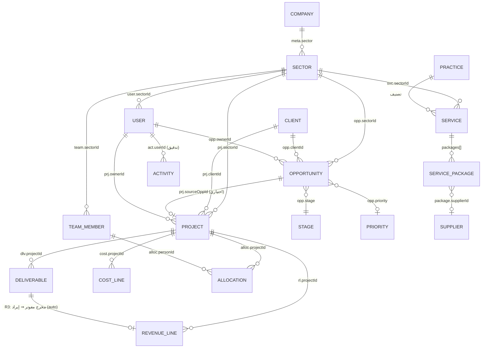

# وثيقة تحليل الأعمال والمتطلبات — منصة «سند» لإدارة أعمال EVC
## الإصدار v1.0 (As-Is) — مبني على استكشاف ميداني فعلي

**الشركة:** رؤية الخبراء الاستشارية (EVC) | **المنصة:** «سند» — `os.evcsol.com` | **إصدار المنصة:** 0.2.0
**تاريخ التحليل:** 2026-07-13 | **الأساس:** معاينة حية (قراءة فقط) + قراءة الكود المصدري + البيانات الحية `/api/state` (revision 890)

> **مفاتيح الوسم:** 🟢 ملاحظة مؤكدة (مشاهدة بدليل) · 🔵 استنتاج · 🟡 افتراض · 🟣 توصية · ⚪ يتطلب قرار إدارة/تحقق خارج المنصة
> **ملاحظة منهجية:** كل رقم أو حقل أو دور ورد أدناه مأخوذ من بيانات المنصة الحية أو كودها المصدري ما لم يوسم بغير ذلك. المصادر العامة (موقع الشركة) استُخدمت لسياق الشركة فقط، لا لوصف المنصة.

---

# 1. الملخص التنفيذي

**ما المنصة؟** 🟢 «سند» منصة داخلية لإدارة أعمال شركة رؤية الخبراء، تقنيًا تطبيق ويب أحادي الصفحة (React) بخادم خلفي على منصة Railway، يخزّن كامل حالة المؤسسة كوثيقة JSON واحدة (`/api/state`). تغطّي دورة الأعمال التجارية: القطاعات ← الفرص ← المشاريع ← المخرجات ← الإيرادات والتكاليف ← التسكين والفريق ← الموازنة، مع لوحات قيادة على مستوى الشركة والقطاع.

**الهدف الاستراتيجي (🔵 من بنية المنصة وبياناتها):** توحيد رؤية الأداء التجاري والمالي والتشغيلي للشركة في نظام واحد بديلًا عن ملفات Excel المتفرقة — فالبيانات الحالية مستوردة فعليًا من تقارير مالية وكشوف تسكين Excel (موثّق في `meta.excelSourceFile` و`syncLog`).

**أهم ما وُجد:**
1. 🟢 **المنصة حيّة وتُستخدم فعلًا** على بيانات حقيقية: 134 فرصة (بقيمة خط أنابيب ~1.28 مليار ريال)، 43 مشروعًا، 90 عميلًا، 342 مخرجًا، 29 عضو فريق برواتبهم، 443 قيد تدقيق. آخر حفظ 2026-07-13.
2. 🟢 **التغطية الفعلية تقتصر على قطاع واحد ونصف:** «الحلول» مكتمل و«الاستشارات» مضاف حديثًا؛ أما «المشاريع الاستراتيجية» و«SAP» فهما **قوالب فارغة** (`placeholder:true`, «بانتظار التفعيل»).
3. 🟢 **نموذج أدوار وصلاحيات موجود** (9 أدوار معرّفة)، لكنه **يُنفَّذ في المتصفح** أساسًا، والخادم يعيد كامل البيانات (ومنها الرواتب) لأي مستخدم مصادَق — فجوة حوكمة/أمان جوهرية.
4. 🟢 **لا يوجد محرك اعتمادات/سير عمل (Workflow) ولا كيانات عقود/فواتير/دفعات/أوامر شراء** ككيانات مستقلة؛ الفرص تنتقل بين مراحل يدويًا، والإيراد يُشتقّ آليًا من المخرجات المفوترة (محرك R3). هذه أكبر فجوة مقابل دورة «الفرصة ← العقد ← الفوترة ← التحصيل» المتوقعة.
5. 🟢 **جودة البيانات تحدٍّ قائم ومُدار:** توجد وحدة «جودة البيانات» مدمجة ترصد 88 مشكلة مصنّفة بالحدّة، وسجل `dataFixes`/`syncLog` يوثّق عمليات تنظيف وتصحيح متكررة (منها تصحيح تضخّم مصروفات بنسبة −80%).
6. 🟢 **يوجد مساعد ذكاء اصطناعي** (OpenAI) قادر على قراءة الملفات والصور و**تنفيذ تعديلات** على الفرص/المشاريع/الإيراد بالأوامر النصية — قدرة قوية لكنها تحمل مخاطر حوكمة وتدقيق وتسريب بيانات.

**أهم الفجوات:** غياب سير عمل الاعتمادات · غياب كيانات التعاقد/الفوترة/التحصيل/المشتريات · تفويض الصلاحيات من جهة المتصفح · تعرّض بيانات حساسة (رواتب/IP) عبر الـAPI · نموذج «وثيقة واحدة» يحدّ من التزامن والتوسّع · اعتماد شبه كامل على الاستيراد اليدوي بدل الإدخال التشغيلي.

**أهم القرارات المطلوبة الآن:**

| القرار | المالك | الأثر |
|--------|--------|-------|
| فرض التفويض (Authorization) وترشيح البيانات الحساسة على مستوى **الخادم** | تقنية المعلومات + الإدارة | يعالج أخطر فجوة أمنية |
| حسم دورة التعاقد والفوترة والتحصيل: هل تُبنى داخل «سند» أم تُتكامل مع نظام مالي (Odoo)؟ | الإدارة العليا + المالية | يحدد نطاق التطوير القادم |
| قرار تفعيل بقية القطاعات (SAP/الاستراتيجية/الاستشارات كاملًا) وخطة إدخال بياناتها | الإدارة العليا | يحوّل «سند» من أداة قطاع إلى منصة شركة |
| سياسة استخدام المساعد الذكي (صلاحياته، تدقيقه، بيانات تُرسل لطرف ثالث) | الإدارة + الأمن | حوكمة وامتثال |
| تدوير كلمة المرور المستخدمة + إنشاء حساب مراجعة «مشاهدة فقط» | مسؤول النظام | أمان فوري |

---

# 2. تعريف المنصة

### 2.1 الهوية
- 🟢 **الاسم:** «سند» (Sanad) — «منصة إدارة أعمال EVC» / «منصة إدارة الأعمال». الشعار: EVC — رؤية الخبراء.
- 🟢 **المالك:** رؤية الخبراء الاستشارية (`meta.org = "EVC — الخبراء الاستشارية"`). النطاق التشغيلي `evcsol.com` (مختلف عن نطاق الشركة العام `evc.sa`؛ ملكية/تشغيل النطاق ⚪ سؤال مفتوح Q7).
- 🟢 **الإعدادات:** السنة المالية 2026 · العملة ريال سعودي (SAR) · اللغة `ar-SA` (RTL) · القطاع الافتراضي SOLUTIONS.

### 2.2 الرؤية والقيمة (🔵 مستنبطة من البنية والبيانات)
تحويل إدارة الأعمال من جداول Excel متناثرة إلى **نظام تشغيل مؤسسي موحّد** يربط: التخطيط (موازنة ومستهدفات) ← التطوير التجاري (فرص وخط أنابيب) ← التنفيذ (مشاريع ومخرجات وتسكين) ← المالية التشغيلية (إيراد وتكلفة وهامش) ← الحوكمة (جودة بيانات، سجل تدقيق، صلاحيات). القيمة: مركزية المعلومة، رؤية فورية للأداء بكل مستوى، وتقليل الاعتماد على الملفات اليدوية.

### 2.3 المستخدمون (🟢 من قائمة المستخدمين الفعلية)
26 مستخدمًا مسجلًا، منهم ~11 لهم اسم دخول فعلي والبقية سجلات فريق «بلا اسم دخول». التوزيع الفعلي للأدوار في القسم 7.

### 2.4 النطاق
| داخل النطاق (🟢 مشاهد) | خارج النطاق حاليًا (🟢 غير موجود) |
|------------------------|-----------------------------------|
| الفرص وخط الأنابيب، المشاريع والمخرجات، الإيراد/التكلفة/الهامش التشغيلي، التسكين الشهري، الفريق والرواتب، العملاء والموردون، كتالوج الخدمات، الموازنة والمستهدفات، جودة البيانات، الاستيراد، إدارة المستخدمين | العقود والفوترة والتحصيل ككيانات · المشتريات وأوامر الشراء · سير عمل الاعتمادات · إدارة الوثائق/التوقيع · الموارد البشرية الكاملة (إجازات/تقييم) · المحاسبة الرسمية |

---

# 3. الوضع الحالي As-Is

### 3.1 البنية التقنية (🟢 من الكود والاستجابات)
- **الواجهة:** React (نسخة إنتاج) + JSX يُصرَّف **في المتصفح** عبر Babel، Tailwind للتنسيق، وXLSX للتصدير. كل الكود في ملف HTML واحد (~472 KB) وكل المكتبات منسوخة محليًا (`/vendor`) بلا اعتماد على CDN خارجي.
- **الخادم:** REST مصغّر على Railway. النقاط: `/api/auth/login`·`/logout` (جلسة بكوكي `evc_session`, HttpOnly)، `/api/state` (GET كامل الحالة / POST حفظ)، `/api/users` (إدارة)، `/api/ai/config`·`/api/ai/chat` (المساعد الذكي).
- **نموذج التخزين:** 🟢 **وثيقة JSON واحدة** لكامل حالة المؤسسة، بعداد نسخة عام (`revision:890`). الحفظ **تفاضلي (delta)** يرسل المفاتيح المتغيرة فقط مع ترويسة `X-Base-Revision` للتزامن التفاؤلي (Optimistic Concurrency).
- **منطق الأعمال في المتصفح:** دالة `applyBusinessRules` تُشغَّل على البيانات بعد جلبها وتُعيد اشتقاق الإيراد وتنظيف المشاريع (القسم 6.2).
- **المصادقة:** bcrypt (كلفة 12)، سياسة `mustChangePassword`، قفل بعد محاولات فاشلة (`failedAttempts`/`lockedUntil`)، سجل دخول (`loginHistory`).

### 3.2 خريطة الوحدات (🟢 من `NAV_COMPANY` + `NAV_SECTOR`)

**أ) وحدات مستوى الشركة** (تظهر لأصحاب نطاق «الشركة» فقط):
| المفتاح | الوحدة | الوظيفة (مشاهدة) |
|---------|--------|-------------------|
| `ceo` | لوحة الرئيس التنفيذي | أداء الشركة المجمّع FY، أداء كل قطاع، أبرز المخاطر، إجمالي خط الأنابيب |
| `portfolio` | محفظة المشاريع | نظرة موحّدة على مشاريع كل القطاعات |
| `sectors` | إدارة القطاعات | تعريف القطاعات ومستهدفاتها وقادتها |

**ب) وحدات مستوى القطاع** (النطاق النشط قابل للتبديل):
| المفتاح | الوحدة | الوظيفة (مشاهدة) |
|---------|--------|-------------------|
| `dashboard` | مركز القيادة | مؤشرات القطاع التشغيلية |
| `followup` | مركز المتابعة | «ما الذي يحتاج انتباهي اليوم» — بنود حرجة/متأخرة |
| `pipeline` | خط الفرص | تمثيل الفرص بمراحلها (Kanban/قمع) |
| `opps` | الفرص | سجل الفرص (إنشاء/تحرير/نقل مرحلة) |
| `projects` | مشاريع القطاع | المشاريع بحالاتها ومالياتها ونسب الإنجاز |
| `internal` | الداخلية والمنتجات | مشاريع/منتجات داخلية غير تعاقدية |
| `revenue` | الإيرادات | أسطر الإيراد (مشتقّة + يدوية) |
| `allocations` | التسكين الشهري | مصفوفة إشغال الأفراد على المشاريع شهريًا |
| `clients` | العملاء | سجل العملاء وأنواعهم |
| `services` | الخدمات الخاصة | كتالوج الخدمات وباقاتها ومورّديها |
| `team` | الفريق | الأعضاء، أدوارهم، **رواتبهم**، إشغالهم |
| `budget` | الموازنة والمستهدفات | مستهدفات الإيراد/المبيعات/الهامش وافتراضات التكلفة |
| `quality` | جودة البيانات | رصد وتصنيف مشكلات البيانات |
| `data` | البيانات والاستيراد | استيراد/تصدير البيانات |
| `users` | المستخدمون والصلاحيات | إدارة الحسابات والأدوار (**adminOnly**) |

### 3.3 نقاط القوة (🟢)
- تغطية وظيفية واسعة تربط التجاري بالمالي بالتشغيلي في مكان واحد، بواجهة عربية RTL أنيقة ومتّسقة.
- **وحدة جودة بيانات مدمجة** وسجل تدقيق (443 قيدًا) — نضج حوكمي نادر في أدوات بهذا الحجم.
- **محرك اشتقاق إيراد** آلي من المخرجات المفوترة (يقلّل الإدخال المزدوج).
- استقلالية عن الإنترنت (vendor محلي) وتصدير Excel مدمج.
- تزامن تفاؤلي بحفظ تفاضلي يقلّل تعارض الحفظ.

### 3.4 نقاط الضعف (🟢/🔵)
- **تفويض من جهة المتصفح** وتعرّض بيانات حساسة عبر الـAPI (القسم 12، R1/R2).
- **نموذج وثيقة واحدة** يحدّ التزامن متعدد المستخدمين والتوسّع مع نمو البيانات.
- **تصريف Babel في المتصفح** لملف 472 KB في كل تحميل (babel نفسه ~3 MB) — كلفة أداء.
- **اعتماد على الاستيراد اليدوي** المتكرر بدل الإدخال التشغيلي (سجل `syncLog` مليء بعمليات إعادة بناء/تنظيف).
- **غياب سير عمل الاعتمادات** والكيانات التعاقدية/المالية الرسمية (القسمان 6 و8).
- ثغرات جودة بيانات فعلية: 71 عميلًا من 90 بلا تصنيف نوع، 88 مشكلة مرصودة، فرص/مشاريع «غير مصنّفة».

---

# 4. الهيكل المؤسسي داخل المنصة

### 4.1 القطاعات (🟢 4 قطاعات، `sectors`)
| القطاع | مستهدف مبيعات | مستهدف إيراد | هامش مستهدف | القائد | الحالة |
|--------|---------------|--------------|-------------|--------|--------|
| قطاع الحلول (SOLUTIONS) | 40M | 32M | 25% | د. ياسر صالح | 🟢 مفعّل ومكتمل |
| قطاع الاستشارات (CONSULTING) | 30M | 24M | 35% | حسن الزعتري | 🟢 مضاف حديثًا (بيانات مستوردة) |
| المشاريع الاستراتيجية (STRATEGIC) | 50M | 40M | 22% | — | 🟢 قالب فارغ (placeholder) |
| قطاع SAP | 35M | 28M | 30% | — | 🟢 قالب فارغ (placeholder) |

> 🔵 استنتاج مهم: رغم أن المنصة تعرض 4 قطاعات، فإن التشغيل الفعلي على قطاعين فقط (الحلول + الاستشارات). القطاعان الآخران هدفان تخطيطيان بلا بيانات.

### 4.2 الممارسات/التخصصات (🟢 5، `practices`)
الابتكار · الذكاء الاصطناعي والبيانات · المدن الذكية · أخرى · استراتيجية القطاع. (ملاحظة: `practices` أخفّ من «الإدارات» — لا توجد كيانات «إدارة/وحدة تنظيمية» صريحة تحت القطاع؛ التقسيم الداخلي يظهر عبر `team[].dept` كنص حر لا ككيان.)

### 4.3 بقية الكيانات الأساسية (🟢 بأعدادها الحية)
الخدمات (15) · العملاء (90؛ حكومي 17، خاص 1، داخلي 1، **بلا تصنيف 71**) · الموردون (33) · الفرص (134) · المشاريع (43) · المخرجات (342) · أسطر الإيراد (31) · أسطر التكلفة (148) · التسكينات (47) · الفريق (29) · المستخدمون (26) · دليل الهوية (25) · النشاط/التدقيق (443).

### 4.4 مخطط العلاقات الفعلي (Entity Relationship Map) — 🟢 مستخرج من الحقول الحقيقية

**فجوات بنيوية ملحوظة (🟢):** لا كيانات لـ: العقد، الفاتورة، الدفعة/التحصيل، أمر الشراء، الاعتماد، الوثيقة، المنافسة (Tender) الرسمية، مؤشر الأداء (KPI) المستقل. الفرصة والمشروع مرتبطان بربط ضعيف اختياري (`sourceOppId` قد يكون فارغًا). لا كيان «إدارة/وحدة» تحت القطاع.

---

# 5. رحلات المستخدمين (🟢 مبنية على الوحدات والصلاحيات الفعلية)

**نقطة الهبوط بحسب الدور (🟢 من الكود):** القيادة (نطاق شركة) تهبط على `ceo`؛ بقية الأدوار تهبط على `followup` («مركز المتابعة»).

### 5.1 الرئيس التنفيذي / مكتب الرئيس التنفيذي (نطاق شركة)
دخول ← لوحة `ceo`: يرى الأداء المجمّع (إيراد 61.19M/96M = 64%، مبيعات 90.6M/120M = 76% — أرقام حية)، بطاقة لكل قطاع، أبرز مخاطر الشركة، إجمالي خط الأنابيب (1121.92M) ← ينتقل لمحفظة المشاريع أو يغوص في قطاع. **لا توجد نقاط اعتماد** في رحلته (لا محرك موافقات) — الرحلة رقابية/تحليلية بحتة.

### 5.2 قائد القطاع (sector_lead / sector_manager)
دخول ← `followup` ثم `dashboard` قطاعه ← يدير الفرص (إنشاء/نقل مرحلة)، يراقب مشاريع القطاع ومالياتها، يعتمد الموازنة والمستهدفات، يراجع التسكين والفريق. صلاحيته تعديل واسعة داخل قطاعه (القسم 7).

### 5.3 مدير تطوير الأعمال (bd_manager)
دخول ← `pipeline`/`opps`: يبني ويحدّث الفرص وخط الأنابيب، يحرّك المراحل (LEAD→QUALIFIED→PROPOSAL→WON/LOST)، يدير العملاء والخدمات. لا صلاحية على المشاريع/التسكين/الإيراد.

### 5.4 مدير المشروع (project_manager) *(دور معرّف، غير مُسنَد لأحد حاليًا 🟢)*
تصميمه: تعديل المشاريع والتسكين والاستيراد. **لا يوجد مستخدم بهذا الدور اليوم** — فجوة بين التصميم والتفعيل.

### 5.5 المالية (finance) *(دور معرّف، غير مُسنَد حاليًا)*
تصميمه: تعديل الإيراد والاستيراد. غياب إسناده يعني أن الإيراد يُدار اليوم عبر admin/قائد القطاع.

### 5.6 الاستشاري (consultant) / المشاهد (viewer) / USER
قراءة غالبًا. «USER» و«viewer» يُعاملان كـ«مشاهدة فقط» في الكود. 16 عضوًا بدور USER بلا اسم دخول = سجلات فريق لأغراض التسكين والرواتب لا حسابات دخول.

### 5.7 مسؤول النظام (admin)
دخول ← أي وحدة + وحدة «المستخدمون والصلاحيات»: ينشئ الحسابات، يمنح الأدوار والقطاعات، يولّد كلمات مرور، يعطّل الحسابات (الخادم يمنعه من تعطيل نفسه/خفض دوره — إنفاذ خادمي جزئي مؤكد 🟢). **الرواتب تظهر له وحده** (بحسب ملاحظة الواجهة — إنفاذها الخادمي يحتاج تحققًا S2).

---

# 6. العمليات وسير العمل

### 6.1 دورة الفرصة → المشروع → الإيراد (🟢 كما هي فعلًا)

| العملية | نقطة البداية | المسؤول | المدخلات | الخطوات/الحالات | الاعتمادات | المخرجات | الاستثناءات |
|---------|---------------|---------|----------|------------------|-------------|-----------|--------------|
| إدارة الفرصة | إنشاء فرصة | bd_manager/قائد قطاع | عميل، قطاع، قيمة، مالك، أولوية، مصدر | مراحل: LEAD(10%)→QUALIFIED(25%)→PROPOSAL/تقييم العميل(50%)→WON(100%)/LOST(0%)/ON_HOLD | 🟢 **لا اعتماد رسمي** — نقل المرحلة يدوي | فرصة بمرحلة واحتمالية | `excludeFromSales` يستبعد فرصة من المبيعات؛ فجوة ترتيب المراحل (لا مرحلة order=4، غالبًا «تفاوض» محذوفة) |
| تحويل لمشروع | فوز الفرصة (WON) | قائد قطاع/admin | الفرصة الفائزة | 🟢 **لا إنشاء آلي** (عُطّلت R1 لتفادي «مشاريع شبح») — المشروع يُنشأ يدويًا أو يأتي برمز مالي من المالية، ويُربط بالاسم | — | مشروع مرتبط بـ`sourceOppId` | قد يبقى مشروع بلا فرصة والعكس |
| تنفيذ المشروع | مشروع مفتوح | قائد قطاع/(مدير مشروع) | نطاق، موازنة، تواريخ | حالات: IN_PROGRESS(31)/COMPLETED(11)/ON_HOLD(1)؛ تتبّع نسبة إنجاز وصرف وهامش وحالة (على المسار/في خطر/حرج) | — | تقدّم المشروع | — |
| إدارة المخرجات | مخرج ضمن مشروع | الفريق | اسم، مبلغ، شهر، مرحلة | حالات: PENDING(83)/DELIVERED(248)/INVOICED(10)/PAID(1) | 🟢 لا اعتماد مخرج رسمي | مخرج بحالة | 🔵 اختناق: 248 مُسلَّم مقابل 11 مفوتر/مدفوع فقط → فجوة تحصيل/تسجيل |
| اشتقاق الإيراد | مخرج → INVOICED/PAID | آلي (محرك R3) | المخرج المفوتر | 🟢 **آلي**: يُنشأ سطر إيراد `rl_dlv_<id>` بقيمة المخرج وشهره وسنته | — | سطر إيراد (auto) | يُحذف السطر تلقائيًا إن رجع المخرج لغير مفوتر |
| التسكين | إشغال شخص على مشروع | قائد قطاع/(مدير مشروع) | شخص، مشروع، أشهر، نوع (أساسي/موسمي) | مصفوفة `monthly{شهر:نسبة}` | — | تسكين شهري | تعيين متأخر/موسمي/مغادرة يُدار كأعلام |
| الموازنة | تخطيط سنوي | قائد قطاع/admin | مستهدفات + افتراضات تكلفة (%) | إدخال مستهدف إيراد/مبيعات/هامش وتوزيع شهري | 🟢 اعتماد ضمني (تعديل مقيّد بالصلاحية) | خطة FY | — |

### 6.2 محرك قواعد الأعمال (🟢 من `applyBusinessRules`، يعمل في المتصفح)
- **R1 (مُعطّلة عمدًا):** كانت تنشئ مشروعًا لكل فرصة فائزة — أُوقفت لأنها ولّدت «مشاريع شبح» لوّثت البيانات. تبقّى منها فقط «تبنّي» مشروع خارجي موجود بنفس الاسم.
- **R2:** تقليم المشاريع الآلية القديمة التي لم تعد فرصتها فائزة وبلا أي أثر (لا مخرجات/إيراد/تكلفة/تسكين).
- **R3:** كل مخرج بحالة INVOICED/PAID وقيمة موجبة ⇒ سطر إيراد آلي (upsert)، ويُحذف عند التراجع.

> 🔵 ملاحظة معمارية: تشغيل منطق الأعمال والاشتقاق **في المتصفح** ثم حفظ النتيجة يعني أن سلامة البيانات المشتقّة تعتمد على العميل — يفضّل نقلها للخادم (توصية القسم 13).

### 6.3 ما هو غائب من دورة التشغيل المتوقعة (🟢 فجوات)
دراسة جدوى/قرار Go-No-Go رسمي · إعداد عرض بنسخ فنية/مالية · **اعتماد متسلسل** للعرض/التسعير · كيان منافسة (Tender) بمواعيد وضمانات · **تعاقد** رسمي (توقيع، دفعات تعاقدية) · **فوترة وتحصيل** ككيان مستقل مربوط بدفعات العقد · **مشتريات** وأوامر شراء للموردين · إغلاق مشروع وتقييم/دروس مستفادة رسمية. (`directives` و`sessions` فارغتان — ربما بذرة ميزات مستقبلية.)

---

# 7. الأدوار والصلاحيات

### 7.1 الأدوار المعرّفة (🟢 `SANAD_ROLES` — 9 أدوار)
مدير النظام (admin) · مكتب الرئيس التنفيذي (ceo_office) · قائد قطاع (sector_lead) · مدير تطوير الأعمال (bd_manager) · مدير مشروع (project_manager) · المالية (finance) · العمليات (operations) · استشاري (consultant) · مشاهدة فقط (viewer).

### 7.2 الأدوار المُسنَدة فعلًا (🟢 من 26 مستخدمًا)
| الدور | العدد | ملاحظة |
|-------|-------|--------|
| admin | 1 | مسؤول النظام |
| sector_manager*→ sector_lead | 3 | *`sector_manager` يُعامل كـ`sector_lead` في الكود |
| sector_lead | 1 | |
| bd_manager | 2 | |
| consultant | 1 | |
| viewer | 2 | (1 معطّل) |
| USER → viewer | 16 | سجلات فريق، غالبًا بلا اسم دخول |

> 🟢 **فجوة تفعيل:** الأدوار `ceo_office` · `project_manager` · `finance` · `operations` **معرّفة في نموذج الصلاحيات لكنها غير مُسنَدة لأي مستخدم** — فجوة بين تصميم RBAC وتطبيقه.

### 7.3 مصفوفة الصلاحيات الفعلية (🟢 مستخرجة حرفيًا من كائن `perm`)
النطاق: نطاق «الشركة» (`isCompany`) لـ admin وceo_office؛ غيرهم مقيّد بقطاعه (`sectorId`).

| الصلاحية (الفعلية في الكود) | الأدوار التي تملكها |
|------------------------------|----------------------|
| تعديل الفرص (`canEditOpps`) | admin · sector_lead · bd_manager |
| تعديل المشاريع (`canEditProjects`) | admin · sector_lead · project_manager · operations |
| تعديل التسكين (`canEditAllocs`) | admin · sector_lead · project_manager · operations |
| تعديل الإيراد (`canEditRevenue`) | admin · sector_lead · finance |
| تعديل الموازنة (`canEditBudget`) | admin · sector_lead |
| تعديل الخدمات (`canEditServices`) | admin · sector_lead · bd_manager |
| الاستيراد (`canImport`) | admin · sector_lead · bd_manager · project_manager · finance · operations |
| إدارة القطاعات (`canAdminSectors`) | admin فقط |
| إدارة المستخدمين (وحدة `users`) | admin فقط (`adminOnly`) |
| رؤية وحدات الشركة (ceo/portfolio/sectors) | نطاق الشركة (admin/ceo_office) فقط |

**قيود مؤكدة إضافية (🟢):**
- «مشاهدة فقط» (viewer/USER): كل محاولات الحفظ تُرفض في العميل (`deniedSave`: «وضع المشاهدة — صلاحيتك لا تسمح بالتعديل»).
- الخادم يمنع المستخدم من **تعطيل حسابه أو خفض دوره** بنفسه (إنفاذ خادمي مؤكد من ملاحظة الواجهة).
- **الرواتب**: تُعرض لمدير النظام فقط (بحسب الواجهة). إنفاذها الخادمي ⚪ يحتاج تحقق (S2).

### 7.4 الفجوة الحوكمية الجوهرية (🟢/🔵)
مصفوفة `perm` تُحسب **في المتصفح** من بيانات المستخدم التي يعيدها الخادم أصلًا. و`/api/state` يعيد **كامل الحالة** (رواتب، ماليات كل القطاعات، سجلات دخول) لأي مستخدم مصادَق. النتيجة المرجّحة (🔵، تحتاج تأكيدًا بحساب viewer دون تعديل): **أي مستخدم مصادَق يستطيع قراءة كل البيانات عبر الـAPI مباشرة، والواجهة وحدها هي التي تُخفيها**. هذه أخطر فجوة (القسم 12، R1).

---

# 8. كتالوج الخصائص (🟢 عيّنة تمثيلية — لكل وحدة خاصيتها الأساسية)

| الوحدة | الخاصية | المستخدم | المخرجات | الحالة الحالية | الفجوة | الأولوية |
|--------|---------|----------|-----------|----------------|--------|----------|
| ceo | أداء الشركة المجمّع + مخاطر | القيادة | لوحة KPIs حية | 🟢 تعمل جيدًا | لا تنبيهات استباقية/تصدير | Should |
| portfolio | محفظة كل المشاريع | القيادة | جدول موحّد | 🟢 تعمل | لا مقارنة عبر السنوات | Could |
| pipeline/opps | إدارة الفرص والمراحل | تطوير الأعمال | فرص بمراحل واحتمالية | 🟢 تعمل | بلا اعتماد/دراسة جدوى/تحويل آلي | Must |
| projects | مشاريع بحالات وماليات وإنجاز | قائد قطاع | بطاقات مشاريع + أعلام خطر | 🟢 تعمل بعمق | لا خطة/جدول زمني تفصيلي، لا عقد مرتبط | Should |
| revenue | أسطر إيراد (مشتقّة+يدوية) | المالية | إيراد شهري | 🟢 تعمل (محرك R3) | لا ربط بفواتير فعلية/تحصيل | Must |
| allocations | تسكين شهري (مصفوفة إشغال) | قائد قطاع | نِسَب إشغال/شخص/شهر | 🟢 تعمل | لا سعة/تعارض/تكلفة إشغال ظاهرة للجميع | Should |
| team | أعضاء + **رواتب** + إشغال | admin | فاتورة رواتب + إشغال | 🟢 تعمل | تعرّض بيانات حساسة (حوكمة) | Must (حوكمة) |
| clients | سجل العملاء + دمج مكرر | تطوير الأعمال | عملاء بأنواع | 🟡 ناقصة | 71/90 بلا تصنيف نوع | Should |
| services | كتالوج خدمات + باقات + موردون | قائد قطاع | خدمات وأسعار | 🟡 ناقصة | الأسعار/التكاليف = 0 (لم تُعبّأ) | Should |
| budget | مستهدفات + افتراضات تكلفة | قائد قطاع | خطة FY | 🟢 تعمل | افتراضات ثابتة، لا سيناريوهات | Could |
| quality | رصد مشكلات البيانات | admin/قائد | 88 مشكلة مصنّفة | 🟢 نقطة قوة | معالجة يدوية، لا منع عند الإدخال | Should |
| data | استيراد/تصدير | admin/قائد | تحميل بيانات | 🟢 تعمل | الاعتماد الأساسي عليها بدل الإدخال | Must (تحوّل) |
| users | إدارة حسابات وأدوار | admin | حسابات + أدوار | 🟢 تعمل | RBAC من جهة العميل (أمان) | Must |
| مساعد ذكي | Q&A + تعديل بيانات + قراءة ملفات/صور | admin (تفعيل) | إجابات + تعديلات مطبّقة | 🟢 موجودة | حوكمة/تدقيق/تسريب لطرف ثالث | Must (سياسة) |
| — | **الاعتمادات/سير العمل** | الكل | — | 🔴 غير موجودة | كامل المحرك مفقود | Must |
| — | **العقود/الفوترة/التحصيل/المشتريات** | المالية/العقود | — | 🔴 غير موجودة | كيانات ودورات مفقودة | Must |
| — | **الوثائق/التوقيع الإلكتروني** | الكل | — | 🔴 غير موجودة | لا إدارة وثائق | Should |

> كتالوج كامل لكل خاصية (هدف/مدخلات/مخرجات/صلاحيات/ارتباطات/استثناءات) يُبنى تدريجيًا في ملف منفصل عند مرحلة التصميم؛ الجدول أعلاه يغطي المستوى القراري.

---

# 9. نموذج البيانات (🟢 الحقول الفعلية من `/api/state`)

| الكيان | حقول جوهرية فعلية | العلاقات |
|--------|--------------------|----------|
| **sector** | id, nameAr/En, color, leadId, managerId, targetSalesSar, targetRevenueSar, targetGrossMarginPct, active, placeholder | ← services/opps/projects/team |
| **practice** | id, nameAr/En, color | ← تصنيف الخدمات |
| **service** | id, nameAr/En, category, status, sectorId, ownerId, summary, **packages[]**(nameAr, priceSar, costSar, supplierId), links[], attachments[], audit[], source | → sector, → supplier |
| **supplier** | id, nameAr/En, org, contactPerson, phone, email, status, notes, source | ← service packages |
| **client** | id, code, nameEn/Ar, type(حكومي/خاص/داخلي), active, aliases[] (دمج مكرر) | ← opps/projects |
| **opportunity** | id, code, titleAr, clientId, sectorId, stage, winPct, valueSar, ownerId, priority, year, excludeFromSales, nextAction, notes, riskFlags[], source, stageChangedAt, createdAt | → client/sector/owner/stage |
| **project** | id, code, financialCode, nameAr, clientId, ownerId, status, budgetSar, actualSpendSar, revenueSar, profitSar, marginPct, contractValueSar, poValueSar, startDate, endDate, progressPct, sectorId, pm, sourceOppId, kind(internal/external/product), sectorProject, revenueSarAllYears | → client/owner/sector/opp |
| **deliverable** | id, projectId, nameAr, amountSar, month, phase, phaseNameAr, status(PENDING/DELIVERED/INVOICED/PAID), deliveredAt, notes, sectorId, year | → project → (R3) revenueLine |
| **revenueLine** | id, projectId, sourceProject, sourceOppId, sectorId, amountSar, month, year, label, auto, ruleId, derivedFrom | ← deliverable/project |
| **costLine** | id, projectId, month, type(رواتب/…), amountSar, year, sectorId, source | → project |
| **allocation** | id, personId, personNameAr, projectId, projectName, type(مشروع/…), monthly{شهر:نسبة}, monthStart/End, year, sectorId, source | → person(team)/project |
| **team member** | id, nameEn/Ar, role(نص حر), dept(نص حر), **salarySar**, status, type(أساسي/موسمي), active, sectorId, seasonal | → sector, ← allocations |
| **user** | id, nameEn/Ar, role(RBAC), email, active, username, managedProjectIds[], mustChangePassword, failedAttempts, lockedUntil, lastLoginAt, **loginHistory[]**(at, **ip**, userAgent, ok) | ← activity |
| **directory** | id, nameAr/En, role, sectorId, scope, email | دليل هوية خفيف |
| **activity** | id, at, userId, username, role, sectorId, kind(state-save), changes | سجل تدقيق |
| **meta/budget** | version, org, sector, fiscalYear, currency, revision, syncLog[], dataFixes[], migrations{} / fy, targetRevenueSar, targetGrossMarginPct, costAssumptions{}, monthlyRevenue[], targetSalesSar | إعدادات وتخطيط |

**ثوابت مرجعية (🟢):** stages (6: LEAD/QUALIFIED/PROPOSAL/WON/LOST/ON_HOLD بنِسَب فوز افتراضية) · priorities (4: P0–P3).

**ملاحظات نموذجية (🟢/🔵):** المعرّفات نصية وصفية (`u_…`, `p_…`, `o_…`). لا كيان «إدارة/وحدة» (يُمثّل كنص في `team.dept`). لا كيان عقد/فاتورة/دفعة/مشتريات/اعتماد/وثيقة/KPI. الحذف في الغالب **منطقي** (`active:false`) لا فعلي. سلامة الإيراد المشتقّ تعتمد على محرك العميل.

---

# 10. التقارير ولوحات المعلومات (🟢 الموجود فعلًا)

| المستوى | ما هو متاح فعلًا في المنصة |
|---------|----------------------------|
| الشركة/الرئيس التنفيذي | لوحة `ceo`: إيراد ومبيعات محقّقة مقابل المستهدف (نِسَب %)، أداء كل قطاع، أبرز المخاطر، إجمالي خط الأنابيب؛ + `portfolio` (محفظة موحّدة) |
| القطاع | `dashboard` (مؤشرات تشغيلية)، `followup` (بنود تحتاج انتباهًا)، `pipeline` (قمع الفرص) |
| المشاريع | حالات، صرف/إنجاز/هامش، أعلام (على المسار/في خطر/حرج)، مخرجات تحتاج انتباهًا |
| المالية التشغيلية | إيراد شهري (مشتقّ)، تكاليف حسب النوع، هامش فعلي مقابل مستهدف |
| الموارد | خريطة تسكين شهرية، متوسط إشغال، فاتورة رواتب |
| الحوكمة | جودة البيانات (88 مشكلة مصنّفة)، سجل تدقيق (443 قيدًا) |
| التصدير | تصدير Excel مدمج (XLSX) |

**فجوات التقارير (🟢/🟣):** لا تقارير تحصيل/أعمار ذمم (لغياب كيان الفاتورة/الدفعة) · لا تدفق نقدي متوقع فعلي · لا معدّل فوز (Win-rate) صريح كتقرير · لا KPIs مؤسسية مستقلة · لا تنبيهات/اشتراكات تقارير مجدولة · التقارير عرضية لحظية لا مؤرشفة.

---

# 11. التكاملات

| التكامل | الحالة | الدليل |
|---------|--------|--------|
| OpenAI (المساعد الذكي) | 🟢 **موجود** (اختياري) | `/api/ai/chat`·`/api/ai/config`، يتطلب `OPENAI_API_KEY` على الخادم؛ يقرأ صورًا/ملفات ويطبّق تعديلات |
| استضافة Railway | 🟢 موجود | ترويسات `server: railway-hikari`, `x-railway-*` |
| تصدير Excel (XLSX) | 🟢 موجود (محلي) | مكتبة `xlsx.full.min.js` |
| **استيراد Excel** (مصدر البيانات الأساسي) | 🟢 موجود (يدوي) | `meta.excelSourceFile`, `excelSourceSheets`, وحدة `data` |
| نظام Odoo (ERP) | ⚪ **بحاجة قرار** | 🔵 مصدر عام يثبت أن الشركة عميل Odoo. لا دليل تكامل تقني في «سند». السؤال: مصدر الحقيقة المالي؟ (Q4) |
| البريد/الإشعارات الخارجية | 🟡 غير مرصود | لا نقطة إشعار بريدي ظاهرة؛ التنبيهات داخل المنصة فقط |
| تخزين وثائق/سحابي | 🟡 غير مرصود | `attachments[]` موجودة كحقل؛ آلية التخزين الفعلية غير مؤكدة |
| نظام مالي رسمي / رواتب HR | ⚪ بحاجة قرار | الرواتب داخل «سند» كنص؛ لا ربط بنظام رواتب |
| التوقيع الإلكتروني | 🔴 غير موجود | مطلوب محتمل للعقود/الاعتمادات 🟣 |
| منصات المنافسات الحكومية (اعتماد…) | 🔴 غير موجود | 🟡 وجاهته من طبيعة العملاء الحكوميين (17 جهة) — قرار |
| SSO / MFA | 🟡 جزئي | مصادقة محلية بكلمة مرور + قفل؛ لا SSO/MFA مرصود |

---

# 12. الفجوات والمخاطر (مرتّبة بالأولوية)

| # | الفجوة/الخطر | الوسم | الأثر | الاحتمال | الأولوية | التوصية | المالك |
|---|---------------|-------|-------|----------|-----------|----------|--------|
| R1 | **تفويض من جهة المتصفح** + `/api/state` يعيد كل البيانات (رواتب/ماليات/IP) لأي مستخدم مصادَق | 🟢/🔵 | مرتفع جدًا (تسرّب) | مرتفع | P0 | فرض التفويض وترشيح الحقول الحساسة **على الخادم**؛ نقاط API لكل مورد حسب الدور والقطاع | تقنية المعلومات |
| R2 | تعرّض **عناوين IP** وسجلات دخول المستخدمين عبر `/api/users` | 🟢 | متوسط–مرتفع (خصوصية) | واقع | P1 | تقييد الحقول الحساسة للأدمن فقط خادميًا + مراجعة الحاجة لتخزين IP | تقنية المعلومات + الأمن |
| R3 | **غياب سير عمل الاعتمادات** لكل القرارات (فرصة/تسعير/مصروف/مخرج) | 🟢 | مرتفع (حوكمة) | واقع | P0 | إدخال محرك موافقات بحدود ومسارات وتدقيق | الإدارة + التطوير |
| R4 | **غياب كيانات العقد/الفاتورة/الدفعة/المشتريات** → لا دورة تعاقد/تحصيل | 🟢 | مرتفع (مالي) | واقع | P0 | قرار: بناء داخلي أم تكامل مع نظام مالي؛ ثم تصميم الكيانات | الإدارة + المالية |
| R5 | ازدواج محتمل لمصدر الحقيقة المالي مع Odoo | 🔵 | مرتفع إن صح | متوسط | P1 | حسم العلاقة (إحلال/تكامل/تعايش) قبل توسيع المالية | الإدارة العليا |
| R6 | **نموذج وثيقة JSON واحدة** يحدّ التزامن والتوسّع | 🟢/🔵 | متوسط–مرتفع (قابلية توسّع) | يتزايد مع النمو | P1 | ترحيل تدريجي لنموذج بيانات مُقسّم (لكل كيان جدوله) مع الحفاظ على الواجهة | تقنية المعلومات |
| R7 | **الاعتماد على الاستيراد اليدوي** المتكرر بدل الإدخال التشغيلي | 🟢 | متوسط (تشغيلي) | واقع | P1 | تحويل تدريجي للإدخال المباشر + منع أخطاء عند المصدر | العمليات + التطوير |
| R8 | **جودة البيانات**: 71 عميلًا بلا نوع، أسعار خدمات=0، فرص/مشاريع غير مصنّفة، 88 مشكلة مرصودة | 🟢 | متوسط | واقع | P1 | حملة تنظيف + قواعد إلزام حقول عند الإدخال | مالكو البيانات بكل قطاع |
| R9 | **منطق الأعمال (اشتقاق الإيراد) في المتصفح** | 🔵 | متوسط (سلامة بيانات) | متوسط | P2 | نقل `applyBusinessRules` للخادم كمصدر حقيقة | التطوير |
| R10 | **المساعد الذكي يعدّل بيانات** ويرسلها لطرف ثالث (OpenAI) | 🟢 | متوسط–مرتفع (حوكمة/امتثال) | حسب الاستخدام | P1 | سياسة استخدام + تقييد صلاحياته + تدقيق كل تعديل + مراجعة تصنيف البيانات المرسلة | الإدارة + الأمن |
| R11 | **تفعيل ناقص للأدوار**: ceo_office/project_manager/finance/operations معرّفة بلا إسناد | 🟢 | متوسط | واقع | P2 | إسناد الأدوار الفعلية أو تنظيف غير المستخدم | مسؤول النظام |
| R12 | تصريف Babel في المتصفح لملف كبير | 🟢 | منخفض–متوسط (أداء) | واقع | P2 | بناء مسبق (build step) بدل التصريف اللحظي | التطوير |
| R13 | حساب admin شخصي عالي الصلاحية + كلمة مرور متداولة نصًا | 🟢/🟣 | متوسط (أمان) | واقع | P1 | تدوير كلمة المرور + حساب مراجعة «مشاهدة فقط» + مبدأ أقل صلاحية | مسؤول النظام |

---

# 13. التصور المستهدف To-Be

> فصل صارم: **ما شوهد 🟢 / ما استُنتج 🔵 / ما يُقترح 🟣 / ما يحتاج قرار ⚪**.

**ما شوهد (الأساس القائم):** منصة عاملة تغطّي التجاري والتشغيلي والمالي‑التشغيلي لقطاع الحلول بعمق، مع حوكمة بيانات وتدقيق ومساعد ذكي.

**ما يُقترح بناؤه (🟣):**
1. **طبقة تفويض خادمية** (P0): نقاط API لكل مورد، ترشيح حسب الدور والقطاع، حجب الحقول الحساسة (رواتب/هوامش/IP) في الخادم — لا في المتصفح.
2. **محرك اعتمادات وسير عمل** (P0): مسارات موافقة قابلة للتهيئة بحدود مالية، لقرار المشاركة والتسعير واعتماد المخرج والمصروف، مع سجل تدقيق لكل خطوة.
3. **الدورة التعاقدية–المالية** (P0/⚪): كيانات العقد ← الدفعات التعاقدية ← الفاتورة ← التحصيل ← أعمار الذمم؛ وربط المشتريات/أوامر الشراء بالموردين. **مشروط بقرار العلاقة مع Odoo (Q4)**.
4. **نقل منطق الأعمال للخادم** (🟣): جعل الاشتقاق والتحقق مصدر حقيقة واحدًا.
5. **تحوّل من الاستيراد للإدخال** (🟣): إدخال تشغيلي مباشر مع قواعد إلزام تمنع مشكلات الجودة عند المصدر، مع إبقاء الاستيراد للترحيل الأولي.
6. **تفعيل بقية القطاعات** (⚪): خطة إدخال بيانات SAP/الاستراتيجية/إكمال الاستشارات لتصبح «سند» منصة شركة لا أداة قطاع.

**ما يحتاج قرار إدارة (⚪):** مصدر الحقيقة المالي (سند مقابل Odoo) · هل يدخل مستخدمون خارجيون (عميل/مورّد) · متطلبات الامتثال (بيانات حكومية/ضوابط الأمن السيبراني) · سياسة الذكاء الاصطناعي.

---

# 14. خارطة الطريق

| الأفق | العناصر | Business Value | Urgency | Complexity | Dependencies | MoSCoW |
|-------|---------|:---:|:---:|:---:|--------------|:---:|
| **إصلاحات عاجلة** | تفويض خادمي (R1) · حجب الرواتب/IP (R2) · تدوير كلمة المرور + حساب مراجعة (R13) | عالٍ | عالٍ | متوسط | — | **Must** |
| **قصير المدى** | محرك اعتمادات أساسي (R3) · حملة تنظيف بيانات + إلزام حقول (R8) · إسناد/تنظيف الأدوار (R11) · سياسة المساعد الذكي (R10) | عالٍ | عالٍ | متوسط | R1 | **Must/Should** |
| **متوسط المدى** | الدورة التعاقدية–المالية (R4) · حسم Odoo (R5) · نقل منطق الأعمال للخادم (R9) · تحوّل للإدخال التشغيلي (R7) | عالٍ | متوسط | عالٍ | قرار Q4 | **Should** |
| **استراتيجي مستقبلي** | ترحيل نموذج البيانات المُقسّم (R6) · بناء مسبق للأداء (R12) · تفعيل بقية القطاعات · SSO/MFA · إدارة وثائق/توقيع · KPIs مؤسسية وتنبيهات مجدولة · بوابة خارجية (عميل/مورّد) | متوسط–عالٍ | منخفض–متوسط | عالٍ | عدة | **Could/Later** |

---

# 15. الأسئلة المفتوحة (ما لا يُحسم من المنصة وحدها)

| # | السؤال | الأثر | المُجيب |
|---|--------|-------|---------|
| Q1 | ما مصدر الحقيقة المالي المعتمد: «سند» أم Odoo أم نظام آخر؟ وكيف تُدار الفوترة والتحصيل فعليًا اليوم؟ | يحدد نطاق أكبر تطوير قادم (R4/R5) | الإدارة + المالية |
| Q2 | هل يُراد بناء الدورة التعاقدية–المالية وسير الاعتمادات **داخل** سند، أم تكاملًا مع نظام قائم؟ | يوجّه المعمارية | الإدارة العليا |
| Q3 | ما خطة تفعيل بقية القطاعات (SAP/الاستراتيجية/إكمال الاستشارات) ومن يملك إدخال بياناتها؟ | يحوّل سند لمنصة شركة | الإدارة العليا + قادة القطاعات |
| Q4 | ما الهيكل التنظيمي الرسمي (إدارات/وحدات تحت القطاع)؟ المنصة لا تمثّله ككيان (نص حر في `dept`) | يحدد الحاجة لكيان «إدارة» ونطاق الصلاحيات | الإدارة العليا |
| Q5 | ما حدود الاعتماد المالية (سقوف المدير/القطاع/الرئيس التنفيذي)؟ | يضبط محرك الموافقات المقترح | الإدارة + المالية |
| Q6 | ما سياسة الوصول للبيانات الحساسة (رواتب/هوامش)؟ من يراها فعلًا؟ | يوجّه طبقة التفويض الخادمية | الإدارة + الموارد البشرية |
| Q7 | من يملك ويشغّل نطاق `evcsol.com` والمنصة (فريق داخلي/مورّد)؟ وما وضع الكود والنسخ الاحتياطي والبيئات؟ | استمرارية وأمن وقابلية تطوير | تقنية المعلومات |
| Q8 | ما سياسة استخدام المساعد الذكي: صلاحياته، تدقيق تعديلاته، وتصنيف البيانات المسموح إرسالها لـOpenAI؟ | حوكمة وامتثال | الإدارة + الأمن |
| Q9 | هل سيدخل مستخدمون خارجيون (عميل/مورّد) في النطاق المستهدف؟ | يغيّر متطلبات الأمن والبوابات | الإدارة العليا |
| Q10 | ما متطلبات الامتثال للبيانات الحكومية (ضوابط الأمن السيبراني الوطنية/تصنيف البيانات)؟ | يحكم الاستضافة والوصول والتدقيق | الإدارة + القانونية |

---

## ملحق أ — أدلة كمية مختارة (🟢 من `/api/state`, revision 890)
- **الفرص (134):** LEAD 49 · QUALIFIED 18 · PROPOSAL 15 · WON 31 · LOST 8 · ON_HOLD 13 | قيمة خط الأنابيب ~1.28 مليار ريال | الحلول 108 · الاستشارات 23 · الاستراتيجية 1.
- **المشاريع (43):** IN_PROGRESS 31 · COMPLETED 11 · ON_HOLD 1 | داخلي 34 · خارجي 9 | الحلول 20 · الاستشارات 23.
- **المخرجات (342):** DELIVERED 248 · PENDING 83 · INVOICED 10 · PAID 1 (فجوة تحصيل/تسجيل واضحة).
- **العملاء (90):** حكومي 17 · خاص 1 · داخلي 1 · **بلا نوع 71**.
- **الفريق (29):** إجمالي فاتورة الرواتب الشهرية ~369,544 ريال.
- **التدقيق (443):** كلها من نوع `state-save` مع فروقات العدّ (was/now) والمستخدم والدور.
- **الموازنة FY2026:** مستهدف إيراد 32M · مستهدف مبيعات 40M · هامش 25% · افتراضات تكلفة (رواتب تشغيل 22% · أتعاب استشاريين 5% · مصاريف تعاقد باطني 40% · أخرى 8%).

## ملحق ب — سجل المصادر
- بيانات وكود المنصة الحية (قراءة فقط): `os.evcsol.com` — `/api/state`, `/api/users`, والكود المصدري للواجهة.
- سياق الشركة (عام): [evc.sa](https://evc.sa/en/) · [Odoo customer ref](https://www.odoo.com/customers/evc-experts-vision-consulting-7037515) · [LinkedIn](https://www.linkedin.com/company/evcsa).

## ملحق ج — الأدلة البصرية
17 لقطة شاشة لكل وحدات المنصة، مرفقة مع تسليم هذه الوثيقة (لوحة الرئيس التنفيذي، المشاريع، الفريق/الرواتب، جودة البيانات، المستخدمون، الفرص، التسكين، وغيرها).
