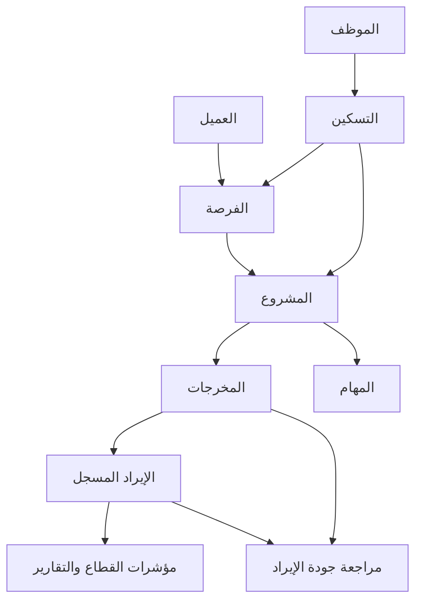

# سند — مخطط التطوير الحي

الحالة: v5.75 وv5.76 منفذتان محليًا، غير منشورتين. الأساس: `1efbea3`، 2026-09-05.
المراجع: قواعد المستودع، ARCHITECTURE، FEATURES، KNOWN-ISSUES، ودليل المالك المؤرخ 2026-09-05.

## توزيع العمل والوصول

| الأداة أو الدور | المسؤولية | الحدود والحالة المتحققة |
|---|---|---|
| المالك عبر ChatGPT | أهداف العمل وحسم السياسة المالية وقبول تجربة كل دفعة | لا يُستبدل اعتماده بتوصية وكيل |
| Codex داخل المستودع | التحقيق والتنفيذ والاختبارات وتحديث الوثائق | نسخة محلية على الفرع المسموح؛ لا كتابة على بيانات التشغيل |
| مراجعة التغيير | فحص المتطلب والفروقات والصلاحيات والدليل المرئي | مراجعة قبل الإصدار، لا يكفي تلخيص الكاتب |
| GitHub | مرجع الكود والقرارات وطلبات التغيير وCI | المالك اعتمد الرفع صراحة؛ المحاولة التالية فشلت لغياب مصادقة GitHub في التنفيذ. الإضافة لم ترتبط بعد؛ لا طلب اعتماد جديد |
| Railway | تشغيل النسخة المقبولة والسجلات والنسخ الاحتياطي | المالك قدم رمز وصول؛ اختبار الاتصال بالمصادقة أعاد HTTP 403 / 1010 قبل نتيجة GraphQL، فصلاحية الرمز ووجهته غير متحققتين. تنزيل الطرفية الرسمية تعذر عبر الشبكة. مسار الإصدار الوحيد باقٍ في DEPLOY-PIPELINE |
| Claude Code | مراجعة إضافية عند تعثر أو تغيير حساس | اختياري؛ لا اشتراك أو ربط مفترض ولا كاتبان على الملفات نفسها |
| المتصفح واختبارات الواجهات | تجربة الرحلات وحالات الخطأ والعربية والهاتف | بيانات اصطناعية على نسخة معزولة |

لا إعادة بناء بإطار آخر ولا إضافة أداة إدارة مهام موازية. Skills الحالية للتوثيق
ومراجعة البيانات ونمط SSR والاختبارات تكفي لهذه الدفعة. MCP المنتج مسار لاحق
مختلف عن أدوات المطور: خدمات محددة الهدف، تفويض المستخدم نفسه، قراءة أولًا،
ثم معاينة كتابة وسجل تدقيق. لا SQL حر ولا حساب أدمن مشترك للمساعدين.

## الوضع الفعلي وعلاقات المعلومات

تطبيق Node/Express واحد بواجهات SSR؛ خدمات الوحدات تستعمل طبقة البيانات المشتركة.
SQLite للتجربة وPostgreSQL للتشغيل. التفاصيل والأدلة في ARCHITECTURE.

الأسهم علاقات عمل واشتقاق، وليست ادعاءً بأن كل سجل تاريخي مرتبط بالفعل.
الفوترة والتحصيل والاعتراف بالإيراد مفاهيم مستقلة. واجهة المالية ملغاة نهائيًا بقرار المالك؛ أزيلت صفحاتها وتعليماتها ومسارا
الفوترة والتحصيل. الحارس القديم يشرح الإلغاء ولا يقترح إعادة التفعيل. لا يُحوّل اسم مشروع يحتوي «2025» وحده إلى قاعدة تأريخ.

## الأولويات والقبول

| الدفعة | النتيجة المطلوبة | دليل القبول |
|---|---|---|
| 1 — إصلاح الرحلات والثقة | ملف شخص موحد من المهام والفريق، إزالة المالية، مطابقة جهات أدق، وسلامة الإيراد | المعايير أدناه |
| 2 — تصحيح التاريخ والضريبة | مصدر وفترة وأساس ضريبة موثّق لكل تعديل قديم | مطابقة تفصيلية قبل/بعد بالهللة، اعتماد سياسة ومصدر، نسخة احتياطية وتجربة استعادة |
| 3 — الفريق والتسكين | عزل التجريبي وتوضيح أعمال الشخص وطاقته وتغطية تكلفته | الموظف يرى مشاريعه وفرصه ومهامه؛ النسب ذات تعريف وفترة، 300% ليست خطأ تلقائيًا |
| 4 — رحلة العمل والواجهات | عميل ← فرصة ← مشروع ← مخرجات/مهام مع مسؤوليات واضحة | اختبار الرحلة بكل دور، من دون إدخال الحقيقة نفسها مرتين |
| 5 — التقارير والمساعد | تقارير مبنية على تعريفات موحدة وربط GPT/Claude | مصدر لكل إجابة، اختبارات رفض خارج النطاق، لا كتابة خفية |

### توجيه المالك أثناء التنفيذ — 2026-09-05

- الضغط على الشخص من مهام فريقي يفتح ملف المورد نفسه بتبويباته، لا الصفحة القديمة.
- إجراءات المدير في تبويب مستقل؛ الأعمال والمهام والطاقة في مقدمة تجربة الشخص.
- مشروع البيانات السعودية: البيع في 2025 لا يمنع إيرادات مخرجاته في 2026.
  هذا مثال لقاعدة الفترات، وليس أمرًا لتعديل سجلات المشروع دون مطابقة المصدر.
- قياس وغيره: لكل مخرج سنة وشهر؛ لا يعاد تصنيف المشروع كاملًا حسب اسمه.
- الشاشات الملغاة تزال من المنتج والتوثيق التشغيلي. لا قائمة «إعادة تفعيل» لها.
- «جامعة الملك سعود» و«جامعة الملك فيصل» جهتان مستقلتان؛ التشابه العام ليس دليل دمج.

### الدفعة 1 — معايير قبول قابلة للاختبار

- AC0: رابط الشخص القديم يفتح ملف المورد الموحد بنفس صلاحية القراءة، ويحافظ على السنة والشهر. الحساب غير المرتبط يعرض سبب النقص، ولا تُخمن هوية الموظف.
- AC1: تعديل مبلغ إيراد يدوي قياسي يحدّث الإجمالي والصافي والضريبة معًا.
- AC2: تغيير السنة أو الشهر وحده يظهر في المعاينة ويُحفظ؛ التراجع يعيد جميع
  الحقول السابقة بدقة، ولا يمحو تعديلًا أحدث خارج الاستيراد.
- AC3: السطر المشتق من مخرج لا يُعدّل باستيراد الإيرادات؛ الرسالة توجه لمصدره.
  تصديره واستيراده دون تغيير مسموح ويُعد مطابقًا.
- AC4: التحقق من نطاق السجل الأصلي والجديد ومن قطاع المشروع؛ لا كشف بالمطابقة
  ولا نقل سجل عبر قطاع غير مسموح، حتى عند إرسال معرف معروف.
- AC5: تعديل مبلغ ذي معالجة ضريبية خاصة يُرفض حتى يُراجع أساسه، ولا يحوّل إلى
  ضريبة قياسية آليًا. القيم الناقصة ليست صفرًا.
- AC6: شاشة عربية من مركز البيانات، ورابط من مركز القطاع، يشرحان نقص دليل
  الفترة وتعارضها واختلاف المبلغ وفقد الارتباط مع رابط المشروع المسموح.
- AC7: الأرقام المعروضة «مسجلة» وليست «مصححة/معتمدة». القراءة لا تغير البيانات،
  والتصفية والترقيم والنطاق متطابقة بين الواجهة والخدمة.
- AC8: اختبارات خدمة وصلاحيات ومسار الاستيراد، وتجربة الواجهة على شاشة ضيقة.
  تسجل نتيجة PostgreSQL وCI والنشر صراحة؛ النجاح المحلي لا يثبتها.

## قرارات جوهرية قبل التصحيح التاريخي

توصية: إيراد 2026 يعكس إنجازًا منسوبًا لفترة موثقة في 2026 وفق سياسة EVC
المعتمدة؛ الفواتير دليل مستقل وليس تاريخ رفع الملف دليلًا على سنة الإنجاز.
السجل ناقص الدليل يبقى ظاهرًا للمراجعة، لا يُنقل إلى 2025 بالتخمين ولا يُحذف.
يلزم حسم أثر الاعتماد اللاحق للتسليم، وأساس المبالغ المستوردة (صافٍ/شامل)،
والمرجع الحالي للموظفين التجريبيين. ملف الفريق القديم للاستدلال والمطابقة فقط.

## v5.76 — اتساق النطاق والهوية

دفعة إضافية قبل تجربة الخادم، تستكمل الدفعة الأولى ولا تغيّر سياسة الموارد أو الإيراد:

- مهمة مسندة إلى المستخدم تبقى ظاهرة إذا لم يقرأ مشروعها أو فرصتها، بسياق غير قابل للنقر
  «جهة خارج نطاقك». العضوية أو منح الإدارة يعيدان السياق المسموح؛ لا توسيع للصلاحية.
- الفواتير والتحصيل في القراءات التاريخية يتبعان النطاق نفسه واستبعاد المسودات والمحذوف؛
  قيمة المبيعات تتبع صلاحية قراءة الفرص، لا قطاع الحساب وحده. شاشة المالية تبقى ملغاة.
- قيد تجريبي نشط في سجل البيانات يستبعد الموظف حتى دون حساب مرتبط، ويمنع ظهوره في
  قوائم الإسناد عبر جهتي الربط. الاسم المتشابه لا يصنّف شخصًا حقيقيًا تجريبيًا.
- استعادة قاعدة قديمة لا تعيد منح دور المالية الملغى إلى ذاكرة الصلاحيات.
- دليل القبول والتنفيذ: `delivery-waves/v5.76-qa.md`. مطابقة السجلات التاريخية غير
  المصنفة ما زالت تتطلب المصدر؛ نجاح الاختبارات لا يثبت صحتها.

## مسار التسليم

متطلب ومعيار قبول → كود وخدمة وصلاحيات وواجهة → اختبارات ومراجعة → تجربة
المالك → الإصدار المقيد في DEPLOY-PIPELINE → تحقق من النسخة المنشورة.
لا تشغيل ذاتي يصلح كل بيانات الشركة أو ينشرها تلقائيًا. إصلاحات الكود القابلة
للمراجعة تستمر؛ قرارات الحقيقة المالية وتغيير بيانات التشغيل لها اعتماد واضح.

## مراجع عملية مرتبطة بالاحتياج

اطُّلعت المصادر الرسمية في 2026-09-05؛ الاختيارات التالية تكييف لسند وليست ادعاء ربط مكتمل:

| احتياج سند | المرجع | التطبيق وحدوده |
|---|---|---|
| اختبارات لا تحتاج تعديل المستودع أو أسرار التشغيل | [GitHub Actions — Secure use](https://docs.github.com/en/actions/reference/security/secure-use) | `contents: read` في CI؛ قاعدة PostgreSQL اختبارية مستقلة، بلا مفاتيح تشغيل |
| تجربة الدفعة قبل الإنتاج | [Railway — Environments](https://docs.railway.com/environments) | الإبقاء على فصل staging ومسار الإصدار المقيد؛ لا إنشاء بيئة أو تغيير نشر تلقائي بلا حاجة |
| مساعد GPT/Claude بصلاحيات المستخدم | [MCP Authorization](https://modelcontextprotocol.io/specification/2025-11-25/basic/authorization) | عند بناء الموصل: رمز مخصص للخدمة وفحص الجمهور؛ لا تمرير رمز طرف آخر ولا مشاركة حساب الأدمن. لم ينفذ OAuth/MCP الخارجي في هذه الدفعة |

## أدلة الدفعة الحالية

- قرار المالك: `adr/ADR-0017-owner-journeys-revenue-periods.md`.
- حالة التنفيذ والاختبارات وخطوات التجربة وحدودها: `delivery-waves/v5.75-qa.md`.
- لا وكيل خارجي مشغّل تلقائيًا، ولا تثبيت إضافات غير لازمة. طلب ربط GitHub عُرض؛ لم يتأكد تفويض الإضافة بعد.
- تحديث الوصول بعد تجديد الموافقة وتقديم رمز Railway: أعيد فحص GitHub ورفع الفرع؛
  المصادقة ما زالت غير متاحة. أضيفت نتيجة اختبار Railway والتثبيت في سجل v5.76؛ لم
  ينفذ نشر أو نسخ احتياطي، ولا يُعد عرض اتصال Railway اكتمالًا لربطه.
