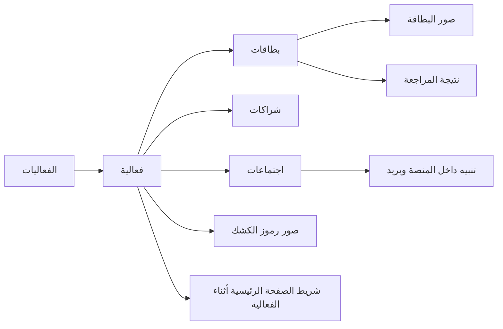

# Events (`الفعاليات`)

This is the current-state reference for the isolated exhibition and conference feature. It documents implemented behaviour at repository HEAD `0f2015b5298ad8390eb03cc5adc47873dadbd091`; it does not describe prototypes, workbook material, or planned work. The implementation is the authority when this reference and code differ.

## Read this set

| Need | Reference |
|---|---|
| Screen labels and operator journeys | [Pages and workflows](pages-workflows.md) |
| Tables, indexes, deletion and record lifetime | [Data model](data-model.md) |
| Every authenticated route and its contract | [API and services](api-services.md) |
| Access, browser processing, QR, meetings, mail and home links | [Permissions and integrations](permissions-integrations.md) |
| What has actually been tested and known boundaries | [Verification and limitations](verification-limitations.md) |

## Scope and boundary

`الفعاليات` captures exhibition contacts, recorded partner details, meeting arrangements, card photographs, and QR images. It is deliberately separate from CRM: its services do not create or mutate an opportunity, project, client, CRM contact, or document. No event row holds a CRM record reference. The isolation decision and its regression rationale are in [ADR-0013](../adr/ADR-0013-events-isolated-module.md).

The feature is an authenticated SSR area: the navigation entry is **`الفعاليات`**, the list is `/app/events`, and an event detail is `/app/event/:id`. API routes are mounted under `/api`; `requireAuth()` runs before the events router. Source entry points are [the router](../../src/modules/events/events.routes.js), [event service](../../src/modules/events/events.js), [meeting service](../../src/modules/events/meetings.js), [SSR view](../../src/web/views/events.js), and [browser code](../../src/web/public/pages/events.js).

There are no links from the event tables to CRM records.

Capture and a card image are separate commits. `POST /events/:id/contacts` validates, detects a possible duplicate, inserts the contact, and writes its audit row in one transaction. Only after that succeeds can `POST /events/contacts/:cid/photo` store a raw image and its separate photo audit. A failed or retried image transfer therefore does not roll back the captured contact. Event create/update/close/delete, contact create/update/outcome/delete, partner writes, and meeting writes each use their own transaction with their own audit entry; the SHA-identical photo path performs neither write nor audit.

## Record states at a glance

An event status is computed from Riyadh's current date and `closed_at`: **`مغلقة`** when manually closed, **`قادمة`** before `starts_on`, **`جارية`** through `ends_on`, and **`انتهت`** afterwards. Its date passing does not stop contact capture; only a manual close does. List `status=live` means current/open items and `status=done` means past or closed items at the page level; see [page behaviour](pages-workflows.md).

## Source map

| Concern | Current source |
|---|---|
| Base storage and later changes | [038](../../migrations/038_events.sql), [039](../../migrations/039_event_blob_title.sql), [040](../../migrations/040_event_meetings.sql), [041](../../migrations/041_event_card_photos.sql) |
| Authorisation matrix | [RBAC](../../src/core/rbac/index.js), [grant pairs](../../src/modules/identity/grants.js) |
| Page admission and navigation | [page policy](../../src/core/policy/pages.js), [nav](../../src/web/nav.js), [web routes](../../src/web/routes.js) |
| Local text recognition | [card parser](../../src/modules/events/card-parser.js), [browser OCR](../../src/web/public/pages/events.js) |
| Tests | [event tests](../../tests/integration/events.test.js), [security tests](../../tests/security/events-page-gate.test.js), and [verification detail](verification-limitations.md) |
