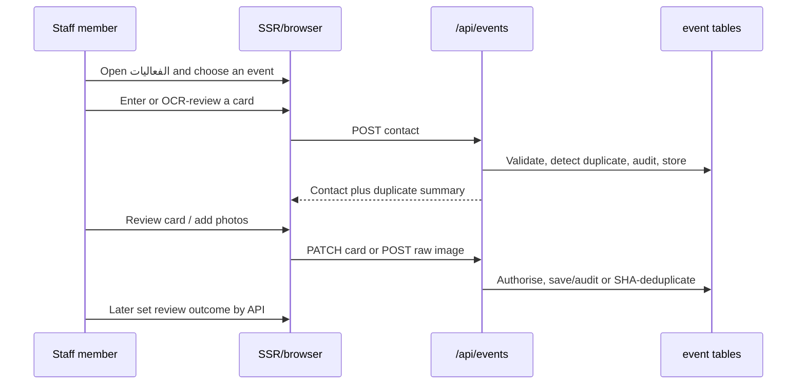

# Pages and workflows

See [the overview](README.md) for scope. UI labels below are copied exactly from the implemented Arabic interface; API-only facilities are identified as such.

## Event list — `الفعاليات`

`GET /app/events` permits `?status=live|done`; any other value is treated as all. Each card presents the event name, dates, venue, lifecycle chip, contact and partner counts, and unreviewed-contact count. A manager also sees **`فعالية جديدة`**, which opens a modal with `name_ar`, `venue`, date range, and `booth_no`; successful creation posts to the API then opens that event’s capture tab. The list is the only implemented surface for partner counts; there is no partner tab or partner-management page.

The list page is admitted by `can(user, 'read', 'event')`. It is readable for every internal role, including `viewer`, and absent for `external`. Cards use status calculated at render time, not a stored state. The detail-page link preserves relevant query state when returning to this list. Source: [list and create markup](../../src/web/views/events.js), [list client behaviour](../../src/web/public/pages/events.js).

## Event detail — `/app/event/:id`

The detail page has four exact tabs: **`التقاط`**, **`البطاقات`**, **`الاجتماعات`**, and **`رموز الكشك`**. It preserves `tab`, `q`, `kind`, `outcome`, `mine`, `dup`, `status`, and `scope` in its return links. An unknown tab defaults to **`التقاط`** when the event is upcoming or live and open; otherwise it defaults to **`البطاقات`**. The server, rather than the browser, decides page admission and whether each write control appears.

### Capture — `التقاط`

The quick form accepts the card kind, person, organisation, title, phone, email, website, sector, note, and pasted card text. The kind choices are **`تعريف بالشركة`**, **`شراكة`**, **`تعاون`**, and **`توظيف`**. A contact must supply at least one of person, organisation, or phone. Saving clears the form and returns the saved contact; it does not reject a possible duplicate. If the event is manually closed or the user lacks create permission, capture controls are unavailable. A past end date alone leaves capture available.

The implemented labels, distinct from API keys, are: **`نوع البطاقة`** (`kind`), **`الاسم`** (`person_name`), **`الجهة`** (`org_name`), **`المنصب`** (`job_title`), **`الجوّال`** (`phone`), **`البريد`** (`email`), **`الموقع الإلكتروني`** (`website`), **`القطاع المعني`** (`sector_id`), **`ملاحظة`** (`note`), and **`الصق نصّ البطاقة`** (`raw_text`, browser maximum 4,000 characters). Camera and reader controls are **`صوّر البطاقة`**, **`إعادة الالتقاط`**, **`جهّز القارئ`**, and **`املأ من النص`**; submission is **`حفظ والتقاط التالي`**. The event creation modal labels are **`اسم الفعالية`** (`name_ar`), **`المكان`** (`venue`), **`من تاريخ`** (`starts_on`), **`إلى تاريخ`** (`ends_on`), and **`رقم الجناح`** (`booth_no`), with **`إنشاء الفعالية`** as its submit action.

The browser keeps an event-and-user-specific draft in `sessionStorage` for 24 hours. Its value stores the current capture key and form fields, deliberately excludes image bytes, and is discarded on expiry, page hide/visibility handling, or after a successful save. The current capture key is sent with the contact request, so a network retry is recovered by the unique `(event_id,capture_key)` record rather than adding a second contact. This is server idempotency, independent of a business duplicate flag. Pasted text can be parsed locally through the server’s local parser; image OCR uses self-hosted `/static/vendor/tesseract-5.1.1/` assets with `ara` and `eng` language data in the browser with a 30-second timeout. Recognition does not upload the image; a separate user action can upload an image after the contact is saved. The browser warms the worker during idle time unless the connection advertises 2G/data-saving, serialises recognition requests, drops a stale result when the card changes, and terminates a timed-out worker. Before upload, it resizes to at most 1600 pixels and JPEG quality `.82`; upload has a 45-second timeout and keeps the unsent blob in the current page’s retry state. If decoding fails but the original is a permitted size/type, it uploads the original bytes.

### Contacts — `البطاقات`

The table has person/photo, organisation, sector, kind, contact details, capturer/time, and outcome. Filters are free text `q`, kind, outcome, **`التقطتها أنا`** (`mine=1`), and **`قد تكون مكررة`** (`dup=1`); export carries the same filters. Invalid filter values simply produce no matching rows because filter values are compared literally. The outcome pills are **`لم تُراجع`**, **`تواصلنا`**, **`صارت فرصة`**, **`صارت شراكة`**, and **`لا متابعة`**. The present browser screen displays and filters them, but contains no outcome-selection/save control; the dedicated API endpoint remains the implemented way to set an outcome.

Selecting a row opens a review dialog. It fetches the single contact, its photos and uploader details, raw pasted/OCR text, and download/open-image controls. When the response’s `may_edit` is true the dialog may change the card kind, sector, contact fields, and note. It cannot change `raw_text`, `capture_key`, or outcome through that generic save. A read-only user receives the same review data without editable fields. Photos are listed oldest first; the first is the cover.

### Meetings — `الاجتماعات`

The default scope is the signed-in user’s meetings; `scope=all` asks for all visible meetings. Rows support keyboard operation and show time, current time state, attendees, location, creator, and join link. The modal uses title, date, start/end time, join link, attendees, location, and note. It defaults the end time to 30 minutes after the start. The creator is always an attendee and cannot be removed. The browser validates HTTP(S) links and calls the conflict probe, but overlap warnings are advisory. Times are Riyadh wall-clock times, and overnight meetings are unsupported.

The people picker is rendered only when the user can create a meeting. There is no public calendar feed, recurrence, or iCalendar attachment.

The implemented meeting labels map to payload keys as follows: **`عنوان الاجتماع`** (`title`), **`اليوم`** or **`التاريخ`** (`meeting_date`), **`من الساعة`** (`start_time`), **`إلى الساعة`** (`end_time`), **`رابط الاجتماع`** (`join_url`), and **`المدعوون`** (`attendee_ids`). The expandable **`تفاصيل إضافية — المكان وملاحظة`** contains **`المكان`** (`location`) and **`ملاحظة`** (`note`). The submit control is **`احفظ الاجتماع`**. The date may be shown as event-day chips with **`يوم آخر`** opening the date input.

### QR kiosk — `رموز الكشك`

An event manager can upload a titled QR image, view the event’s QR image list, or delete one. The authoring card is **`أضف رمزاً`**: **`عنوان الرمز`** maps to the `title` header (the visible field is capped at 80 characters, while the API accepts up to 120), and **`ارفع صورة الرمز`** chooses the raw image. Each card offers **`اعرضه للزوّار`** and, for managers, **`حذف`**; untitled stored rows display **`رمز بلا عنوان`**. Any authorised reader can open the accessible, full-screen kiosk and close it with its supplied control. QR files are authenticated image resources; this is not a public visitor URL or a hosted registration endpoint.

## Main journeys



```mermaid
sequenceDiagram
  participant C as Meeting creator
  participant A as /api/events
  participant D as event_meeting
  participant M as Mail/notifications
  C->>A: POST meeting with invitees
  A->>A: Validate Riyadh date/time/link; check overlaps
  A->>D: Store meeting and attendees; audit
  A->>M: Queue new invitations
  M-->>C: Delivery follows configured mail transport
```

Email is generated for new invitees and relevant time changes; it is not proof of delivery. Deleting a meeting sends the in-app **`أُلغي اجتماع`** notification to every attendee except the deleting user, and does not queue a cancellation email. Detail is in [integrations](permissions-integrations.md#meetings-notifications-and-mail).
