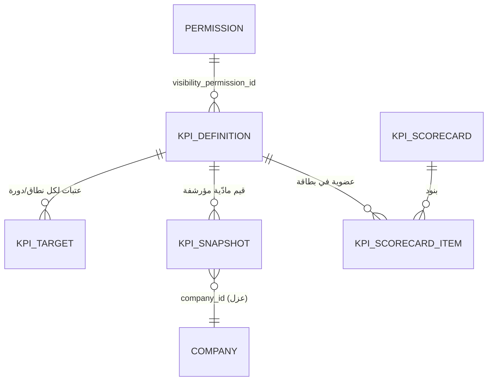

# SPEC-05 — إطار مؤشرات الأداء القابل للتخصيص لمنصة «سند» (Enterprise OS)

- **الحالة:** مسودة قابلة للتنفيذ (v1.0)
- **التاريخ:** 2026-07-13
- **المالك:** فريق منصة «سند» — رؤية الخبراء الاستشارية (EVC)
- **المرجعية:** `docs/02-analysis-report.md` (تحليل As-Is) · `platform/docs/specs/01-data-model.md` (نموذج البيانات، 90 جدولًا) · `platform/docs/specs/02-rbac.md` (النطاقات والأدوار) · `platform/docs/specs/03-api-contract.md` · لقطة الترحيل `platform/seed/legacy-state.snapshot.json` (revision 890)
- **النطاق:** إطار مؤشرات أداء **مبني على البيانات لا مضمّن في الشيفرة (data-driven, not hard-coded)**: مخطّط تعريف المؤشرات وعتباتها وقيمها المادّية، خوارزمية تقييم RAG، كتالوج 25 مؤشرًا (PMO + الموظفين/الفرق + التجاري/المالي) بصيغ محسوبة مباشرة من جداول SPEC-01، قواعد التوازن ومكافحة ثقافة المراقبة، ومصفوفة الرؤية والصلاحيات، وبذور التهيئة.

> هذا المستند مرجع تنفيذي مباشر لمهندس. **كل مؤشر معرّف بـ:** المعرّف · الاسم (عربي/إنجليزي) · التصنيف والبُعد القيمي · الصيغة/الحساب من جداول SPEC-01 بأسماء أعمدة حقيقية · المستوى (شركة/قطاع/برنامج/مشروع/فريق/موظف) · الدورية · الاتجاه المرغوب · وحدة القياس · عتبات RAG الافتراضية · جداول المصدر · صلاحية الرؤية. كل الصيغ تُكتب بـ SQL قابل للتشغيل على **SQLite (تطوير)** و**PostgreSQL (إنتاج)** عبر طبقة المستودعات (اختلافات دوال التاريخ موسومة في القسم 5.4).

---

## جدول المحتويات

1. [المبادئ الحاكمة ومكافحة ثقافة المراقبة](#1-المبادئ-الحاكمة-ومكافحة-ثقافة-المراقبة)
2. [تشريح المؤشر (Anatomy) والأبعاد القيمية](#2-تشريح-المؤشر-anatomy-والأبعاد-القيمية)
3. [نموذج بيانات الإطار القابل للتخصيص](#3-نموذج-بيانات-الإطار-القابل-للتخصيص)
4. [مستويات التجميع والدورية](#4-مستويات-التجميع-والدورية)
5. [خوارزمية تقييم RAG](#5-خوارزمية-تقييم-rag)
6. [كتالوج مؤشرات PMO](#6-كتالوج-مؤشرات-pmo)
7. [كتالوج مؤشرات الموظفين والفرق](#7-كتالوج-مؤشرات-الموظفين-والفرق)
8. [كتالوج المؤشرات التجارية والمالية](#8-كتالوج-المؤشرات-التجارية-والمالية)
9. [قواعد التوازن وتركيب بطاقات الأداء (Scorecards)](#9-قواعد-التوازن-وتركيب-بطاقات-الأداء)
10. [الرؤية والصلاحيات](#10-الرؤية-والصلاحيات)
11. [آلية الحساب والمادّية (Computation & Materialization)](#11-آلية-الحساب-والمادّية)
12. [بذور التهيئة (Seed)](#12-بذور-التهيئة-seed)
13. [أمثلة محسوبة من البيانات الحقيقية](#13-أمثلة-محسوبة-من-البيانات-الحقيقية)
14. [فجوات البيانات ومتطلبات التفعيل](#14-فجوات-البيانات-ومتطلبات-التفعيل)
15. [ملحق: جدول ملخص كل المؤشرات](#15-ملحق-جدول-ملخص-كل-المؤشرات)

---

## 1. المبادئ الحاكمة ومكافحة ثقافة المراقبة

هذه المبادئ **ملزِمة** ومنفَّذة بنيويًا في مخطّط الإطار (القسم 3) وقواعد بطاقات الأداء (القسم 9)، لا مجرد توصيات.

### 1.1 المبادئ الأساسية
1. **القيمة والنتيجة قبل النشاط.** المؤشر الجيد يقيس *مخرَجًا مقبولًا في وقته بجودته وهامشه*، لا كمية النشاط. الساعات مدخل لا نتيجة.
2. **مبني على البيانات لا على الشيفرة.** كل مؤشر وعتبة ووزن ونطاق رؤية يُخزَّن كصفوف في جداول `kpi_definition`/`kpi_target` (القسم 3) — تُضاف/تُعطَّل/تُعاد معايرتها من الإدارة **دون تغيير كود**، تحقيقًا لمبدأ «النموذج المرن غير الـHard-coded» في ADR-0001 وSPEC-01.
3. **الفصل بين النطاقات.** كل مؤشر يُحسب ويُرشَّح ضمن `company_id` (ومعه `sector_id`/النطاق الأدنى) وفق SPEC-02؛ المستخدم لا يرى مؤشرًا خارج نطاقه.
4. **مصدر حقيقة خادمي.** المؤشرات تُحسب على **الخادم** من جداول SPEC-01 (لا في المتصفح) وتُؤرشَف في `kpi_snapshot` (يعالج R9 في التحليل: نقل الاشتقاق للخادم).

### 1.2 مكافحة ثقافة المراقبة (Anti-Surveillance) — قواعد إلزامية
> السياق: المنصة تحوي رواتب أفراد وتسكينًا شهريًا وسجلات دخول؛ سوء استخدام المؤشرات لمراقبة الأفراد بالساعات خطر حوكمي حقيقي. القواعد التالية تُمنع تقنيًا:

- **حظر مؤشرات الساعات المفردة كتقييم فردي.** المؤشرات `people.planned_hours` و`people.actual_hours` و`people.billable_hours` مُصنَّفة **`is_base_measure = true`**: تُعرض كأرقام سياقية فقط ولا يُسمح لها بحمل تقييم RAG على مستوى `EMPLOYEE`، ولا تدخل بطاقة أداء فردية كبند مستقل مقيَّم (يُفرَض في القسم 9.2).
- **قاعدة تنوّع الأبعاد.** أي بطاقة أداء على مستوى `EMPLOYEE` أو `TEAM` **يجب** أن تضم مؤشرات من **٣ أبعاد قيمية مختلفة على الأقل** من `{COMPLETION, QUALITY, VALUE, TIME}` — لا يجوز بناء بطاقة من بُعد واحد (مثلاً «الساعات» فقط أو «المهام» فقط). يُتحقَّق منها في `kpi_scorecard` عبر قيد خدمة (القسم 9.2).
- **الاستغلال وعبء العمل نطاقيان لا تعظيميان.** `people.utilization` و`people.workload` اتجاههما **`TARGET_BAND`**: تجاوز السقف (فرط التحميل > 100–120%) **أحمر** تمامًا كنقص الإشغال. المؤشر يحمي الموظف من الإرهاق ولا يدفع لمزيد من الساعات.
- **الالتزام ≠ الإنتاجية.** `people.timesheet_compliance` مؤشر **نظافة عملية (process hygiene)**، يُعرض منفصلًا ولا يُدمج في درجة الإنتاجية ولا يُرتَّب به الأفراد.
- **الفردي إرشادي لا عقابي.** عتبة `RED` على مستوى `EMPLOYEE` تُطلق **مسار دعم/إرشاد** (`notification` من نوع coaching) لا إجراءً عقابيًا؛ التقارير الفردية تُجمَّع للمدير المباشر لغرض التطوير، والمقارنة العلنية بين الأفراد (leaderboard) مُعطَّلة افتراضيًا (`config.key='kpi.individual_leaderboard'=false`).
- **الاتجاه قبل اللقطة.** الإنتاجية تُقاس اتجاهًا متحركًا (`people.productivity_trend`, rolling-90) لا لقطة يوم، لتفادي معاقبة تذبذب طبيعي.
- **الحقول الحساسة محجوبة.** أي مؤشر يكشف راتبًا/هامشًا/تكلفة فردية يخضع لحجب SPEC-02 القسم 7 (القسم 10 أدناه).

**المحصّلة:** المزيج الإلزامي لكل بطاقة = إنجاز + جودة + قيمة + وقت. الساعات تبقى مدخلًا للسياق فقط.

---

## 2. تشريح المؤشر (Anatomy) والأبعاد القيمية

### 2.1 السمات القياسية لكل مؤشر
كل مؤشر في الكتالوج (الأقسام 6–8) يُعرَّف بالسمات التالية — وهي أعمدة `kpi_definition`:

| السمة | الوصف | القيم |
|-------|-------|-------|
| `id` | معرّف نصي مساحته الاسمية `<domain>.<name>` | `pmo.on_time_completion` |
| `code` | كود قصير للعرض | `OTC` |
| `name_ar` / `name_en` | الاسم ثنائي اللغة | «نسبة الإنجاز في الوقت» / On-Time Completion |
| `category` | التصنيف الوظيفي | `PMO` · `DELIVERY` · `QUALITY` · `RISK` · `PEOPLE` · `COMMERCIAL` · `FINANCIAL` |
| `value_dimension` | **البُعد القيمي** (لقاعدة التوازن) | `COMPLETION` · `QUALITY` · `VALUE` · `TIME` · `EFFICIENCY` · `RISK` |
| `unit` | وحدة القياس | `PCT` · `DAYS` · `RATIO` · `INDEX` · `SAR` · `COUNT` |
| `direction` | الاتجاه المرغوب | `HIGHER_BETTER` · `LOWER_BETTER` · `ZERO_BEST` · `TARGET_BAND` |
| `default_period` | الدورية الافتراضية | `DAILY`·`WEEKLY`·`MONTHLY`·`QUARTERLY`·`ANNUAL`·`ROLLING_30`·`ROLLING_90` |
| `applicable_levels` | المستويات القابلة للتطبيق | مصفوفة من `COMPANY,SECTOR,PORTFOLIO,PROGRAM,PROJECT,TEAM,EMPLOYEE` |
| `is_base_measure` | مقياس أساس سياقي لا يُقيَّم فرديًا | `true`/`false` (قاعدة مكافحة المراقبة) |
| `is_sensitive` | يكشف حقلًا حسّاسًا (راتب/هامش/تكلفة) | `true`/`false` |
| `formula_sql` | تعبير الحساب المرجعي (بسط/مقام) | نص SQL |
| `source_tables` | جداول SPEC-01 المصدر | مصفوفة أسماء جداول |

### 2.2 الأبعاد القيمية الستة (مصفوفة التوازن)
| البُعد | يقيس | أمثلة مؤشرات |
|-------|------|--------------|
| `COMPLETION` | هل أُنجز العمل الملتزَم به؟ | Task Completion Rate, On-Time Completion |
| `QUALITY` | هل أُنجز بجودة مقبولة دون إعادة عمل؟ | Deliverable Acceptance Rate |
| `VALUE` | هل حقّق قيمة/عائدًا/هامشًا؟ | Revenue vs Target, Gross Margin, CPI |
| `TIME` | هل في الوقت المخطّط؟ | SPI, Milestone Adherence, Issue Aging, Late Tasks |
| `EFFICIENCY` | هل بكفاءة موارد معقولة (بلا إرهاق)؟ | Utilization, Resource Utilization, Billable Ratio |
| `RISK` | ما درجة التعرّض/عدم الاستقرار؟ | Risk Exposure, Change Request Rate |

---

## 3. نموذج بيانات الإطار القابل للتخصيص

> يمتد على نطاق «التقارير» في SPEC-01 (§11). أربعة جداول: **`kpi_definition`** (المؤشر) · **`kpi_target`** (العتبات والمستهدف لكل مؤشر×نطاق×دورة) · **`kpi_snapshot`** (القيمة المادّية المؤرشفة) · **`kpi_scorecard`/`kpi_scorecard_item`** (بطاقات الأداء المركّبة). يتبع كل الاتفاقيات القياسية لـ SPEC-01 (المفاتيح `TEXT` ULID، `STD_SCOPE`، `STD_AUDIT`، الفهارس الجزئية على غير المحذوف).

### 3.1 `kpi_definition` — تعريف المؤشر (مصدر الحقيقة القابل للتخصيص)
```sql
CREATE TABLE kpi_definition (
  id                TEXT PRIMARY KEY,          -- 'pmo.on_time_completion'
  -- STD_SCOPE
  company_id        TEXT NOT NULL REFERENCES company(id),
  sector_id         TEXT REFERENCES sector(id),          -- NULL = يسري على كل القطاعات
  code              TEXT NOT NULL,             -- 'OTC'
  name_ar           TEXT NOT NULL,
  name_en           TEXT,
  description_ar    TEXT,
  category          TEXT NOT NULL CHECK (category IN
                     ('PMO','DELIVERY','QUALITY','RISK','PEOPLE','COMMERCIAL','FINANCIAL')),
  value_dimension   TEXT NOT NULL CHECK (value_dimension IN
                     ('COMPLETION','QUALITY','VALUE','TIME','EFFICIENCY','RISK')),
  unit              TEXT NOT NULL CHECK (unit IN ('PCT','DAYS','RATIO','INDEX','SAR','COUNT')),
  direction         TEXT NOT NULL CHECK (direction IN
                     ('HIGHER_BETTER','LOWER_BETTER','ZERO_BEST','TARGET_BAND')),
  default_period    TEXT NOT NULL CHECK (default_period IN
                     ('DAILY','WEEKLY','MONTHLY','QUARTERLY','ANNUAL','ROLLING_30','ROLLING_90')),
  applicable_levels JSONB NOT NULL,            -- ['COMPANY','SECTOR','PROGRAM','PROJECT','TEAM','EMPLOYEE']
  is_base_measure   BOOLEAN NOT NULL DEFAULT false,  -- قاعدة مكافحة المراقبة (لا تقييم فردي)
  is_sensitive      BOOLEAN NOT NULL DEFAULT false,  -- يكشف راتب/هامش/تكلفة
  is_composite      BOOLEAN NOT NULL DEFAULT false,  -- مركّب من مؤشرات أخرى (kpi_component)
  formula_sql       TEXT,                      -- تعبير الحساب المرجعي (موثّق، للتنفيذ في خدمة الحساب)
  numerator_desc    TEXT,                      -- وصف البسط
  denominator_desc  TEXT,                      -- وصف المقام
  source_tables     JSONB,                     -- ['project','milestone']
  visibility_permission_id TEXT REFERENCES permission(id),  -- من يرى المؤشر (مورد 'report' غالبًا)
  min_visibility_scope TEXT CHECK (min_visibility_scope IN
                     ('COMPANY','SECTOR','DEPARTMENT','TEAM','PROJECT','OWN')),  -- أدنى نطاق يُظهر القيمة
  is_system         BOOLEAN NOT NULL DEFAULT false,  -- مؤشر بذرة نظامي (لا يُحذف، يُعطَّل/يُعاد معايرته فقط)
  is_active         BOOLEAN NOT NULL DEFAULT true,
  sort_order        INTEGER,
  -- STD_AUDIT
  created_at TIMESTAMPTZ NOT NULL DEFAULT now(), created_by TEXT REFERENCES app_user(id),
  updated_at TIMESTAMPTZ NOT NULL DEFAULT now(), updated_by TEXT REFERENCES app_user(id),
  deleted_at TIMESTAMPTZ, deleted_by TEXT REFERENCES app_user(id), row_version INTEGER NOT NULL DEFAULT 1
);
CREATE UNIQUE INDEX ux_kpi_def_code ON kpi_definition(company_id, code) WHERE deleted_at IS NULL;
CREATE INDEX ix_kpi_def_category ON kpi_definition(company_id, category);
CREATE INDEX ix_kpi_def_active ON kpi_definition(company_id, is_active);
```

### 3.2 `kpi_target` — العتبات والمستهدف (قابلة للتهيئة لكل مؤشر × نطاق × دورة)
> **نموذج العتبات الموحّد (band model):** كل تقييم RAG يُعبَّر عنه بأربعة حدود `green_lo/green_hi/amber_lo/amber_hi`؛ `NULL` = غير محدود (±∞). هذا التمثيل الواحد يغطّي كل الاتجاهات الأربعة (القسم 5)، فيبقى الإطار قابلًا للتخصيص الكامل من الإدارة دون منطق خاص لكل مؤشر.

```sql
CREATE TABLE kpi_target (
  id             TEXT PRIMARY KEY,
  -- STD_SCOPE
  company_id     TEXT NOT NULL REFERENCES company(id),
  kpi_id         TEXT NOT NULL REFERENCES kpi_definition(id) ON DELETE CASCADE,
  scope_level    TEXT NOT NULL CHECK (scope_level IN
                   ('COMPANY','SECTOR','PORTFOLIO','PROGRAM','PROJECT','TEAM','EMPLOYEE')),
  scope_id       TEXT,                     -- معرّف الكيان؛ NULL = الافتراضي لكل كيانات هذا المستوى
  period_type    TEXT,                     -- NULL = يرث default_period من التعريف
  fiscal_year    INTEGER,                  -- NULL = يسري لكل السنوات
  target_value   NUMERIC(18,3),            -- المستهدف (للعرض ولحساب الانحراف)
  green_lo       NUMERIC(18,3),            -- حدود RAG (NULL=غير محدود)
  green_hi       NUMERIC(18,3),
  amber_lo       NUMERIC(18,3),
  amber_hi       NUMERIC(18,3),
  weight         NUMERIC(6,3) DEFAULT 1,   -- الوزن ضمن بطاقة أداء/مؤشر مركّب
  effective_from DATE,
  effective_to   DATE,
  notes          TEXT,
  -- STD_AUDIT
  created_at TIMESTAMPTZ NOT NULL DEFAULT now(), created_by TEXT REFERENCES app_user(id),
  updated_at TIMESTAMPTZ NOT NULL DEFAULT now(), updated_by TEXT REFERENCES app_user(id),
  deleted_at TIMESTAMPTZ, deleted_by TEXT REFERENCES app_user(id), row_version INTEGER NOT NULL DEFAULT 1
);
CREATE UNIQUE INDEX ux_kpi_target ON kpi_target
  (kpi_id, scope_level, COALESCE(scope_id,'*'), COALESCE(period_type,'*'), COALESCE(fiscal_year,0))
  WHERE deleted_at IS NULL;
CREATE INDEX ix_kpi_target_kpi ON kpi_target(kpi_id, scope_level);
```
- **دقّة الاختيار (resolution):** عند التقييم تختار الخدمة أكثر صف عتبات تحديدًا: `scope_id` مطابق للكيان أولًا، ثم `scope_id IS NULL` (افتراضي المستوى)، ثم يرث افتراض الشركة. يسمح بعتبة مختلفة لمشروع حرج عن باقي المشاريع دون كود.

### 3.3 `kpi_snapshot` — القيمة المادّية المؤرشفة (للاتجاه والأداء)
```sql
CREATE TABLE kpi_snapshot (
  id             TEXT PRIMARY KEY,
  -- STD_SCOPE
  company_id     TEXT NOT NULL REFERENCES company(id),
  kpi_id         TEXT NOT NULL REFERENCES kpi_definition(id) ON DELETE CASCADE,
  scope_level    TEXT NOT NULL,
  scope_id       TEXT,                     -- معرّف الكيان (project/sector/employee...)؛ NULL للشركة
  period_type    TEXT NOT NULL,            -- 'MONTHLY','ROLLING_90',...
  period_year    INTEGER NOT NULL,
  period_month   INTEGER,                  -- 1..12 (NULL للفترات غير الشهرية)
  period_start   DATE NOT NULL,
  period_end     DATE NOT NULL,
  value          NUMERIC(18,3),            -- القيمة المحسوبة
  numerator      NUMERIC(18,3),            -- البسط (للتدقيق وإعادة البناء)
  denominator    NUMERIC(18,3),            -- المقام
  target_value   NUMERIC(18,3),            -- المستهدف المطبَّق وقت الحساب
  rag            TEXT CHECK (rag IN ('GREEN','AMBER','RED','NA')),  -- NA = لا بيانات كافية
  trend_delta    NUMERIC(18,3),            -- الفرق عن الفترة السابقة (اتجاه)
  sample_size    INTEGER,                  -- حجم العيّنة (لكبح ضجيج العيّنات الصغيرة)
  details        JSONB,                    -- تفصيل (توزيع الشرائح مثلًا لأعمار الذمم)
  computed_at    TIMESTAMPTZ NOT NULL DEFAULT now(),
  computed_by    TEXT REFERENCES app_user(id),   -- NULL = وظيفة نظام
  is_final       BOOLEAN NOT NULL DEFAULT false   -- true عند إغلاق الفترة (لا يُعاد حسابها)
);
CREATE UNIQUE INDEX ux_kpi_snapshot ON kpi_snapshot
  (kpi_id, scope_level, COALESCE(scope_id,'*'), period_type, period_year, COALESCE(period_month,0));
CREATE INDEX ix_kpi_snapshot_scope ON kpi_snapshot(scope_level, scope_id, period_year, period_month);
CREATE INDEX ix_kpi_snapshot_kpi_period ON kpi_snapshot(kpi_id, period_year, period_month);
CREATE INDEX ix_kpi_snapshot_rag ON kpi_snapshot(company_id, rag, period_year, period_month);
```
- القيد الفريد يفرض **لقطة واحدة لكل مؤشر×كيان×فترة**؛ خدمة الحساب تُنفِّذ upsert (يتسق مع نمط R3 المنقول للخادم). حفظ `numerator`/`denominator`/`sample_size` يجعل كل رقم قابلًا للتدقيق وإعادة البناء (فجوة «التقارير غير المؤرشفة» في التحليل §10).

### 3.4 `kpi_scorecard` و `kpi_scorecard_item` — بطاقات الأداء المركّبة
```sql
CREATE TABLE kpi_scorecard (
  id             TEXT PRIMARY KEY,
  -- STD_SCOPE
  company_id     TEXT NOT NULL REFERENCES company(id),
  sector_id      TEXT REFERENCES sector(id),
  code           TEXT NOT NULL,            -- 'PROJECT_HEALTH','SECTOR_EXEC','EMPLOYEE_BALANCED'
  name_ar        TEXT NOT NULL,
  scope_level    TEXT NOT NULL,            -- المستوى الذي تُعرض له البطاقة
  purpose        TEXT,
  is_active      BOOLEAN NOT NULL DEFAULT true,
  -- STD_AUDIT
  created_at TIMESTAMPTZ NOT NULL DEFAULT now(), created_by TEXT REFERENCES app_user(id),
  updated_at TIMESTAMPTZ NOT NULL DEFAULT now(), updated_by TEXT REFERENCES app_user(id),
  deleted_at TIMESTAMPTZ, deleted_by TEXT REFERENCES app_user(id), row_version INTEGER NOT NULL DEFAULT 1
);
CREATE UNIQUE INDEX ux_scorecard_code ON kpi_scorecard(company_id, code) WHERE deleted_at IS NULL;

CREATE TABLE kpi_scorecard_item (
  id             TEXT PRIMARY KEY,
  company_id     TEXT NOT NULL REFERENCES company(id),
  scorecard_id   TEXT NOT NULL REFERENCES kpi_scorecard(id) ON DELETE CASCADE,
  kpi_id         TEXT NOT NULL REFERENCES kpi_definition(id),
  weight         NUMERIC(6,3) NOT NULL DEFAULT 1,   -- وزن المؤشر في الدرجة المركّبة
  sort_order     INTEGER,
  UNIQUE (scorecard_id, kpi_id)
);
CREATE INDEX ix_scorecard_item_card ON kpi_scorecard_item(scorecard_id);
```
- **قيد التوازن (القسم 9.2):** خدمة إنشاء/تعديل بطاقة على مستوى `EMPLOYEE`/`TEAM` ترفض الحفظ إن لم تضم مؤشرات من ≥ ٣ أبعاد قيمية مختلفة، أو إن ضمّت مؤشر أساس (`is_base_measure=true`) كبند مقيَّم. (تُفرَض في طبقة الخدمة لأن SQL وحده لا يعبّر عنها بسهولة.)

### 3.5 مخطط العلاقات


---

## 4. مستويات التجميع والدورية

### 4.1 مستويات التجميع (scope_level) وربطها بجداول SPEC-01
| المستوى | معرّف الكيان (`scope_id`) | جدول الربط في SPEC-01 | كيفية التجميع لأعلى |
|---------|---------------------------|------------------------|----------------------|
| `COMPANY` | NULL (شركة واحدة) | `company` | تجميع كل القطاعات |
| `SECTOR` | `sector.id` | `sector` | `WHERE sector_id = ?` |
| `PORTFOLIO` | `portfolio.id` | `portfolio` | برامج المحفظة |
| `PROGRAM` | `program.id` | `program` | `project.program_id = ?` |
| `PROJECT` | `project.id` | `project` | الوحدة الأساسية لأغلب مؤشرات PMO |
| `TEAM` | `org_unit.id` (نوع TEAM) | `org_unit` + `membership` | موظفو الوحدة عبر `membership` |
| `EMPLOYEE` | `employee.id` | `employee` | الوحدة الأساسية لمؤشرات الأفراد |

- التجميع من مشروع إلى برنامج/قطاع/شركة يكون **موزونًا** (بالميزانية/القيمة) لا حسابيًا بسيطًا حيثما ذُكر (مثل SPI/CPI/الهامش)، لتفادي أن يطمس مشروع صغير مشروعًا كبيرًا.

### 4.2 الدورية وإطارات الفترات
| الدورية | حدود الفترة (`period_start`..`period_end`) | مؤشرات نموذجية |
|---------|-------------------------------------------|-----------------|
| `DAILY` | يوم | تشغيلية نادرة (تنبيهات المتأخر) |
| `WEEKLY` | أسبوع (يبدأ الأحد، `Asia/Riyadh`) | Late Tasks, Issue Aging |
| `MONTHLY` | شهر تقويمي | الأغلبية: OTC, SPI, CPI, Utilization, Revenue vs Target |
| `QUARTERLY` | ربع سنة مالية | Win Rate, Change Request Rate |
| `ANNUAL` | السنة المالية (`company.fiscal_year`) | مجملات المستهدفات |
| `ROLLING_30/90` | نافذة متحركة تنتهي اليوم | Productivity Trend (90), Billable Ratio (30) |

- السنة المالية تتبع `company.fiscal_year` (2026) والمنطقة `Asia/Riyadh`.

---

## 5. خوارزمية تقييم RAG

### 5.1 النموذج الموحّد (band evaluation)
تُقيَّم كل قيمة `v` مقابل حدود `kpi_target` الأربعة بمنطق **واحد** لكل الاتجاهات:

```
function evaluateRag(v, t):            # t = صف kpi_target المختار
    if v is NULL or sample_size < min_sample: return 'NA'
    if within(v, t.green_lo, t.green_hi): return 'GREEN'
    if within(v, t.amber_lo, t.amber_hi): return 'AMBER'
    return 'RED'

function within(v, lo, hi):            # NULL = غير محدود
    return (lo is NULL or v >= lo) and (hi is NULL or v <= hi)
```

### 5.2 كيف تُشتق الحدود من الاتجاه (اصطلاح البذور)
| `direction` | المعنى | تمثيل الحدود (مثال HIGHER_BETTER بعتبتين g,a حيث g>a) |
|-------------|--------|------------------------------------------------------|
| `HIGHER_BETTER` | الأعلى أفضل (نسبة إنجاز) | `green:[g,∞] amber:[a,g) red:[−∞,a)` → `green_lo=g,green_hi=NULL, amber_lo=a,amber_hi=g` |
| `LOWER_BETTER` | الأقل أفضل (أعمار الذمم) | `green:[−∞,g] amber:(g,a] red:(a,∞]` → `green_hi=g,green_lo=NULL, amber_hi=a,amber_lo=g` |
| `ZERO_BEST` | الصفر مثالي (مخاطر عالية مفتوحة) | كـ LOWER_BETTER بعتبات صغيرة صحيحة (0/1/2) |
| `TARGET_BAND` | نطاق مثالي (الإشغال) | `green:[gl,gh] amber:[al,ah]\green red:خارجهما` → الحدود الأربعة كلها محددة |

> **التخصيص الكامل:** الجداول تخزّن الأرقام الفعلية للحدود؛ الاتجاه في `kpi_definition` توثيقي/إرشادي للواجهة (سهم أعلى/أسفل)، بينما التقييم يعتمد الحدود المخزّنة حصريًا. تغيير عتبة = تحديث صف `kpi_target` (بلا نشر كود).

### 5.3 كبح ضجيج العيّنات الصغيرة
- `min_sample` افتراضي = 3 (config `kpi.min_sample`). مؤشر بمقام < العتبة يُعطى `rag='NA'` بدل رقم مُضلِّل (مثال: win rate على موظف حسم صفقتين فقط).

### 5.4 ملاحظة اختلاف دوال التاريخ (SQLite ↔ PostgreSQL)
الصيغ أدناه تستخدم معاملات فترة `:pstart`/`:pend` (تحقنها خدمة الحساب) وتتجنّب دوال «الآن» داخل SQL. عند الحاجة للفارق بالأيام:
- **PostgreSQL:** `(d2 - d1)` أو `EXTRACT(DAY FROM (d2 - d1))`.
- **SQLite:** `julianday(d2) - julianday(d1)`.
طبقة المستودعات توفّر دالة مجرّدة `day_diff(d1,d2)`؛ تُكتب الصيغ أدناه بها.

---

## 6. كتالوج مؤشرات PMO

> جداول المصدر الرئيسة: `project`, `program`, `milestone`, `deliverable`, `task`, `change_request`, `risk`, `issue`, `allocation`/`allocation_month`, `time_entry`, `cost_line`, `expense`, `approval_request`. كل صيغة تُرشَّح ضمنيًا بـ `deleted_at IS NULL` و`company_id = :company` (و`sector_id`/`project_id` حسب النطاق).

---

### 6.1 `pmo.on_time_completion` — نسبة الإنجاز في الوقت (On-Time Completion)
- **الاسم:** «نسبة الإنجاز في الوقت» / On-Time Completion (OTC)
- **التصنيف/البُعد:** PMO / `TIME` · **الوحدة:** `PCT` · **الاتجاه:** `HIGHER_BETTER`
- **المستويات:** PROJECT, PROGRAM, SECTOR, COMPANY · **الدورية:** MONTHLY
- **التعريف:** من المخرجات المستحقّة في الفترة، نسبة ما سُلِّم في موعده أو قبله.
- **الصيغة (من `deliverable`؛ الموعد المخطّط = آخر يوم في `year-month`):**
```sql
-- البسط: مخرجات سُلِّمت في موعدها  /  المقام: مخرجات مستحقة في الفترة
SELECT 100.0 * SUM(CASE WHEN d.delivered_at IS NOT NULL
                         AND d.delivered_at <= last_day_of_month(d.year, d.month)
                        THEN 1 ELSE 0 END)
            / NULLIF(COUNT(*),0) AS otc
FROM deliverable d
WHERE d.deleted_at IS NULL AND d.company_id = :company
  AND (:sector_id IS NULL OR d.sector_id = :sector_id)
  AND (:project_id IS NULL OR d.project_id = :project_id)
  AND make_date(d.year, d.month, 1) BETWEEN :pstart AND :pend
  AND d.status IN ('DELIVERED','INVOICED','PAID');   -- تمّ تسليمها فعليًا
```
- **بديل على المعالم (`milestone`) عند توفّرها:** `delivered_at → achieved_at`, `last_day → due_date`.
- **عتبات RAG الافتراضية:** Green ≥ 90 · Amber 75–90 · Red < 75.
- **الرؤية:** `report`/scope. غير حسّاس.

---

### 6.2 `pmo.milestone_adherence` — التزام المعالم (Milestone Adherence)
- **الاسم:** «التزام المعالم» / Milestone Adherence (MA)
- **التصنيف/البُعد:** PMO / `TIME` · **الوحدة:** `PCT` · **الاتجاه:** `HIGHER_BETTER`
- **المستويات:** PROJECT, PROGRAM, SECTOR · **الدورية:** MONTHLY
- **التعريف:** من المعالم التي كان يجب إنجازها حتى نهاية الفترة، نسبة ما أُنجز في موعده. (المعالم الفائتة غير المنجزة تبقى في المقام — لا تُخفى.)
- **الصيغة (من `milestone`):**
```sql
SELECT 100.0 * SUM(CASE WHEN m.status = 'ACHIEVED'
                         AND m.achieved_at IS NOT NULL
                         AND m.achieved_at <= m.due_date
                        THEN 1 ELSE 0 END)
            / NULLIF(COUNT(*),0) AS milestone_adherence
FROM milestone m
JOIN project p ON p.id = m.project_id AND p.deleted_at IS NULL
WHERE m.deleted_at IS NULL AND m.company_id = :company
  AND (:project_id IS NULL OR m.project_id = :project_id)
  AND (:sector_id IS NULL OR p.sector_id = :sector_id)
  AND m.status <> 'CANCELLED'
  AND m.due_date <= :pend;                    -- مستحق حتى نهاية الفترة
```
- **عتبات RAG:** Green ≥ 95 · Amber 85–95 · Red < 85.

---

### 6.3 `pmo.schedule_performance_index` — مؤشر أداء الجدول / انحراف الجدول (SPI / SV)
- **الاسم:** «مؤشر أداء الجدول» / Schedule Performance Index (SPI) — ومعه انحراف الجدول SV
- **التصنيف/البُعد:** PMO / `TIME` · **الوحدة:** `RATIO` (SPI) + `SAR` (SV) · **الاتجاه:** `HIGHER_BETTER` (المثالي حول 1)
- **المستويات:** PROJECT, PROGRAM, SECTOR (موزون بالميزانية) · **الدورية:** MONTHLY
- **التعريف (Earned Value):** القيمة المكتسبة مقابل المخططة زمنيًا.
  - `BAC` (الميزانية عند الاكتمال) = `project.budget_sar` (أو `planned_cost_sar`).
  - `EV` (القيمة المكتسبة) = `progress_pct/100 × BAC`.
  - `PV` (القيمة المخططة) = `BAC × elapsed_fraction`, حيث `elapsed_fraction = clamp((:pend − start_date)/(end_date − start_date), 0, 1)`.
  - `SPI = EV / PV` · `SV = EV − PV`.
- **الصيغة (لمشروع واحد):**
```sql
WITH ev AS (
  SELECT p.id,
         COALESCE(p.budget_sar, p.planned_cost_sar) AS bac,
         COALESCE(p.progress_pct,0)/100.0 AS pct,
         MIN(1.0, MAX(0.0,
            CAST(day_diff(p.start_date, :pend) AS REAL)
            / NULLIF(day_diff(p.start_date, p.end_date),0))) AS elapsed
  FROM project p
  WHERE p.deleted_at IS NULL AND p.company_id = :company
    AND p.id = :project_id AND p.status IN ('IN_PROGRESS','ON_HOLD')
)
SELECT (pct*bac) AS ev, (bac*elapsed) AS pv,
       (pct*bac) / NULLIF(bac*elapsed,0) AS spi,
       (pct*bac) - (bac*elapsed)         AS sv_sar
FROM ev;
-- التجميع للقطاع/البرنامج: SPI الموزون = SUM(EV) / SUM(PV) عبر مشاريع النطاق.
```
- **عتبات RAG (SPI):** Green ≥ 0.95 · Amber 0.85–0.95 · Red < 0.85.
- **ملاحظة تفعيل:** تعتمد على `progress_pct` و`start/end_date` الموثوقة؛ راجع §14 لجودة البيانات.

---

### 6.4 `pmo.cost_performance_index` — مؤشر أداء التكلفة / انحراف التكلفة (CPI / CV)
- **الاسم:** «مؤشر أداء التكلفة» / Cost Performance Index (CPI) — ومعه انحراف التكلفة CV
- **التصنيف/البُعد:** PMO / `VALUE` · **الوحدة:** `RATIO` (CPI) + `SAR` (CV) · **الاتجاه:** `HIGHER_BETTER` (المثالي ≥ 1)
- **المستويات:** PROJECT, PROGRAM, SECTOR (موزون) · **الدورية:** MONTHLY
- **التعريف:** `EV` كما في 6.3. `AC` (التكلفة الفعلية) = مجموع التكاليف الفعلية للمشروع حتى `:pend`:
  `AC = Σ cost_line.amount_sar + Σ expense.amount_sar` (أو `project.actual_spend_sar` كبديل مجمّع).
  `CPI = EV / AC` · `CV = EV − AC`.
- **الصيغة:**
```sql
WITH ac AS (
  SELECT :project_id AS pid,
    ( COALESCE((SELECT SUM(amount_sar) FROM cost_line c
                 WHERE c.project_id=:project_id AND c.deleted_at IS NULL
                   AND make_date(c.year,c.month,1) <= :pend),0)
    + COALESCE((SELECT SUM(amount_sar) FROM expense e
                 WHERE e.project_id=:project_id AND e.deleted_at IS NULL
                   AND e.status IN ('APPROVED','RECORDED','PAID')
                   AND e.expense_date <= :pend),0) ) AS actual_cost
),
ev AS (
  SELECT COALESCE(progress_pct,0)/100.0 * COALESCE(budget_sar,planned_cost_sar) AS earned
  FROM project WHERE id=:project_id AND deleted_at IS NULL
)
SELECT ev.earned AS ev, ac.actual_cost AS ac,
       ev.earned / NULLIF(ac.actual_cost,0) AS cpi,
       ev.earned - ac.actual_cost           AS cv_sar
FROM ev, ac;
```
- **عتبات RAG (CPI):** Green ≥ 0.95 · Amber 0.90–0.95 · Red < 0.90.
- **الرؤية:** حسّاس (تكلفة) — `is_sensitive=true`, min scope = SECTOR؛ يُحجب عن viewer/bd_manager (SPEC-02 §7).

---

### 6.5 `pmo.deliverable_acceptance_rate` — معدل قبول المخرجات (Deliverable Acceptance Rate)
- **الاسم:** «معدل قبول المخرجات» / Deliverable Acceptance Rate (DAR)
- **التصنيف/البُعد:** QUALITY / `QUALITY` · **الوحدة:** `PCT` · **الاتجاه:** `HIGHER_BETTER`
- **المستويات:** PROJECT, PROGRAM, SECTOR, TEAM · **الدورية:** MONTHLY
- **التعريف (القبول من أول مرة — first-pass):** من المخرجات المعروضة للاعتماد في الفترة، نسبة المقبولة دون رفض/إعادة عمل.
- **الصيغة الأساسية (عبر سير الاعتماد `approval_request` لكيان deliverable — SPEC-01 §8):**
```sql
SELECT 100.0 * SUM(CASE WHEN ar.status='APPROVED'
                    AND NOT EXISTS (SELECT 1 FROM approval_action aa
                                    WHERE aa.request_id=ar.id
                                      AND aa.action IN ('REJECT','REQUEST_CHANGES'))
                    THEN 1 ELSE 0 END)
            / NULLIF(COUNT(*),0) AS dar
FROM approval_request ar
JOIN deliverable d ON d.id = ar.target_id AND d.deleted_at IS NULL
WHERE ar.target_entity='deliverable' AND ar.deleted_at IS NULL
  AND ar.company_id=:company
  AND (:sector_id IS NULL OR ar.sector_id=:sector_id)
  AND (:project_id IS NULL OR d.project_id=:project_id)
  AND ar.decided_at BETWEEN :pstart AND :pend;
```
- **بديل للبيانات القديمة (قبل تفعيل سير الاعتماد):** القبول ≈ مخرجات بلغت `INVOICED/PAID` (قبِلها العميل ⇒ فُوترت) من إجمالي `DELIVERED+INVOICED+PAID` في الفترة.
- **عتبات RAG:** Green ≥ 95 · Amber 85–95 · Red < 85.

---

### 6.6 `pmo.risk_exposure` — التعرّض للمخاطر (Risk Exposure)
- **الاسم:** «التعرّض للمخاطر» / Risk Exposure (RE)
- **التصنيف/البُعد:** RISK / `RISK` · **الوحدة:** `INDEX` (مؤشر) + `COUNT` (مخاطر عالية) · **الاتجاه:** `ZERO_BEST`
- **المستويات:** PROJECT, PROGRAM, SECTOR, COMPANY · **الدورية:** MONTHLY (وتشغيليًا مستمر)
- **التعريف:** مجموع أوزان (الاحتمال × الأثر) للمخاطر المفتوحة/الجاري تخفيفها، مع قائد التقييم = **عدد المخاطر العالية الخطورة المفتوحة**.
  الأوزان: LOW=1, MEDIUM=2, HIGH=3 ⇒ درجة الخطر = `prob_w × impact_w` (1..9). «عالية الخطورة» = درجة ≥ 6.
- **الصيغة (من `risk`):**
```sql
SELECT
  SUM( (CASE probability WHEN 'HIGH' THEN 3 WHEN 'MEDIUM' THEN 2 ELSE 1 END)
     * (CASE impact      WHEN 'HIGH' THEN 3 WHEN 'MEDIUM' THEN 2 ELSE 1 END) ) AS exposure_index,
  SUM(CASE WHEN (CASE probability WHEN 'HIGH' THEN 3 WHEN 'MEDIUM' THEN 2 ELSE 1 END)
              * (CASE impact      WHEN 'HIGH' THEN 3 WHEN 'MEDIUM' THEN 2 ELSE 1 END) >= 6
           THEN 1 ELSE 0 END) AS high_severity_open   -- قائد RAG
FROM risk r
WHERE r.deleted_at IS NULL AND r.company_id=:company
  AND r.status IN ('OPEN','MITIGATING')
  AND ( (:scope_level='PROJECT'  AND r.scope_type='PROJECT'  AND r.scope_id=:project_id)
     OR (:scope_level='SECTOR'   AND r.sector_id=:sector_id)
     OR (:scope_level='COMPANY') );
```
- **عتبات RAG (على `high_severity_open` لكل مشروع):** Green = 0 · Amber = 1 · Red ≥ 2. (`exposure_index` يُعرض كمقدار مصاحب.)
- **الرؤية:** `report`/scope.

---

### 6.7 `pmo.issue_aging` — تقادم القضايا (Issue Aging)
- **الاسم:** «تقادم القضايا» / Issue Aging (IA)
- **التصنيف/البُعد:** PMO / `TIME` · **الوحدة:** `DAYS` (متوسط عمر) + `PCT` (نسبة المتقادمة) · **الاتجاه:** `LOWER_BETTER`
- **المستويات:** PROJECT, PROGRAM, SECTOR · **الدورية:** WEEKLY
- **التعريف:** متوسط عمر القضايا المفتوحة، ونسبة ما تجاوز عمره حدّ SLA (14 يومًا افتراضيًا).
- **الصيغة (من `issue`):**
```sql
SELECT AVG(day_diff(i.created_at, :pend)) AS avg_age_days,
       100.0 * SUM(CASE WHEN day_diff(i.created_at, :pend) > 14 THEN 1 ELSE 0 END)
             / NULLIF(COUNT(*),0) AS pct_aged
FROM issue i
LEFT JOIN project p ON p.id = (CASE WHEN i.scope_type='PROJECT' THEN i.scope_id END)
WHERE i.deleted_at IS NULL AND i.company_id=:company
  AND i.status IN ('OPEN','IN_PROGRESS')
  AND (:sector_id IS NULL OR i.sector_id=:sector_id)
  AND (:project_id IS NULL OR (i.scope_type='PROJECT' AND i.scope_id=:project_id));
```
- **عتبات RAG (على `avg_age_days`):** Green ≤ 7 · Amber 7–14 · Red > 14.

---

### 6.8 `pmo.change_request_rate` — معدل طلبات التغيير (Change Request Rate)
- **الاسم:** «معدل طلبات التغيير» / Change Request Rate (CRR)
- **التصنيف/البُعد:** RISK / `RISK` · **الوحدة:** `RATIO` (طلبات/مشروع) + `PCT` (أثر النطاق) · **الاتجاه:** `LOWER_BETTER` (لكنه مؤشر مراقبة لا عقاب — التغيير المُدار صحّي)
- **المستويات:** PROJECT, PROGRAM, SECTOR · **الدورية:** QUARTERLY
- **التعريف:** تواتر طلبات التغيير لكل مشروع نشط، وأثرها على النطاق = `Σ cost_impact_sar(المعتمدة) / contract_value_sar`.
- **الصيغة:**
```sql
-- التواتر (لقطاع): طلبات التغيير في الفترة ÷ عدد المشاريع النشطة
SELECT CAST(COUNT(cr.id) AS REAL) / NULLIF(COUNT(DISTINCT p.id),0) AS cr_per_project,
       100.0 * COALESCE(SUM(CASE WHEN cr.status='APPROVED' THEN cr.cost_impact_sar END),0)
             / NULLIF(SUM(p.contract_value_sar),0) AS scope_impact_pct
FROM project p
LEFT JOIN change_request cr ON cr.project_id=p.id AND cr.deleted_at IS NULL
     AND cr.created_at BETWEEN :pstart AND :pend
WHERE p.deleted_at IS NULL AND p.company_id=:company
  AND (:sector_id IS NULL OR p.sector_id=:sector_id)
  AND p.status IN ('IN_PROGRESS','ON_HOLD');
```
- **عتبات RAG (على `cr_per_project` / ربع):** Green ≤ 1 · Amber 2–3 · Red > 3. (أثر النطاق: Green ≤ 5% · Amber 5–15% · Red > 15%.)

---

### 6.9 `pmo.task_completion_rate` — معدل إنجاز المهام (Task Completion Rate)
- **الاسم:** «معدل إنجاز المهام» / Task Completion Rate (TCR)
- **التصنيف/البُعد:** DELIVERY / `COMPLETION` · **الوحدة:** `PCT` · **الاتجاه:** `HIGHER_BETTER`
- **المستويات:** PROJECT, PROGRAM, TEAM, SECTOR · **الدورية:** MONTHLY (وWEEKLY للفرق)
- **التعريف:** من المهام المخطّط إنهاؤها في الفترة، نسبة المنجزة (`DONE`).
- **الصيغة (من `task`):**
```sql
SELECT 100.0 * SUM(CASE WHEN t.status='DONE'
                    AND t.actual_end BETWEEN :pstart AND :pend THEN 1 ELSE 0 END)
            / NULLIF(SUM(CASE WHEN t.planned_end BETWEEN :pstart AND :pend
                          AND t.status <> 'CANCELLED' THEN 1 ELSE 0 END),0) AS tcr
FROM task t
JOIN project p ON p.id = t.project_id AND p.deleted_at IS NULL
WHERE t.deleted_at IS NULL AND t.company_id=:company
  AND (:project_id IS NULL OR t.project_id=:project_id)
  AND (:sector_id IS NULL OR p.sector_id=:sector_id);
```
- **عتبات RAG:** Green ≥ 90 · Amber 75–90 · Red < 75.
- **مكافحة المراقبة:** على مستوى المشروع/الفريق مؤشر إنتاجية مشروع؛ على مستوى الفرد يُقرن إلزاميًا بمؤشر جودة (DAR) ضمن البطاقة (§9).

---

### 6.10 `pmo.resource_utilization` — استغلال موارد المشروع (Resource Utilization)
- **الاسم:** «استغلال موارد المشروع» / Resource Utilization (RU-PMO)
- **التصنيف/البُعد:** PMO / `EFFICIENCY` · **الوحدة:** `PCT` · **الاتجاه:** `TARGET_BAND`
- **المستويات:** PROJECT, PROGRAM, SECTOR · **الدورية:** MONTHLY
- **التعريف:** الساعات الفعلية المسجّلة على المشروع مقابل الساعات المخطّطة (من التسكين). يكشف نقص/فرط الاستخدام على مستوى المشروع لا الفرد.
  `RU = 100 × Σ time_entry.hours(project) / planned_hours(project)`, حيث `planned_hours = Σ allocation_month.pct × standard_monthly_hours`.
- **الصيغة:**
```sql
WITH actual AS (
  SELECT SUM(te.hours) h FROM time_entry te
  WHERE te.project_id=:project_id AND te.deleted_at IS NULL
    AND te.work_date BETWEEN :pstart AND :pend
),
planned AS (
  SELECT SUM(am.pct/100.0) * :std_monthly_hours AS h
  FROM allocation a JOIN allocation_month am ON am.allocation_id=a.id
  WHERE a.project_id=:project_id AND a.deleted_at IS NULL AND a.year=:year
    AND am.month BETWEEN :mstart AND :mend
)
SELECT 100.0 * actual.h / NULLIF(planned.h,0) AS resource_utilization
FROM actual, planned;
```
- **عتبات RAG (TARGET_BAND):** Green 80–110 · Amber [60–80) و(110–125] · Red < 60 أو > 125.
  (فرط الاستخدام مؤشر إرهاق/سوء تقدير، أحمر مثل نقصه.)

---

## 7. كتالوج مؤشرات الموظفين والفرق

> **تنبيه حاكم:** كل مؤشرات هذا القسم تخضع لقواعد مكافحة المراقبة (§1.2 و§9). مؤشرات الساعات الثلاثة (7.1–7.3) **مقاييس أساس** (`is_base_measure=true`) لا تحمل RAG فرديًا. جداول المصدر: `time_entry`, `timesheet`, `allocation`/`allocation_month`, `task`, `employee`.
> **سعة العمل القياسية:** `standard_monthly_hours` من `config` (افتراضي 176 = 22 يوم × 8 ساعات)؛ `capacity_hours(period)` تُشتق من أيام العمل الفعلية في الفترة ناقصًا الإجازات مستقبلًا.

---

### 7.1 `people.planned_hours` — الساعات المخطّطة (Planned Hours) — مقياس أساس
- **الاسم:** «الساعات المخطّطة» / Planned Hours (PH)
- **التصنيف/البُعد:** PEOPLE / `EFFICIENCY` · **الوحدة:** `COUNT` (ساعات) · **الاتجاه:** — (سياقي) · **`is_base_measure=true`**
- **المستويات:** EMPLOYEE, TEAM, PROJECT, SECTOR · **الدورية:** MONTHLY
- **التعريف:** الساعات المخطّطة من التسكين الشهري: `Σ (allocation_month.pct/100) × standard_monthly_hours`.
- **الصيغة:**
```sql
SELECT SUM(am.pct/100.0) * :std_monthly_hours AS planned_hours
FROM allocation a JOIN allocation_month am ON am.allocation_id=a.id
WHERE a.deleted_at IS NULL AND a.company_id=:company AND a.year=:year
  AND am.month BETWEEN :mstart AND :mend
  AND (:employee_id IS NULL OR a.employee_id=:employee_id)
  AND (:sector_id  IS NULL OR a.sector_id=:sector_id);
```
- **RAG:** لا يُقيَّم على مستوى الفرد (قاعدة §1.2). يُعرض رقمًا سياقيًا يغذّي الإشغال (7.4).

---

### 7.2 `people.actual_hours` — الساعات الفعلية (Actual Hours) — مقياس أساس
- **الاسم:** «الساعات الفعلية» / Actual Hours (AH)
- **التصنيف/البُعد:** PEOPLE / `EFFICIENCY` · **الوحدة:** `COUNT` (ساعات) · **الاتجاه:** — · **`is_base_measure=true`**
- **المستويات:** EMPLOYEE, TEAM, PROJECT, SECTOR · **الدورية:** MONTHLY
- **الصيغة (من `time_entry`):**
```sql
SELECT SUM(te.hours) AS actual_hours
FROM time_entry te
WHERE te.deleted_at IS NULL AND te.company_id=:company
  AND te.work_date BETWEEN :pstart AND :pend
  AND (:employee_id IS NULL OR te.employee_id=:employee_id)
  AND (:project_id  IS NULL OR te.project_id=:project_id);
```
- **RAG:** لا يُقيَّم فرديًا.

---

### 7.3 `people.billable_hours` — الساعات القابلة للفوترة (Billable Hours & Ratio) — أساس + نسبة
- **الاسم:** «الساعات القابلة للفوترة ونسبتها» / Billable Hours & Ratio (BH)
- **التصنيف/البُعد:** PEOPLE / `VALUE` · **الوحدة:** `COUNT` (ساعات) + `PCT` (النسبة) · **الاتجاه:** `HIGHER_BETTER` (على النسبة، لا على المطلق) · مطلق الساعات `is_base_measure=true`
- **المستويات:** EMPLOYEE (النسبة إرشادية)، TEAM, SECTOR (النسبة مقيَّمة) · **الدورية:** MONTHLY / ROLLING_30
- **التعريف:** `billable_ratio = 100 × Σ hours(is_billable) / Σ hours`.
- **الصيغة:**
```sql
SELECT SUM(CASE WHEN te.is_billable THEN te.hours ELSE 0 END) AS billable_hours,
       100.0 * SUM(CASE WHEN te.is_billable THEN te.hours ELSE 0 END)
             / NULLIF(SUM(te.hours),0) AS billable_ratio
FROM time_entry te
JOIN employee emp ON emp.id = te.employee_id AND emp.deleted_at IS NULL   -- للقطاع عبر الموظف
WHERE te.deleted_at IS NULL AND te.company_id=:company
  AND te.work_date BETWEEN :pstart AND :pend
  AND (:employee_id IS NULL OR te.employee_id=:employee_id)
  AND (:sector_id  IS NULL OR emp.sector_id=:sector_id);
```
- **عتبات RAG (على النسبة، مستوى TEAM/SECTOR):** Green ≥ 70 · Amber 55–70 · Red < 55.
- **مكافحة المراقبة:** النسبة على مستوى الفرد إرشادية فقط؛ القابلية للفوترة قرار تسكين إداري لا سلوك فردي.

---

### 7.4 `people.utilization` — نسبة الإشغال (Utilization)
- **الاسم:** «نسبة الإشغال» / Utilization (UT)
- **التصنيف/البُعد:** PEOPLE / `EFFICIENCY` · **الوحدة:** `PCT` · **الاتجاه:** `TARGET_BAND`
- **المستويات:** EMPLOYEE, TEAM, SECTOR · **الدورية:** MONTHLY
- **التعريف:** الساعات الفعلية مقابل السعة. متغيّران: الإجمالي والقابل للفوترة.
  `utilization = 100 × actual_hours / capacity_hours` · `billable_utilization = 100 × billable_hours / capacity_hours`.
- **الصيغة:**
```sql
SELECT 100.0 * COALESCE(SUM(te.hours),0)          / NULLIF(:capacity_hours,0) AS utilization,
       100.0 * COALESCE(SUM(CASE WHEN te.is_billable THEN te.hours END),0)
                                                   / NULLIF(:capacity_hours,0) AS billable_utilization
FROM time_entry te
WHERE te.deleted_at IS NULL AND te.company_id=:company
  AND te.employee_id=:employee_id AND te.work_date BETWEEN :pstart AND :pend;
```
- **عتبات RAG (TARGET_BAND):** Green 75–90 · Amber [65–75) و(90–100] · Red < 65 أو > 100.
- **مكافحة المراقبة صريحة:** > 100% (فرط تحميل) **أحمر** — المؤشر يحمي من الإرهاق ولا يعظّم الساعات. النطاق المثالي متوسط ليس أقصى.

---

### 7.5 `people.productivity_trend` — اتجاه الإنتاجية (Productivity Trend)
- **الاسم:** «اتجاه الإنتاجية» / Productivity Trend (PT)
- **التصنيف/البُعد:** PEOPLE / `VALUE` · **الوحدة:** `INDEX` (مؤشر مركّب) + اتجاه · **الاتجاه:** `HIGHER_BETTER` (ميل مستقر/صاعد) · **`is_composite=true`**
- **المستويات:** EMPLOYEE (إرشادي), TEAM, SECTOR · **الدورية:** ROLLING_90
- **التعريف (نتيجة لا ساعات):** مؤشر مخرجات مركّب يُتتبَّع اتجاهه المتحرك، يمزج **إنجازًا + جودةً + وقتًا** صراحةً:
  `output_index = 0.45×norm(task_completion) + 0.35×deliverable_acceptance + 0.20×on_time_completion`
  و`PT = output_index(نافذة 90 الحالية) − output_index(النافذة السابقة)` (اتجاه، لا لقطة).
- **الحساب:** يُشتق من لقطات `kpi_snapshot` للمؤشرات المكوّنة (TCR, DAR, OTC) للكيان نفسه، فلا يعيد الاستعلام الخام:
```sql
-- من kpi_snapshot: متوسط موزون للمكوّنات على نافذة rolling-90، مطروحًا منه النافذة السابقة
-- (تنفَّذ في خدمة الحساب لأنها تجمع ثلاث لقطات؛ التخزين في kpi_snapshot.value = الاتجاه، details=المكوّنات)
```
- **عتبات RAG (على الاتجاه %):** Green ≥ −2 (مستقر/صاعد) · Amber −2..−10 · Red < −10 (تراجع مستمر).
- **مكافحة المراقبة:** بلا ساعات؛ اتجاه لا لقطة؛ إرشادي على الفرد لغرض الإرشاد لا الترتيب.

---

### 7.6 `people.task_completion` — إنجاز المهام (الفرد) (Task Completion — Individual)
- **الاسم:** «إنجاز المهام (فرد)» / Task Completion — Individual
- **التصنيف/البُعد:** DELIVERY / `COMPLETION` · **الوحدة:** `PCT` · **الاتجاه:** `HIGHER_BETTER`
- **المستويات:** EMPLOYEE, TEAM · **الدورية:** MONTHLY
- **التعريف:** كـ TCR (6.9) لكن على `task.assignee_employee_id`.
- **الصيغة:**
```sql
SELECT 100.0 * SUM(CASE WHEN t.status='DONE'
                    AND t.actual_end BETWEEN :pstart AND :pend THEN 1 ELSE 0 END)
            / NULLIF(SUM(CASE WHEN t.planned_end BETWEEN :pstart AND :pend
                          AND t.status <> 'CANCELLED' THEN 1 ELSE 0 END),0) AS task_completion
FROM task t
WHERE t.deleted_at IS NULL AND t.company_id=:company
  AND t.assignee_employee_id=:employee_id;
```
- **عتبات RAG:** Green ≥ 85 · Amber 70–85 · Red < 70.
- **قيد بطاقة إلزامي (§9):** لا يُعرض على الفرد إلا مقرونًا ببُعد جودة (DAR) وبُعد وقت (Late Tasks)، لمنع «سباق كمية مهام» على حساب الجودة.

---

### 7.7 `people.late_tasks` — المهام المتأخرة (Late Tasks)
- **الاسم:** «المهام المتأخرة» / Late Tasks (LT)
- **التصنيف/البُعد:** DELIVERY / `TIME` · **الوحدة:** `PCT` (نسبة) + `COUNT` · **الاتجاه:** `LOWER_BETTER`
- **المستويات:** EMPLOYEE, TEAM, PROJECT · **الدورية:** WEEKLY
- **التعريف:** من المهام المفتوحة، نسبة ما تجاوز موعده المخطّط دون إنجاز.
- **الصيغة:**
```sql
SELECT SUM(CASE WHEN t.planned_end < :pend AND t.status NOT IN ('DONE','CANCELLED')
                THEN 1 ELSE 0 END) AS late_count,
       100.0 * SUM(CASE WHEN t.planned_end < :pend AND t.status NOT IN ('DONE','CANCELLED')
                        THEN 1 ELSE 0 END)
             / NULLIF(SUM(CASE WHEN t.status NOT IN ('DONE','CANCELLED') THEN 1 ELSE 0 END),0) AS late_pct
FROM task t
WHERE t.deleted_at IS NULL AND t.company_id=:company
  AND (:employee_id IS NULL OR t.assignee_employee_id=:employee_id)
  AND (:project_id  IS NULL OR t.project_id=:project_id);
```
- **عتبات RAG (على `late_pct`):** Green ≤ 5 · Amber 5–15 · Red > 15.

---

### 7.8 `people.workload` — عبء العمل (Workload) — تحذيري لحماية الموظف
- **الاسم:** «عبء العمل» / Workload (WL)
- **التصنيف/البُعد:** PEOPLE / `EFFICIENCY` · **الوحدة:** `PCT` (إجمالي الإشغال) · **الاتجاه:** `TARGET_BAND`
- **المستويات:** EMPLOYEE, TEAM · **الدورية:** MONTHLY
- **التعريف:** مجموع نِسَب التسكين المتزامنة للفرد عبر كل مشاريعه في الشهر — يكشف فرط التحميل (> 100%) والفراغ (< 50%).
- **الصيغة (من `allocation_month` عبر كل تسكينات الفرد):**
```sql
SELECT am.month, SUM(am.pct) AS total_allocation_pct
FROM allocation a JOIN allocation_month am ON am.allocation_id=a.id
WHERE a.deleted_at IS NULL AND a.company_id=:company
  AND a.employee_id=:employee_id AND a.year=:year AND am.month=:month
GROUP BY am.month;   -- القيمة > 100 = تعارض/فرط تحميل
```
- **عتبات RAG (TARGET_BAND):** Green 70–100 · Amber [50–70) و(100–120] · Red < 50 أو > 120.
- **مكافحة المراقبة:** الأحمر العلوي (> 120%) **إنذار حماية** يُطلق `notification` لإعادة توزيع العبء؛ الغرض تخفيف الضغط لا زيادته.

---

### 7.9 `people.timesheet_compliance` — الالتزام بالجداول الزمنية (Timesheet Compliance)
- **الاسم:** «الالتزام بتسجيل الوقت» / Timesheet Compliance (TC)
- **التصنيف/البُعد:** PEOPLE / `COMPLETION` (نظافة عملية) · **الوحدة:** `PCT` · **الاتجاه:** `HIGHER_BETTER`
- **المستويات:** TEAM, SECTOR, COMPANY (وEMPLOYEE إرشادي فقط) · **الدورية:** MONTHLY
- **التعريف:** من الجداول المتوقّعة (سجل لكل موظف نشط لكل فترة)، نسبة ما قُدِّم واعتُمِد في موعده.
- **الصيغة (من `timesheet` مقابل الموظفين النشطين):**
```sql
WITH expected AS (
  SELECT e.id AS employee_id FROM employee e
  WHERE e.deleted_at IS NULL AND e.company_id=:company AND e.active
    AND (:sector_id IS NULL OR e.sector_id=:sector_id)
),
submitted AS (
  SELECT ts.employee_id
  FROM timesheet ts JOIN timesheet_period tp ON tp.id=ts.period_id
  WHERE ts.deleted_at IS NULL AND tp.year=:year AND tp.month=:month
    AND ts.status IN ('SUBMITTED','APPROVED')
    AND ts.submitted_at <= date(tp.end_date, '+'||:grace_days||' day')  -- في الموعد + مهلة
)
SELECT 100.0 * (SELECT COUNT(*) FROM submitted)
             / NULLIF((SELECT COUNT(*) FROM expected),0) AS timesheet_compliance;
```
- **عتبات RAG:** Green ≥ 95 · Amber 85–95 · Red < 85.
- **مكافحة المراقبة:** مؤشر نظافة عملية منفصل تمامًا عن الأداء/الإنتاجية؛ لا يُدمج في أي بطاقة أداء فردية مقيَّمة ولا يُرتَّب به الأفراد علنًا.

---

## 8. كتالوج المؤشرات التجارية والمالية

> جداول المصدر: `opportunity`/`stage_history`/`pipeline_stage`, `revenue_line`, `cost_line`/`expense`, `budget`, `invoice`/`collection`, `contract`, `sector`. المؤشرات المالية (الهامش/التكلفة/الأعمار) غالبًا **حسّاسة** (§10).

---

### 8.1 `commercial.win_rate` — معدل الفوز (Win Rate)
- **الاسم:** «معدل الفوز» / Win Rate (WR)
- **التصنيف/البُعد:** COMMERCIAL / `VALUE` · **الوحدة:** `PCT` · **الاتجاه:** `HIGHER_BETTER`
- **المستويات:** SECTOR, COMPANY, EMPLOYEE(المالك) · **الدورية:** QUARTERLY
- **التعريف:** من الفرص المحسومة في الفترة (فوز+خسارة)، نسبة الفائزة. متغيّران: بالعدد وبالقيمة (موزون).
- **الصيغة (من `opportunity` + `stage_history` لزمن الحسم):**
```sql
WITH decided AS (
  SELECT o.id, o.value_sar, ps.is_won, ps.is_lost
  FROM opportunity o
  JOIN pipeline_stage ps ON ps.id = o.stage_id
  WHERE o.deleted_at IS NULL AND o.company_id=:company
    AND (:sector_id IS NULL OR o.sector_id=:sector_id)
    AND (:owner_id  IS NULL OR o.owner_user_id=:owner_id)
    AND o.exclude_from_sales = false
    AND (ps.is_won OR ps.is_lost)
    AND COALESCE(o.stage_changed_at, o.updated_at) BETWEEN :pstart AND :pend
)
SELECT 100.0 * SUM(CASE WHEN is_won THEN 1 ELSE 0 END) / NULLIF(COUNT(*),0)          AS win_rate_count,
       100.0 * SUM(CASE WHEN is_won THEN value_sar ELSE 0 END) / NULLIF(SUM(value_sar),0) AS win_rate_value
FROM decided;
```
- **عتبات RAG (قابلة للمعايرة حسب القطاع):** Green ≥ 40 · Amber 25–40 · Red < 25.
- **العيّنة الصغيرة:** إن كان المقام < `min_sample` ⇒ `NA` (يمنع تضخيم معدل مالك حسم صفقتين).

---

### 8.2 `commercial.pipeline_coverage` — تغطية خط الأنابيب (Pipeline Coverage)
- **الاسم:** «تغطية خط الأنابيب» / Pipeline Coverage (PC)
- **التصنيف/البُعد:** COMMERCIAL / `VALUE` · **الوحدة:** `RATIO` (مضاعف) · **الاتجاه:** `HIGHER_BETTER` (نطاق مثالي)
- **المستويات:** SECTOR, COMPANY · **الدورية:** MONTHLY
- **التعريف:** خط الأنابيب المرجّح مقابل المستهدف المتبقّي من المبيعات.
  `weighted_pipeline = Σ(value_sar × win_pct/100)` للفرص المفتوحة؛
  `remaining_target = budget.target_sales_sar − won_sales_ytd`؛ `PC = weighted_pipeline / remaining_target`.
- **الصيغة:**
```sql
WITH pipe AS (
  SELECT SUM(o.value_sar * COALESCE(o.win_pct,0)/100.0) AS weighted
  FROM opportunity o JOIN pipeline_stage ps ON ps.id=o.stage_id
  WHERE o.deleted_at IS NULL AND o.company_id=:company
    AND (:sector_id IS NULL OR o.sector_id=:sector_id)
    AND o.exclude_from_sales=false AND ps.is_terminal=false   -- مفتوحة
),
won AS (
  SELECT COALESCE(SUM(o.value_sar),0) AS won_ytd
  FROM opportunity o JOIN pipeline_stage ps ON ps.id=o.stage_id
  WHERE o.deleted_at IS NULL AND o.company_id=:company AND ps.is_won
    AND (:sector_id IS NULL OR o.sector_id=:sector_id)
    AND o.year=:fiscal_year
),
tgt AS (
  SELECT target_sales_sar FROM budget
  WHERE company_id=:company AND fiscal_year=:fiscal_year
    AND (COALESCE(sector_id,'*') = COALESCE(:sector_id,'*')) AND deleted_at IS NULL
)
SELECT pipe.weighted / NULLIF((tgt.target_sales_sar - won.won_ytd),0) AS pipeline_coverage
FROM pipe, won, tgt;
```
- **عتبات RAG:** Green ≥ 3 · Amber 2–3 · Red < 2. (قاعدة إبهام: تغطية 3× للمستهدف المتبقّي.)

---

### 8.3 `financial.revenue_vs_target` — الإيراد مقابل المستهدف (Revenue vs Target)
- **الاسم:** «الإيراد مقابل المستهدف» / Revenue vs Target (RvT)
- **التصنيف/البُعد:** FINANCIAL / `VALUE` · **الوحدة:** `PCT` · **الاتجاه:** `HIGHER_BETTER`
- **المستويات:** SECTOR, COMPANY, PROJECT · **الدورية:** MONTHLY (تراكمي YTD)
- **التعريف:** الإيراد المحقّق مقابل المستهدف **المُعدَّل بوتيرة السنة** (pace-adjusted) لتقييم عادل خلال السنة.
  `pace_target = target_revenue_sar × (الأشهر المنقضية / 12)`؛ `RvT = 100 × revenue_ytd / pace_target`.
- **الصيغة:**
```sql
WITH rev AS (
  SELECT COALESCE(SUM(rl.amount_sar),0) AS revenue_ytd
  FROM revenue_line rl
  WHERE rl.deleted_at IS NULL AND rl.company_id=:company AND rl.year=:fiscal_year
    AND rl.month <= :current_month
    AND (:sector_id IS NULL OR rl.sector_id=:sector_id)
    AND (:project_id IS NULL OR rl.project_id=:project_id)
),
tgt AS (
  SELECT target_revenue_sar FROM budget
  WHERE company_id=:company AND fiscal_year=:fiscal_year
    AND (COALESCE(sector_id,'*') = COALESCE(:sector_id,'*')) AND deleted_at IS NULL
)
SELECT 100.0 * rev.revenue_ytd
     / NULLIF(tgt.target_revenue_sar * (:current_month/12.0),0) AS revenue_vs_target_pace
FROM rev, tgt;
```
- **عتبات RAG (على الوتيرة):** Green ≥ 95 · Amber 80–95 · Red < 80.
- **بديل غير مُعدَّل:** `100 × revenue_ytd / target_revenue_sar` (نسبة الإنجاز السنوي المطلق، لعرض لوحة CEO كما في التحليل §5.1).

---

### 8.4 `financial.gross_margin` — الهامش الإجمالي (Gross Margin) — حسّاس
- **الاسم:** «الهامش الإجمالي» / Gross Margin (GM)
- **التصنيف/البُعد:** FINANCIAL / `VALUE` · **الوحدة:** `PCT` · **الاتجاه:** `HIGHER_BETTER` (مقابل المستهدف) · **`is_sensitive=true`**
- **المستويات:** PROJECT, SECTOR, COMPANY · **الدورية:** MONTHLY (وعند الإغلاق)
- **التعريف:** `GM% = 100 × (revenue − cost) / revenue`، حيث `cost = Σ cost_line + Σ expense`. يُقارن بـ `sector.target_gross_margin_pct` / `budget.target_gross_margin_pct`.
- **الصيغة:**
```sql
WITH r AS (SELECT COALESCE(SUM(amount_sar),0) rev FROM revenue_line
           WHERE deleted_at IS NULL AND company_id=:company AND year=:fiscal_year
             AND (:sector_id IS NULL OR sector_id=:sector_id)
             AND (:project_id IS NULL OR project_id=:project_id)),
     c AS (SELECT COALESCE(SUM(amount_sar),0) cost FROM cost_line
           WHERE deleted_at IS NULL AND company_id=:company AND year=:fiscal_year
             AND (:sector_id IS NULL OR sector_id=:sector_id)
             AND (:project_id IS NULL OR project_id=:project_id))
SELECT 100.0 * (r.rev - c.cost) / NULLIF(r.rev,0) AS gross_margin_pct FROM r, c;
```
- **عتبات RAG (نسبةً للمستهدف T، مثال قطاع الحلول T=25):** Green ≥ T · Amber [T−5, T) · Red < T−5.
  (تُخزَّن كأرقام مطلقة في `kpi_target` لكل قطاع؛ الحلول 25، الاستشارات 35، SAP 30، الاستراتيجية 22 — من `sector.target_gross_margin_pct`.)
- **الرؤية:** حسّاس — يُحجب عن `viewer`/`bd_manager`؛ متاح لـ`finance`/`sector_lead`/`ceo_office`/`admin` (SPEC-02 §5.4/§7). min scope = SECTOR.

---

### 8.5 `financial.collection_rate` — معدل التحصيل (Collection Rate / DSO)
- **الاسم:** «معدل التحصيل» / Collection Rate (+ DSO) · **`is_sensitive=true`**
- **التصنيف/البُعد:** FINANCIAL / `VALUE` · **الوحدة:** `PCT` (التحصيل) + `DAYS` (DSO) · **الاتجاه:** `HIGHER_BETTER` (التحصيل) / `LOWER_BETTER` (DSO)
- **المستويات:** PROJECT, SECTOR, COMPANY · **الدورية:** MONTHLY
- **التعريف:** `collection_rate = 100 × Σ collection / Σ invoice.total(issued)` في الفترة؛
  `DSO ≈ (Σ outstanding_ar / revenue_period) × days_in_period`.
- **الصيغة:**
```sql
WITH inv AS (
  SELECT COALESCE(SUM(total_sar),0) issued, COALESCE(SUM(outstanding_sar),0) outstanding
  FROM invoice WHERE deleted_at IS NULL AND company_id=:company
    AND status <> 'CANCELLED' AND issue_date BETWEEN :pstart AND :pend
    AND (:sector_id IS NULL OR sector_id=:sector_id)
    AND (:project_id IS NULL OR project_id=:project_id)
),
col AS (
  SELECT COALESCE(SUM(amount_sar),0) collected FROM collection
  WHERE deleted_at IS NULL AND company_id=:company
    AND collected_date BETWEEN :pstart AND :pend
    AND (:sector_id IS NULL OR sector_id=:sector_id)
    AND (:project_id IS NULL OR project_id=:project_id)
)
SELECT 100.0 * col.collected / NULLIF(inv.issued,0) AS collection_rate,
       inv.outstanding AS outstanding_ar
FROM inv, col;
```
- **عتبات RAG (على `collection_rate`):** Green ≥ 90 · Amber 75–90 · Red < 75.
- **الرؤية:** حسّاس (مالي) — `finance`/`sector_lead`/`ceo_office`/`admin`.

---

### 8.6 `financial.ar_aging` — أعمار الذمم المدينة (AR Aging)
- **الاسم:** «أعمار الذمم المدينة» / Accounts Receivable Aging (ARA) · **`is_sensitive=true`**
- **التصنيف/البُعد:** FINANCIAL / `RISK` · **الوحدة:** `PCT` (نسبة الشريحة > 90 يومًا) · **الاتجاه:** `LOWER_BETTER`
- **المستويات:** SECTOR, COMPANY, CLIENT · **الدورية:** MONTHLY
- **التعريف:** توزيع المستحق غير المحصّل على شرائح (0–30 / 31–60 / 61–90 / 90+ يومًا من `due_date`)؛ قائد RAG = نسبة شريحة 90+.
- **الصيغة (من `invoice`):**
```sql
SELECT
  SUM(CASE WHEN day_diff(i.due_date,:pend) <= 30 THEN i.outstanding_sar ELSE 0 END) AS b_0_30,
  SUM(CASE WHEN day_diff(i.due_date,:pend) BETWEEN 31 AND 60 THEN i.outstanding_sar ELSE 0 END) AS b_31_60,
  SUM(CASE WHEN day_diff(i.due_date,:pend) BETWEEN 61 AND 90 THEN i.outstanding_sar ELSE 0 END) AS b_61_90,
  SUM(CASE WHEN day_diff(i.due_date,:pend) > 90 THEN i.outstanding_sar ELSE 0 END) AS b_90_plus,
  100.0 * SUM(CASE WHEN day_diff(i.due_date,:pend) > 90 THEN i.outstanding_sar ELSE 0 END)
        / NULLIF(SUM(i.outstanding_sar),0) AS pct_over_90
FROM invoice i
WHERE i.deleted_at IS NULL AND i.company_id=:company
  AND i.status IN ('ISSUED','SENT','PARTIALLY_PAID','OVERDUE')
  AND i.outstanding_sar > 0
  AND (:sector_id IS NULL OR i.sector_id=:sector_id);
```
- **عتبات RAG (على `pct_over_90`):** Green ≤ 10 · Amber 10–25 · Red > 25. (الشرائح تُحفظ في `kpi_snapshot.details` للعرض.)
- **الرؤية:** حسّاس (مالي).

---

## 9. قواعد التوازن وتركيب بطاقات الأداء

### 9.1 بطاقات أداء البذور (Scorecards)
| البطاقة (code) | المستوى | المؤشرات (الأبعاد) | الغرض |
|-----------------|---------|---------------------|-------|
| `PROJECT_HEALTH` | PROJECT | OTC(TIME) · CPI(VALUE) · DAR(QUALITY) · TCR(COMPLETION) · Risk Exposure(RISK) | صحة المشروع (تحلّ محل «على المسار/في خطر/حرج» بمنطق موزون قابل للتدقيق) |
| `SECTOR_EXEC` | SECTOR | Revenue vs Target(VALUE) · Gross Margin(VALUE) · Win Rate(VALUE) · Pipeline Coverage(VALUE) · Collection Rate(VALUE) | لوحة قائد القطاع |
| `COMPANY_CEO` | COMPANY | تجميع SECTOR_EXEC + Portfolio OTC + AR Aging | لوحة الرئيس التنفيذي (تعالج فجوة «Win-rate/تنبيهات» في التحليل §10) |
| `TEAM_DELIVERY` | TEAM | TCR(COMPLETION) · DAR(QUALITY) · Late Tasks(TIME) · Billable Ratio(VALUE) · Utilization(EFFICIENCY) | صحة تسليم الفريق |
| `EMPLOYEE_BALANCED` | EMPLOYEE | Task Completion(COMPLETION) · DAR(QUALITY) · Late Tasks(TIME) · Productivity Trend(VALUE) | بطاقة فرد **متوازنة** (٤ أبعاد؛ بلا ساعات مفردة) |

- **الدرجة المركّبة:** `score = Σ(weight_i × rag_to_score(rag_i)) / Σweight_i`، حيث `GREEN=100, AMBER=60, RED=20`؛ لون البطاقة يتبع خريطة نطاق للدرجة (Green ≥ 80، Amber 55–80، Red < 55) وتُخزَّن كمؤشر مركّب في `kpi_snapshot`.

### 9.2 القيود الإلزامية على بطاقات الأفراد/الفرق (يفرضها service layer)
1. **تنوّع الأبعاد:** بطاقة `EMPLOYEE`/`TEAM` يجب أن تضم مؤشرات من ≥ ٣ أبعاد من `{COMPLETION, QUALITY, VALUE, TIME}`. رفض الحفظ خلاف ذلك.
2. **حظر مقاييس الأساس:** لا يجوز إدراج مؤشر `is_base_measure=true` (الساعات المخطّطة/الفعلية/القابلة للفوترة المطلقة) كبند **مقيَّم** في بطاقة فردية.
3. **فصل نظافة العملية:** `timesheet_compliance` لا يدخل الدرجة المركّبة الفردية.
4. **الاتجاه لا اللقطة على الأفراد:** الإنتاجية الفردية تُمثَّل بـ`productivity_trend` (rolling-90) لا بلقطة شهر.
5. **RED فردي ⇒ مسار إرشاد:** إشعار `type='COACHING'` للمدير المباشر، بلا نشر علني ولا ربط تلقائي بإجراء عقابي.

### 9.3 أوزان البذور
تُخزَّن في `kpi_scorecard_item.weight`؛ الافتراض 1 لكل بند، مع رفع وزن مؤشرات القيمة/الجودة على مؤشرات النشاط في البطاقات الفردية (مثال: DAR=1.5, Task Completion=1.0) تعزيزًا لمبدأ «القيمة قبل النشاط».

---

## 10. الرؤية والصلاحيات

### 10.1 المبدأ
- كل مؤشر يحمل `visibility_permission_id` (غالبًا مورد `report` بفعل `read`/`export` من SPEC-02 §3.5) و`min_visibility_scope`.
- خدمة عرض المؤشر تُطبّق **مرشّحين**: (أ) نطاق الكيان مقابل نطاق المستخدم (`/co`,`/sec`,`/dep`,`/prj`,`/own`)؛ (ب) حجب الحقول الحسّاسة إن كان `is_sensitive=true` والدور غير مخوَّل.

### 10.2 مصفوفة رؤية مختصرة (أدوار SPEC-02 × فئات المؤشرات)
| فئة المؤشر | admin | ceo_office | finance | sector_lead | dept_manager | project_manager | bd_manager | hr | consultant | viewer |
|-------------|:----:|:---------:|:------:|:-----------:|:------------:|:---------------:|:----------:|:--:|:----------:|:-----:|
| PMO (OTC/MA/SPI/TCR/Risk/Issue/CR) | co | co | co | sec | dep | prj | — | — | prj(قراءة) | sec |
| مالي حسّاس (CPI/GM/Collection/AR) | co | co | co | sec | — | prj(بلا هامش) | — | — | — | **محجوب** |
| تجاري (Win/Pipeline/Revenue) | co | co | co | sec | dep(قراءة) | — | sec(القيمة لا الهامش) | — | — | sec(القيمة فقط) |
| موظفين/فرق (Utilization/Workload/Tasks) | co | co(مجمّع) | — | sec | dep | prj | — | co | own | — |
| رواتب/تكلفة فردية داخل مؤشر | co※ | — | co(ككلفة) | — | — | — | — | co | own | — |

- `—` = لا وصول · ※ admin = break-glass مع تدقيق. مؤشرات الأفراد على مستوى `EMPLOYEE` يراها المدير المباشر (`dep`/`tm`) والفرد نفسه (`own`) فقط، لا الأقران (يتسق مع تعطيل الـleaderboard §1.2).
- **الحجب داخل المؤشر:** مثال — `project_manager` يرى `pmo.cost_performance_index` بلا كشف تفصيل الرواتب داخل التكلفة؛ `viewer` لا يرى أي مؤشر `is_sensitive`.

---

## 11. آلية الحساب والمادّية

### 11.1 خدمة الحساب (KPI Engine)
- **وظيفة مجدولة داخلية** (in-process job، وفق ADR-0001) تعمل ليلًا: لكل `kpi_definition` نشط × كل كيان في مستوياته المطبّقة × الفترة الجارية ⇒ تُنفّذ `formula_sql` بمعاملات الفترة/النطاق، تقيّم RAG (القسم 5)، وتُنفّذ **upsert** في `kpi_snapshot` (القيد `ux_kpi_snapshot`).
- **إعادة الحساب عند الطلب** (on-demand) لكيان بعد تعديل مؤثّر (إغلاق مخرج، اعتماد فاتورة) عبر نقطة `POST /api/kpi/recompute` (SPEC-03) — تحديث تفاضلي لا كامل.
- **إغلاق الفترة:** عند إقفال شهر تُضبط `is_final=true` فلا يُعاد حسابها (ثبات تاريخي للتقارير).

### 11.2 الأداء
- الاعتماد على فهارس SPEC-01 المركّبة: `(sector_id, year, month)` على revenue/cost/deliverable، `(assignee_employee_id, status)` على task، `(project_id, work_date)` على time_entry.
- في PostgreSQL: **Materialized Views** للتجميعات الثقيلة (إيراد/تكلفة القطاع شهريًا) تُحدَّث بعد كل تشغيل؛ في SQLite: جداول تلخيص تكتبها الخدمة (SPEC-01 §15).
- `sample_size` يُخزَّن لكل لقطة لتطبيق كبح العيّنة الصغيرة (§5.3) بلا إعادة استعلام.

### 11.3 التكامل مع التنبيهات والتقارير
- تحوّل لقطة إلى `RED` (أو من GREEN→AMBER) ⇒ إدراج `notification` (SPEC-01 §12.3) بالنوع المناسب (`RISK_FLAGGED`, `DELIVERABLE_LATE`, `INVOICE_DUE`, `COACHING`).
- `report_definition`/`report_schedule` (SPEC-01 §11) تقرأ من `kpi_snapshot` لبناء تقارير مجدولة (CEO شهري، قطاع أسبوعي) — تعالج فجوة «تنبيهات/تقارير مجدولة» في التحليل §10.
- سجل التدقيق: كل تعديل يدوي على `kpi_definition`/`kpi_target` يُكتب في `audit_log` (تغيير عتبة قرار حوكمي يُتتبَّع).

---

## 12. بذور التهيئة (Seed)

مثال بذور لـ`kpi_definition` (تُدرَج بـ `is_system=true`) وعتبات `kpi_target` الافتراضية على مستوى الشركة. (المقتطف يوضّح النمط؛ الملف الكامل يغطّي الـ25 مؤشرًا.)

```sql
-- تعريف مؤشر (مثال OTC)
INSERT INTO kpi_definition
  (id, company_id, code, name_ar, name_en, category, value_dimension, unit, direction,
   default_period, applicable_levels, is_base_measure, is_sensitive, is_system, is_active,
   source_tables, min_visibility_scope)
VALUES
  ('pmo.on_time_completion','cmp_evc','OTC','نسبة الإنجاز في الوقت','On-Time Completion',
   'PMO','TIME','PCT','HIGHER_BETTER','MONTHLY',
   json('["PROJECT","PROGRAM","SECTOR","COMPANY"]'), 0,0,1,1,
   json('["deliverable","milestone"]'),'SECTOR');

-- عتبة RAG افتراضية (HIGHER_BETTER: green>=90, amber 75..90)
INSERT INTO kpi_target
  (id, company_id, kpi_id, scope_level, scope_id, period_type, fiscal_year,
   target_value, green_lo, green_hi, amber_lo, amber_hi)
VALUES
  ('kt_otc_default','cmp_evc','pmo.on_time_completion','PROJECT',NULL,'MONTHLY',2026,
   90, 90, NULL, 75, 90);

-- عتبة هامش خاصة بقطاع الحلول (target=25) — يوضّح التخصيص بلا كود
INSERT INTO kpi_target
  (id, company_id, kpi_id, scope_level, scope_id, period_type, fiscal_year,
   target_value, green_lo, green_hi, amber_lo, amber_hi)
VALUES
  ('kt_gm_solutions','cmp_evc','financial.gross_margin','SECTOR','SOLUTIONS','MONTHLY',2026,
   25, 25, NULL, 20, 25);
```

**جدول عتبات البذور الكامل (مستوى الشركة، FY2026):**

| kpi_id | direction | green | amber | red |
|--------|-----------|-------|-------|-----|
| `pmo.on_time_completion` | HIGHER | ≥90 | 75–90 | <75 |
| `pmo.milestone_adherence` | HIGHER | ≥95 | 85–95 | <85 |
| `pmo.schedule_performance_index` | HIGHER | ≥0.95 | 0.85–0.95 | <0.85 |
| `pmo.cost_performance_index` | HIGHER | ≥0.95 | 0.90–0.95 | <0.90 |
| `pmo.deliverable_acceptance_rate` | HIGHER | ≥95 | 85–95 | <85 |
| `pmo.risk_exposure` (high open) | ZERO_BEST | 0 | 1 | ≥2 |
| `pmo.issue_aging` (avg days) | LOWER | ≤7 | 7–14 | >14 |
| `pmo.change_request_rate` (per prj/Q) | LOWER | ≤1 | 2–3 | >3 |
| `pmo.task_completion_rate` | HIGHER | ≥90 | 75–90 | <75 |
| `pmo.resource_utilization` | BAND | 80–110 | 60–80 / 110–125 | <60 / >125 |
| `people.billable_hours` (ratio) | HIGHER | ≥70 | 55–70 | <55 |
| `people.utilization` | BAND | 75–90 | 65–75 / 90–100 | <65 / >100 |
| `people.productivity_trend` (Δ%) | HIGHER | ≥−2 | −2..−10 | <−10 |
| `people.task_completion` | HIGHER | ≥85 | 70–85 | <70 |
| `people.late_tasks` (%) | LOWER | ≤5 | 5–15 | >15 |
| `people.workload` (%) | BAND | 70–100 | 50–70 / 100–120 | <50 / >120 |
| `people.timesheet_compliance` | HIGHER | ≥95 | 85–95 | <85 |
| `commercial.win_rate` | HIGHER | ≥40 | 25–40 | <25 |
| `commercial.pipeline_coverage` (x) | HIGHER | ≥3 | 2–3 | <2 |
| `financial.revenue_vs_target` (pace) | HIGHER | ≥95 | 80–95 | <80 |
| `financial.gross_margin` (vs target T) | HIGHER | ≥T | T−5..T | <T−5 |
| `financial.collection_rate` | HIGHER | ≥90 | 75–90 | <75 |
| `financial.ar_aging` (%>90d) | LOWER | ≤10 | 10–25 | >25 |
| `people.planned_hours` / `people.actual_hours` | — | مقاييس أساس بلا RAG فردي |

> `T` للهامش يُؤخذ من `sector.target_gross_margin_pct`: الحلول 25، الاستشارات 35، SAP 30، الاستراتيجية 22.

---

## 13. أمثلة محسوبة من البيانات الحقيقية

مأخوذة من `legacy-state.snapshot.json` (revision 890) لتوضيح المخرجات (مع تحفّظ على جودة البيانات القديمة — §14):

1. **Win Rate (شركة، بالعدد):** فرص محسومة = WON(31) + LOST(8) = 39؛ WR = 31/39 = **79.5%** ⇒ GREEN. (رقم مرتفع لأن اللقطة تُصنّف الفرص المستوردة كفائزة؛ في التشغيل الحيّ سيعكس الحسم الفعلي.)
2. **Revenue vs Target (شركة، مطلق):** إيراد محقّق 61.19M مقابل مستهدف 96M (لوحة CEO) = **64%** من السنة الكاملة. بوتيرة يوليو (الشهر 7): pace_target = 96M×7/12 = 56M ⇒ RvT_pace = 61.19/56 = **109%** ⇒ GREEN بمعيار الوتيرة.
3. **On-Time Completion (مخرجات):** 342 مخرجًا، DELIVERED 248 / INVOICED 10 / PAID 1؛ المقام (المسلَّم فعليًا) = 259، والبسط يُحسب من `delivered_at ≤ آخر الشهر المخطّط`. المثال يوضّح أن **فجوة التحصيل** (248 مُسلَّم مقابل 11 مفوتر) ستظهر كـ DAR منخفض عبر سير الاعتماد لا كـ OTC.
4. **Pipeline Coverage (شركة):** خط أنابيب ~1.28 مليار مقابل مستهدف مبيعات 40M ⇒ تغطية خام هائلة (>30×) — يكشف أن اللقطة تضخّم القيم غير المرجّحة؛ الصيغة المرجّحة (`value×win_pct`) والمستهدف المتبقّي يعطيان رقمًا واقعيًا عند تنظيف `win_pct`.
5. **Gross Margin (قطاع الحلول):** المستهدف T=25%؛ يُحسب من `Σrevenue_line − Σcost_line` للقطاع ⇒ يُقيَّم مقابل 25 (Green) / 20–25 (Amber) / <20 (Red).

> الأمثلة تُبرز أيضًا قيمة كبح العيّنة الصغيرة والتنظيف: مؤشرات التجاري تعتمد على `win_pct`/`exclude_from_sales` النظيفة (R8 في التحليل).

---

## 14. فجوات البيانات ومتطلبات التفعيل

| المؤشر | يتطلب بيانات غير مكتملة في اللقطة | متطلب التفعيل |
|--------|-----------------------------------|----------------|
| SPI / Milestone Adherence | `milestone` (غير موجود)، `progress_pct` موثوق (كثير = 0)، `start/end_date` كاملة | إدخال معالم + تحديث نسب الإنجاز التشغيلية |
| CPI / Resource Utilization / كل مؤشرات الساعات | `task`, `time_entry`, `timesheet` (كيانات جديدة، لا بيانات) | تفعيل تسجيل الوقت والمهام (تحوّل من الاستيراد للإدخال — R7) |
| Deliverable Acceptance Rate | `approval_request` لكيان deliverable (محرك الاعتماد جديد) | تفعيل سير اعتماد المخرجات (R3) |
| Collection Rate / AR Aging | `invoice`, `collection` (كيانات جديدة) | بناء دورة الفوترة/التحصيل أو تكامل Odoo (R4/R5، قرار Q1) |
| Win Rate / Pipeline Coverage | `win_pct`, `exclude_from_sales`, `stage_history` نظيفة | تنظيف بيانات الفرص + سجل انتقالات المراحل (R8) |
| Gross Margin | تصنيف `cost_line.type` وأسعار الخدمات (كثير = 0) | حملة جودة بيانات مالية (R8) |

- **استراتيجية التدرّج:** تُفعَّل مؤشرات المستوى الأعلى (Revenue vs Target, Win Rate, OTC على المخرجات) فورًا من بيانات موجودة؛ ومؤشرات الساعات/المعالم/الفوترة تُفعَّل تدريجيًا مع نضج الإدخال التشغيلي وكيانات To-Be. المؤشر غير المفعَّل يبقى `is_active` لكن لقطاته `rag='NA'` حتى تتوفّر بياناته (بلا كسر الواجهة).

---

## 15. ملحق: جدول ملخص كل المؤشرات

| # | المعرّف | الاسم | الفئة | البُعد | الوحدة | الاتجاه | المستويات | الدورية | حسّاس | أساس |
|---|---------|-------|-------|-------|--------|---------|-----------|---------|:----:|:---:|
| 1 | `pmo.on_time_completion` | نسبة الإنجاز في الوقت | PMO | TIME | PCT | ↑ | Prj/Prog/Sec/Co | شهري | | |
| 2 | `pmo.milestone_adherence` | التزام المعالم | PMO | TIME | PCT | ↑ | Prj/Prog/Sec | شهري | | |
| 3 | `pmo.schedule_performance_index` | مؤشر أداء الجدول (SPI/SV) | PMO | TIME | RATIO/SAR | ↑~1 | Prj/Prog/Sec | شهري | | |
| 4 | `pmo.cost_performance_index` | مؤشر أداء التكلفة (CPI/CV) | PMO | VALUE | RATIO/SAR | ↑~1 | Prj/Prog/Sec | شهري | ✓ | |
| 5 | `pmo.deliverable_acceptance_rate` | معدل قبول المخرجات | QUALITY | QUALITY | PCT | ↑ | Prj/Prog/Sec/Team | شهري | | |
| 6 | `pmo.risk_exposure` | التعرّض للمخاطر | RISK | RISK | INDEX/COUNT | →0 | Prj/Prog/Sec/Co | شهري | | |
| 7 | `pmo.issue_aging` | تقادم القضايا | PMO | TIME | DAYS/PCT | ↓ | Prj/Prog/Sec | أسبوعي | | |
| 8 | `pmo.change_request_rate` | معدل طلبات التغيير | RISK | RISK | RATIO/PCT | ↓ | Prj/Prog/Sec | ربعي | | |
| 9 | `pmo.task_completion_rate` | معدل إنجاز المهام | DELIVERY | COMPLETION | PCT | ↑ | Prj/Prog/Team/Sec | شهري | | |
| 10 | `pmo.resource_utilization` | استغلال موارد المشروع | PMO | EFFICIENCY | PCT | نطاق | Prj/Prog/Sec | شهري | | |
| 11 | `people.planned_hours` | الساعات المخطّطة | PEOPLE | EFFICIENCY | ساعات | — | Emp/Team/Prj/Sec | شهري | | ✓ |
| 12 | `people.actual_hours` | الساعات الفعلية | PEOPLE | EFFICIENCY | ساعات | — | Emp/Team/Prj/Sec | شهري | | ✓ |
| 13 | `people.billable_hours` | الساعات القابلة للفوترة ونسبتها | PEOPLE | VALUE | ساعات/PCT | ↑ (نسبة) | Emp/Team/Sec | شهري/م30 | | ✓(مطلق) |
| 14 | `people.utilization` | نسبة الإشغال | PEOPLE | EFFICIENCY | PCT | نطاق | Emp/Team/Sec | شهري | | |
| 15 | `people.productivity_trend` | اتجاه الإنتاجية | PEOPLE | VALUE | INDEX | ↑ | Emp/Team/Sec | متحرك90 | | |
| 16 | `people.task_completion` | إنجاز المهام (فرد) | DELIVERY | COMPLETION | PCT | ↑ | Emp/Team | شهري | | |
| 17 | `people.late_tasks` | المهام المتأخرة | DELIVERY | TIME | PCT/COUNT | ↓ | Emp/Team/Prj | أسبوعي | | |
| 18 | `people.workload` | عبء العمل | PEOPLE | EFFICIENCY | PCT | نطاق | Emp/Team | شهري | | |
| 19 | `people.timesheet_compliance` | الالتزام بتسجيل الوقت | PEOPLE | COMPLETION | PCT | ↑ | Team/Sec/Co | شهري | | |
| 20 | `commercial.win_rate` | معدل الفوز | COMMERCIAL | VALUE | PCT | ↑ | Sec/Co/Owner | ربعي | | |
| 21 | `commercial.pipeline_coverage` | تغطية خط الأنابيب | COMMERCIAL | VALUE | RATIO | ↑ | Sec/Co | شهري | | |
| 22 | `financial.revenue_vs_target` | الإيراد مقابل المستهدف | FINANCIAL | VALUE | PCT | ↑ | Sec/Co/Prj | شهري | | |
| 23 | `financial.gross_margin` | الهامش الإجمالي | FINANCIAL | VALUE | PCT | ↑ | Prj/Sec/Co | شهري | ✓ | |
| 24 | `financial.collection_rate` | معدل التحصيل (+DSO) | FINANCIAL | VALUE | PCT/DAYS | ↑ / ↓ | Prj/Sec/Co | شهري | ✓ | |
| 25 | `financial.ar_aging` | أعمار الذمم المدينة | FINANCIAL | RISK | PCT | ↓ | Sec/Co/Client | شهري | ✓ | |

**الإجمالي: 25 مؤشرًا** عبر 7 فئات و6 أبعاد قيمية، مغطّاة بأربعة جداول إطار قابلة للتخصيص، بصيغ محسوبة مباشرة من جداول SPEC-01، وعتبات RAG بذرية قابلة لإعادة المعايرة من الإدارة بلا نشر كود — مع قواعد إلزامية تمنع اختزال الأداء في الساعات.
```
